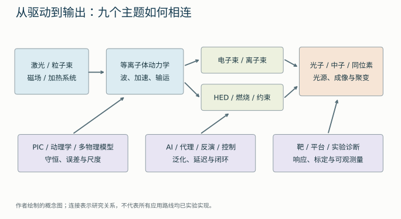
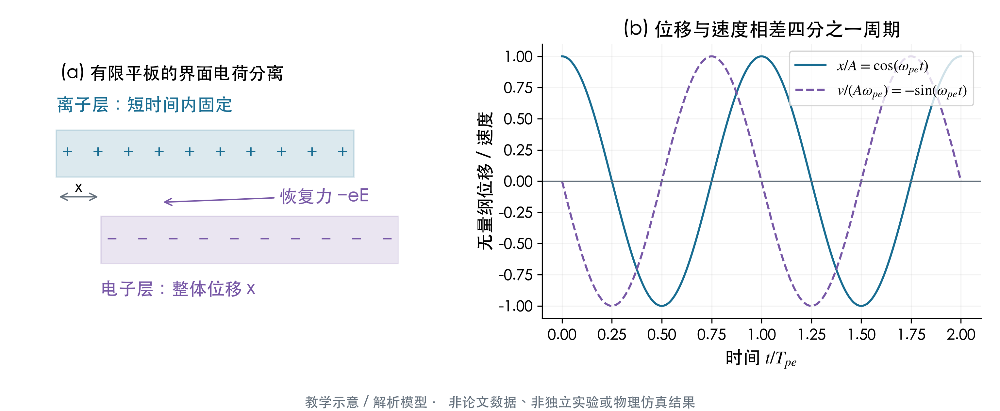
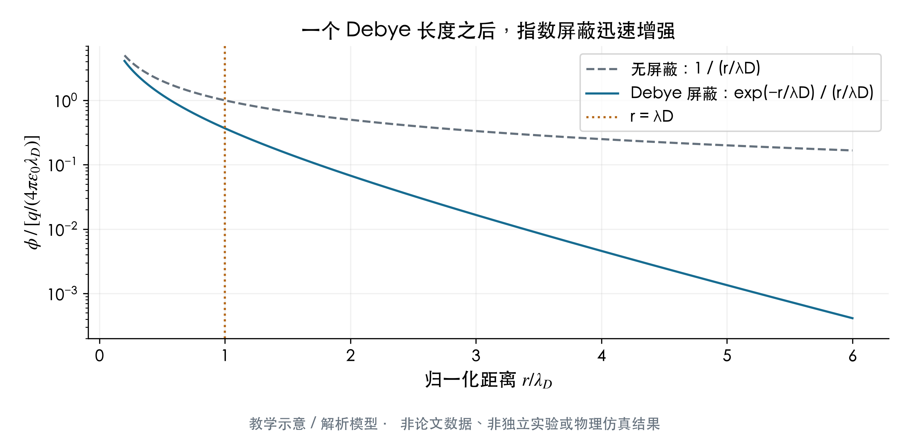
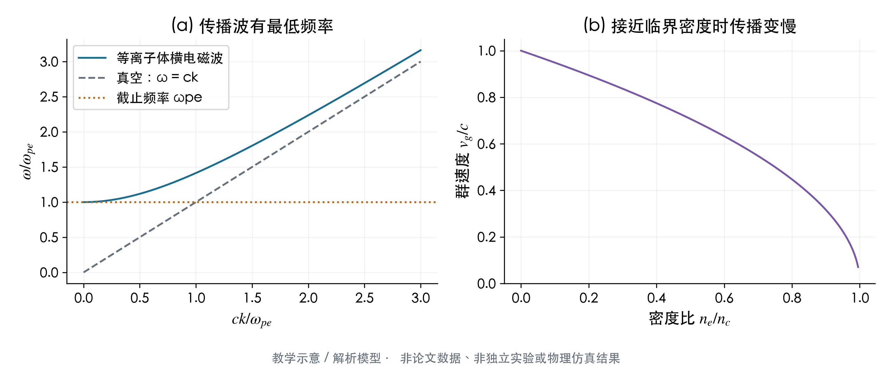
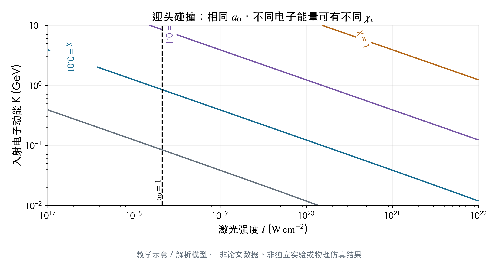
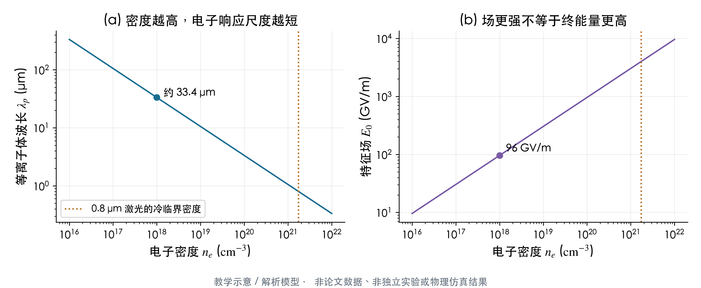
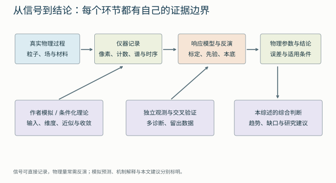

# 00 · 阅读地图与共同基础：从等离子体到今年的论文

本章是九个主题的公共入口。先建立一套判断参数、模型和证据的方法，再进入专题章，就不必在每篇论文中从缩写重新开始。以下推导是教学整理；除明确引用的论文发现外，不代表本仓库做了新的实验或计算。

## 1. 先看整条研究链

仓库关心的是带电粒子与电磁场怎样交换能量，以及怎样测量、计算和利用这种交换。激光等离子体加速利用激光或束流驱动的集体电场；强场 QED 研究高能粒子与强场作用时的量子辐射；HEDP/ICF 研究压缩、加热和燃烧；磁约束研究长时间保持高温等离子体。PIC、机器学习和诊断穿过这些方向，承担求解、控制与证据建立的工作。

**图的读法：** 左边是驱动与介质，中间是粒子和场的动力学，右边是束流、辐射、核反应或聚变输出；底部三种方法贯穿整条链。它解释了为什么同一篇文章可能出现在三个分类里。分类篇数不能相加当作独立论文数。也不能从“在模拟分类中出现”推出“这是一篇只有模拟的文章”。

例如，电子束输出之后仍有输运损失、转换靶吸收和探测器响应。完整应用指标应写成

$$
Y_{\mathrm{useful}}=N_{\mathrm{source}}\,\eta_{\mathrm{transport}}\,
\eta_{\mathrm{conversion}}\,\eta_{\mathrm{acceptance}}\,\eta_{\mathrm{use}}.
$$

这里 $N_{\mathrm{source}}$ 是每发源粒子数，输运、接受度与使用因子表示相应环节的比例；$\eta_{\mathrm{conversion}}$ 表示每个初级粒子平均生成的相关次级粒子数，可能大于1，因此它不是能量效率。因子之间常常相关，实际优化需要联合相空间和靶响应，不能总用几个独立常数相乘。这个式子首先是记账框架：源端能量纪录可能没有转化成最终有效信号的增加。应用章详细处理这一问题。

## 2. 等离子体究竟是什么

等离子体是含有可运动电荷、能够产生集体电磁响应的物质。它可能是完全电离的高温气体，也可能是部分电离的低温放电，或正在被激光加热的固体。通常在足够大的尺度上近似电中性，即 $n_e\simeq\sum_i Z_i n_i$；“准中性”不意味着每处电场都为零，也不意味着鞘层、尾波和电荷分离可以忽略。

用三个问题识别物理状态：粒子在研究时间内是否碰撞很多次？外场能否把粒子轨道明显弯曲？观察尺度与电荷屏蔽尺度相比有多大？不同答案决定流体、动理学、相对论或量子模型是否合适。

### 2.1 从小位移推导等离子体频率

考虑一维平板模型：有限厚的冷电子层与均匀离子层初始重合，离子在短时间内不动。将电子层相对离子层位移 $x$，两侧界面出现电荷分离；层内恢复场的量级为 $E=n_e e x/\epsilon_0$。电子受到反向力：

$$
m_e\frac{d^2x}{dt^2}=-eE=-\frac{n_e e^2}{\epsilon_0}x,
\qquad
\omega_{pe}=\sqrt{\frac{n_e e^2}{m_e\epsilon_0}}.
$$

$e>0$ 是元电荷，电子电荷是 $-e$；$n_e$ 在 SI 中用 $\mathrm{m^{-3}}$，$\omega_{pe}$ 是角频率，单位 $\mathrm{rad\,s^{-1}}$。数值上

$$
\omega_{pe}\simeq5.64\times10^4\sqrt{n_e[\mathrm{cm^{-3}}]}\ \mathrm{s^{-1}},
\qquad
\lambda_p=\frac{2\pi c}{\omega_{pe}}.
$$

在 $n_e=10^{18}\,\mathrm{cm^{-3}}$ 时，$\omega_{pe}\simeq5.64\times10^{13}\,\mathrm{s^{-1}}$，周期约 $111\,\mathrm{fs}$，$\lambda_p\simeq33.4\,\mu\mathrm m$。因此几十飞秒激光可以有效激发这一尺度的电子尾波。升高密度会缩短周期并增大特征场，却也常缩短加速长度，不能只看场更大。

**逐图理解。** (a)蓝色离子层固定，紫色电子层沿水平方向右移；图中的上下错开仅为分开标签，并非电子离开了离子平面。真正产生恢复场的是两端的未抵消电荷，因此电子受到向左的力。(b)横轴为经过的电子振荡周期数，纵轴为位移和速度分别除以各自幅值后的无量纲量。位移最大时速度为零，经过平衡位置时速度最大，二者相差四分之一周期。它把“集体电场像弹簧”变成可算的相位关系。曲线是冷、无耗散、小位移方程的解析解，既不是尾波的全部三维结构，也不是一篇论文的实验轨迹。

### 2.2 屏蔽长度与温度

对热平衡电子，弱静电势满足玻尔兹曼关系

$$
n_e(\phi)=n_0\exp\left(\frac{e\phi}{k_B T_e}\right)
\simeq n_0\left(1+\frac{e\phi}{k_B T_e}\right).
$$

固定离子背景下，$\rho=e(n_i-n_e)\simeq-n_0e^2\phi/(k_BT_e)$。代入泊松方程 $\nabla^2\phi=-\rho/\epsilon_0$ 得

$$
\nabla^2\phi=\frac{\phi}{\lambda_D^2},\qquad
\lambda_D=\sqrt{\frac{\epsilon_0k_BT_e}{n_e e^2}}.
$$

点电荷电势随距离呈 $\exp(-r/\lambda_D)/r$ 衰减。这告诉我们：长于 $\lambda_D$ 的电荷扰动会被集体屏蔽，但近表面、短时间或非平衡系统不能机械套用热平衡推导。在上述密度、$T_e=100\,\mathrm{eV}$ 下，$\lambda_D\simeq74\,\mathrm{nm}$；计算时 $k_BT_e=100\,\mathrm{eV}=1.602\times10^{-17}\,\mathrm J$，不能再把“100 eV 温度”当成开尔文数乘一次 $k_B$。

Debye 球粒子数 $N_D=(4\pi/3)n_e\lambda_D^3$ 很大时，平均场和弱耦合图像通常较好。暖稠密物质可能同时出现强离子关联、电子简并和部分电离，这时必须进入 HEDP 章讨论的 EOS、原子物理和输运模型。

**坐标与物理意义。** 横轴是距离除以Debye长度；纵轴为电势除以 $q/(4\pi\epsilon_0\lambda_D)$，采用对数刻度。灰虚线只包含裸库仑势的 $1/r$ 几何衰减，蓝线还包含电子重排造成的指数屏蔽。橙虚线处二者相差因子 $e^{-1}$，距离增加后相差越来越大。对数轴上相差一个大刻度意味着十倍，不能当作线性差值。此图说明为什么大尺度体区常近似准中性，但不能据此断言激光前沿、非平衡鞘层或暖稠密体系也服从这一静态、弱势、经典热平衡模型。

### 2.3 为什么会有临界密度

冷、无碰撞、无磁场等离子体中，令电场随时间为 $e^{-i\omega t}$。电子动量方程给出 $-i\omega m_e\mathbf v=-e\mathbf E$，电流 $\mathbf J=-n_ee\mathbf v=i n_ee^2\mathbf E/(m_e\omega)$。把电流代入 Maxwell 方程得到横电磁波色散：

$$
\omega^2=\omega_{pe}^2+c^2k^2.
$$

若固定激光频率 $\omega_0$ 而 $\omega_{pe}>\omega_0$，$k$ 变为虚数，简单模型中波不能在体内传播。令二者相等得

$$
n_c=\frac{\epsilon_0m_e\omega_0^2}{e^2}
\simeq\frac{1.115\times10^{21}}{\lambda_0^2[\mu\mathrm m]}\ \mathrm{cm^{-3}}.
$$

对于 $0.8\,\mu\mathrm m$，$n_c\simeq1.74\times10^{21}\,\mathrm{cm^{-3}}$。低于它称欠密，高于它称过密，接近它称近临界。相对论运动会改变有效惯性和传播条件；密度也会随预脉冲、电离和膨胀变化。论文中的“近临界泡沫”必须问清是初始电子密度、预电离之后密度，还是主脉冲作用时的瞬时密度。

**逐子图解读。** (a)横轴为 $ck/\omega_{pe}$、纵轴为 $\omega/\omega_{pe}$，两者无量纲。真空直线从零开始，等离子体曲线从截止频率1开始；它只画实数波数的传播分支，低于截止频率的倏逝场没有画成传播波。(b)固定激光频率，横轴是 $n_e/n_c$，纵轴是 $v_g/c=\sqrt{1-n_e/n_c}$，显示接近临界密度时脉冲包络传播变慢。这为尾场去相位和近临界相互作用提供背景，但相速度、群速度、粒子速度是不同量。相对论透明、自聚焦、磁场和碰撞均未包含，不能用此曲线直接判断强脉冲穿透厚靶的结果。

## 3. 激光有多强：能量、功率、强度与 a₀

焦点强度大致是功率除有效面积，功率大致是脉冲能量除持续时间。准确数值取决于时间与空间分布；FWHM、$1/e^2$ 半径、总能量和焦斑内能量需要分别记账。10 J、30 fs 的脉冲平均量级为 $0.33\,\mathrm{PW}$，但单靠“PW”不能确定焦点场，因为光学像差、焦斑和包围能量也重要。

线偏振正弦平面波的峰值场 $E_0$ 满足 $I=\epsilon_0cE_0^2/2$。电子非相对论振荡动量幅值为 $eE_0/\omega_0$，除以 $m_ec$ 定义

$$
a_0=\frac{eE_0}{m_ec\omega_0}
\simeq0.855\,\lambda_0[\mu\mathrm m]
\sqrt{\frac{I}{10^{18}\,\mathrm{W\,cm^{-2}}}}.
$$

当 $a_0\gtrsim1$，振荡动量达到 $m_ec$ 量级，需要相对论动力学。$I=10^{19}\,\mathrm{W\,cm^{-2}}$、$\lambda_0=0.8\,\mu\mathrm m$ 时，$a_0\simeq2.16$。改变偏振或场幅定义会改变中间系数，比较论文时要保持定义一致。

**a₀ 与量子效应并不等价。** $a_0$ 判断强激光的经典非线性；电子量子参数 $\chi_e$ 则比较粒子静止系电场与 Schwinger 场。高能电子迎头碰撞可以在并不极端的实验室强度下增大 $\chi_e$。强场 QED 章从 Lorentz 变换解释这个区别。

**先读两条轴。** 横轴为激光峰值强度，单位 $\mathrm{W/cm^2}$；纵轴为入射电子动能，单位GeV，两轴均为对数。黑虚线是固定0.8微米、线偏振约定下的 $a_0=1$，与入射电子能量无关；彩色线是相同 $\chi_e$ 的组合。超相对论电子迎头遇到平面波时，有量级关系

$$
\chi_e\simeq2\gamma a_0\frac{\hbar\omega_0}{m_ec^2},
\qquad \gamma=1+\frac{K}{m_ec^2}.
$$

在同一强度下，电子能量越高，静止系有效场越强；沿同一彩线提高电子能量则可降低所需强度。图用上述近似计算，没有拟合论文数据。彩线不是某个实验已经达到的边界，更不是“超过便一定可测”的阈值；焦点重叠、辐射导致的能量变化、事件数和本底必须到03/08章一起考虑。

## 4. 从单粒子到分布函数

最底层经典动力学是 Lorentz 力：

$$
\frac{d\mathbf p}{dt}=q(\mathbf E+\mathbf v\times\mathbf B),\qquad
\mathbf p=\gamma m\mathbf v,\qquad
\gamma=(1-v^2/c^2)^{-1/2}.
$$

点乘速度，利用 $\mathbf v\cdot(\mathbf v\times\mathbf B)=0$ 得

$$
\frac{d(\gamma mc^2)}{dt}=q\mathbf E\cdot\mathbf v.
$$

磁场本身不直接对粒子做功，但它能改变轨迹，从而改变粒子与电场的相位和相互作用时间。因此 DLA 的通道磁场、磁重联的磁能释放和离子磁喷嘴都不能用“磁场不做功”一句话排除；应该追踪完整的场—粒子能量流。

对宏观系统，分布函数 $f_s(\mathbf x,\mathbf p,t)$ 描述某物种在相空间中的粒子密度，满足

$$
\partial_tf_s+\mathbf v\cdot\nabla_{\mathbf x}f_s
+q_s(\mathbf E+\mathbf v\times\mathbf B)\cdot\nabla_{\mathbf p}f_s
=C_s[f]+S_s.
$$

右边 $C_s$ 表示碰撞，$S_s$ 表示电离、注入等源汇。无碰撞无源就是 Vlasov 方程。对动量积分可得到密度、流速、压强张量；每一阶矩通常依赖下一阶，所以流体方程需要“闭合”。这正是许多 ML 闭合论文的物理问题：网络不是仅拟合一个曲线，而是替代无法负担的高阶动力学信息。模型章解释它为何容易在长期推进时失稳。

场的能量密度 $u=\epsilon_0E^2/2+B^2/(2\mu_0)$ 与 Poynting 通量 $\mathbf S=\mathbf E\times\mathbf B/\mu_0$ 满足

$$
\partial_tu+\nabla\cdot\mathbf S=-\mathbf J\cdot\mathbf E.
$$

粒子得到的能量对应场失去的能量。若加入辐射、碰撞、边界逃逸或核反应，它们也要有自己的能量项。读一篇“高效率”或“能量守恒算法”论文，先写清它守恒的是哪套方程、哪些边界和哪些离散量，再评价结果。

## 5. 选择模型前先比较尺度

| 比较量 | 含义 | 常见后果 |
| --- | --- | --- |
| $\lambda_D/L$ | 屏蔽长度与装置尺度 | 很小时可在体区近似准中性；鞘层仍需单独处理 |
| $\lambda_{\mathrm{mfp}}/L$ | 碰撞平均自由程与变化尺度 | 接近或大于1时局域输运可能失效 |
| $\rho_s/L$、$\Omega_st$ | 回旋半径、回旋时间与观察尺度 | 控制磁化与漂移近似；电子和离子可能不同 |
| $\omega_{pe}t$ | 电子响应次数 | 决定是否能忽略快速电荷振荡 |
| $v/c$、$a_0$ | 相对论运动与驱动非线性 | 决定相对论动力学与强驱动效应 |
| $\chi_e$、$\chi_\gamma$ | 量子辐射与对产生参数 | 决定是否需要随机光子发射与强场 QED |
| $\Gamma$、$T/T_F$ | 关联与电子简并 | 决定理想气体 EOS、经典粒子模型是否适用 |

$L$ 是相关梯度尺度，$t$ 是观察时间；$\rho_s=v_\perp/|\Omega_s|$，$\Omega_s=q_sB/m_s$ 是非相对论回旋频率，相对论情形须考虑 $\gamma$。耦合参数 $\Gamma=q^2/(4\pi\epsilon_0 a k_BT)$ 中 $a$ 为粒子间距，$T_F$ 是电子 Fermi 温度。表中没有一个固定阈值能替代完整模型判断，尤其不能仅凭“密度高”断言碰撞、简并和强耦合全都重要。

**如何做量级判断。** 两个子图的横轴都是电子密度，单位 $\mathrm{cm^{-3}}$、对数刻度。(a)纵轴是等离子体波长，单位微米，随密度的平方根倒数下降；(b)纵轴是冷电子特征场，单位GV/m，随密度的平方根上升。标出的 $10^{18}\,\mathrm{cm^{-3}}$ 对应约33.4微米与96 GV/m。橙线是0.8微米激光的冷临界密度，提示传播条件也在变化。该图只比较公式量级，不宣称所有密度都能提供图中梯度；真实能增益还要乘上可持续的长度，并考虑去相位、耗尽、透明条件、碰撞和物性。

## 6. 读论文结果时先辨认五种量

**第一种是仪器直接记录的信号。** 例如屏上像素、谱峰计数、探针电流、时间序列。它们仍需要本底、饱和、时间响应和标定检查。

**第二种是经响应模型推断的物理量。** 束荷、温度、能谱、辐射效率和部分中子产额通常经过反演。不能把“实验约束的反演”写成“逐粒子直接测量”，但也不能因此否定其全部实验价值。

**第三种是作者模拟。** PIC、Geant4、辐射流体或平衡求解器可以给出实验无法直接看到的过程，也能做设计预测；其证据强度取决于物理模块、输入、维度、收敛和观测对照。

**第四种是解析或条件化理论。** 推导能解释机制、控制参数和极限；必须保留平面波、单粒子、低反应概率或某种渐近假设，不能把条件下存在的模式直接叫作已经制成的源。

**第五种是本综述的跨论文判断。** 当这里写“值得优先关注”“可能的瓶颈”时，是根据不同文章提出的综合解释或研究建议，应回到相应论文验证，而不是新增实验事实。

证据链可抽象为

$$
\mathbf y=\mathcal R[\mathbf x]+\mathbf b+\boldsymbol\epsilon,
$$

其中 $\mathbf x$ 为目标物理量，$\mathcal R$ 为仪器与输运响应，$\mathbf b$ 为本底，$\boldsymbol\epsilon$ 为噪声。测到了 $\mathbf y$ 不等于唯一确定 $\mathbf x$。多诊断、先验和校准能改善识别能力，但需要传播它们的不确定度。诊断章与 AI 章会分别讨论物理响应和统计反演。

## 7. 怎样比较两篇看起来都很好的文章

先比较共同的输入条件：激光到靶能量、脉宽、波长、焦斑、靶密度与预脉冲，或磁约束的装置、磁场、加热与放电状态。再比较输出定义：总电荷还是某能区/角域内的电荷，峰值通量还是平均通量，单发最好值还是多发统计，瞬时能散还是输运后的接受度。

常见数量纲转换值得掌握。$1\,\mathrm{nC}/e\simeq6.24\times10^9$ 个电子；$1\,\mathrm{MeV}=1.602\times10^{-13}\,\mathrm J$；$1\,\mathrm{Gy}=1\,\mathrm{J\,kg^{-1}}$。于是15 pC、47 MeV 的窄带束每发能量约 $0.705\,\mathrm{mJ}$，100 Hz 时在这个束团能区的平均电子功率约 $70.5\,\mathrm{mW}$。这是按代表性束荷/能量估算，忽略谱展宽、漏失和 shot 相关性，不能等同于墙插效率或样品剂量；数据来自100 Hz论文。[R374](../appendices/reference-catalog.md#r374)，[官方摘要](https://arxiv.org/abs/2609.26390)。

数值论文比较“加速40倍”时，问清是否包括数据生成、训练、I/O、GPU通信和在线调用；ML比较“小误差”时，问清是否跨放电、跨装置、跨参数区间以及是否长期滚动推进。实验比较“稳定”时，问清连续 shots 数、成功率和失效发是否被剔除。这些问题往往比某个漂亮的平均数更能判断前沿方向是否走向实际用途。

## 8. 以问题选择阅读路线

如果最关心强激光怎样产生粒子与辐射，按本章→01加速→02应用→03强场QED→08诊断阅读。若关心PIC科研计算，按本章→05数值→01或04具体物理→06AI→08验证阅读。若关心聚变，按本章→04惯性约束或07磁约束→05数值→06代理与控制→08诊断。09章帮助识别跨方向的波、输运、重联及低温等离子体方法。

学习中每读一个机制，完成四个动作：用自己的话说清能量从哪里来；指出最重要的无量纲参数；手算一个量级；明确哪个量是直接观测、哪个量依赖模型。这样才会逐渐形成可迁移的理解，而不只是记住论文标题。

## 9. 基础文献与本章证据来源

尾波加速的历史起点可读 Tajima–Dawson 1979 原论文；完整的波、注入和限制机制参考 Esarey–Schroeder–Leemans 2009 综述。这里用它们作背景路标，基础推导由本文教学整理，没有把早年方案当作今年的实验。[1979原始论文](https://doi.org/10.1103/PhysRevLett.43.267)，[2009综述](https://doi.org/10.1103/RevModPhys.81.1229)。强激光与相对论量子过程的背景可参考 Di Piazza 等2012综述，具体2026进展由03章的仓库文章支持。[2012综述](https://doi.org/10.1103/RevModPhys.84.1177)。

本章联网核对上述三条书目信息，以及R374官方摘要、R035正式论文页和R393官方论文页；详细最新结论由各主题章的本地全文与来源检查记录支持。参数例题、Debye/临界密度/Lorentz能量式推导是独立教学计算，不能被解读为对任何论文的数值复现。
