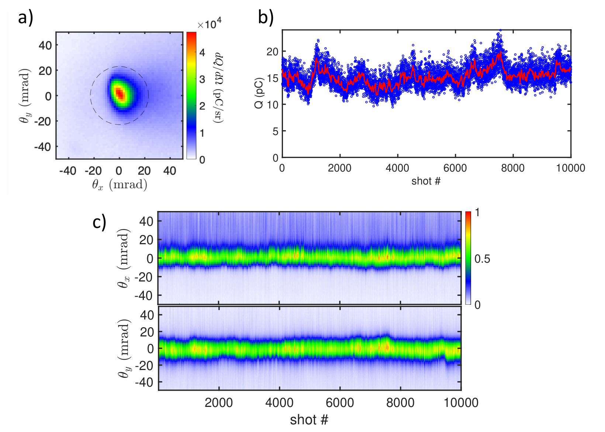
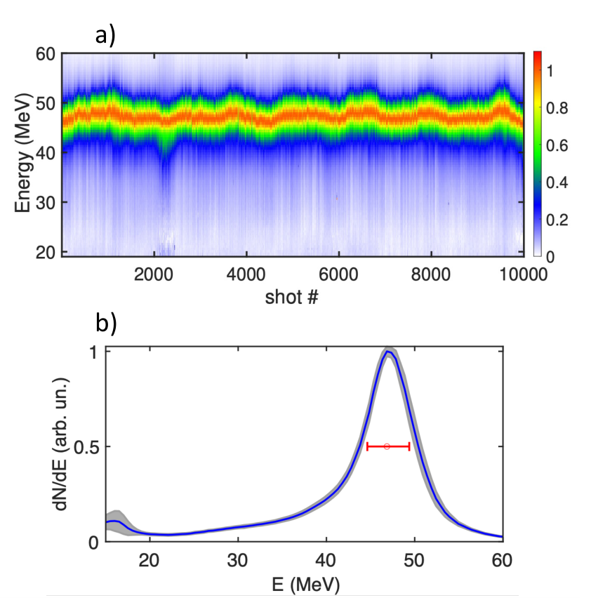
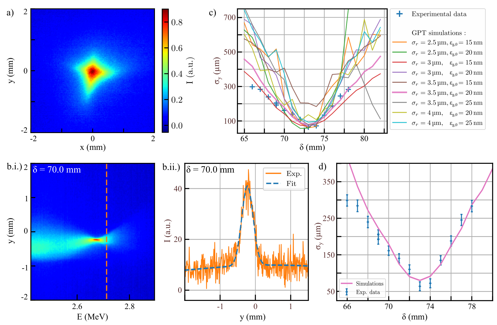
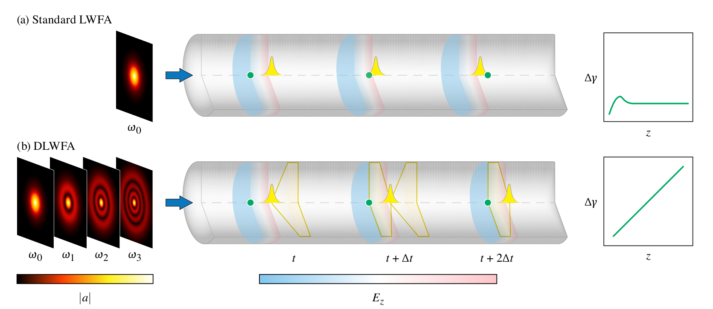
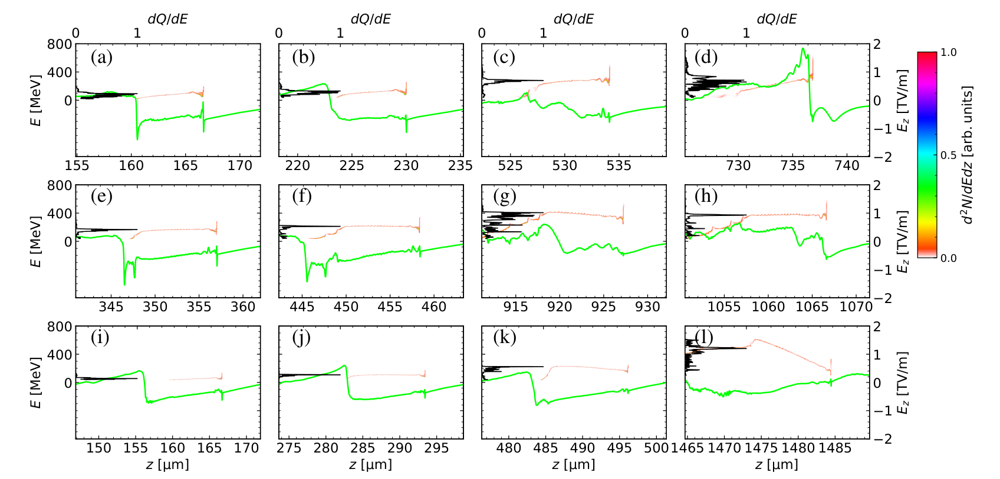
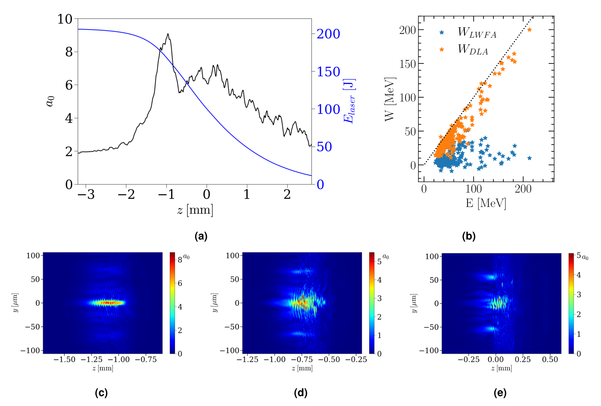

# 01 激光与束流驱动等离子体加速：从高梯度到可使用的粒子束

> 阅读定位：先建立电子、离子在等离子体里如何获得能量的图景，再理解 2026 年论文在解决哪一种瓶颈。时间截止 2026-09-30；“今年”按公开发表/预印本提交日期判断。仓库路由包含 126 条相关记录，其中存在跨类与宽泛匹配，不能把 126 当作这一机制的独立论文总数。本章重点解释 16 组工作，并把其他论文接入共同问题。所有数值沿用论文定义，未开展本地 PIC 复现。

## 1. 先分清四条路线和五种性能

传统射频加速器用金属腔的电场做功，梯度受到击穿和热负荷限制。等离子体已经电离，可以承受很强的电荷分离场：电子被排开，较重离子来不及移动，留下类似弹簧的恢复力。但“大电场”只是起点；粒子必须在正确的相位进入，在传播中保持聚焦，最后完整地离开加速区。

| 路线 | 驱动与主要做功场 | 主要对象 | 常见优势 | 首要困难 |
|---|---|---|---|---|
| LWFA，激光尾场加速 | 激光有质动力驱动电子密度波，纵向尾场做功 | 电子 | 全光学、短束团、较高单级能量 | 注入波动、去相位、激光耗尽 |
| PWFA，束流尾场加速 | 驱动粒子束激发尾场，后随见证束吸能 | 电子，亦研究正电子 | 相速度接近光速、可独立设计驱动束与见证束 | 上游束源、束流加载、横向不稳定性 |
| 等离子体 DLA，直接激光加速 | 激光横向电场对通道内振荡电子做功 | 电子 | 高电荷、宽谱、适合转换靶 | 共振持续性、发散、注入与三维通道 |
| 激光离子加速 | 热电子鞘场、辐射压力、冲击波或透明靶电荷分离场 | 质子、氘及重离子 | 超短源、强瞬时流强、多种靶设计 | 能散、有效电荷、靶补给、输运 |

这里的 DLA 指等离子体通道内的 direct laser acceleration；介质光栅中的 dielectric laser accelerator 也简称 DLA，仓库 [R298](../appendices/reference-catalog.md#r298) 属于后者，其相位匹配边界和材料限制不同，应在阅读时拆开。

电子能量 $K=(\gamma-1)m_ec^2$ 的单位常为 MeV/GeV；电荷 $Q=Ne$ 衡量有多少电子，$1\,\mathrm{nC}$ 约为 $6.24\times10^9$ 个。相对能散 $\sigma_K/\langle K\rangle$ 区分窄谱与宽谱，须注明 RMS 或 FWHM。发散角是离开源后的角分布；归一化发射度则是位置和动量共同占据的相空间面积，二者不能互换：

$$
\epsilon_{n,x}=\frac{1}{m_ec}\sqrt{\langle x^2\rangle\langle p_x^2\rangle-\langle xp_x\rangle^2}.
$$

均已减去质心。单位可写 m·rad；若束流近单能且近轴，$p_x\simeq\beta\gamma m_ecx'$，因此 $\epsilon_n\simeq\beta\gamma\epsilon$。束团被强透镜聚到很小，未必意味着发射度很小，因为发散可能同时增大。最终还要看重复频率、稳定性和应用接受度；峰值能量最高的少数电子，未必属于可用束团。

## 2. 必要原理：从等离子体振荡推到加速尺度

### 2.1 密度为什么决定长度和梯度

取有限厚平板电子层与固定、均匀离子层的界面位移模型（或等价的纵向扰动），密度为 $n_0$，电子层偏移小距离 $x$；无限均匀介质的刚性整体平移没有这一恢复场。高斯定律给出恢复场量级 $E=n_0ex/\epsilon_0$，电子方程是

$$
m_e\ddot x=-eE=-\frac{n_0e^2}{\epsilon_0}x,
\qquad
\omega_p=\sqrt{\frac{n_0e^2}{\epsilon_0m_e}},\quad
\lambda_p=\frac{2\pi c}{\omega_p}.
$$

这是冷、无碰撞、小振幅模型，不含热运动、相对论非线性和离子响应。把电子在一个等离子体周期中加速到 $c$ 作为量级估计，$eE_0/(m_e\omega_p)\sim c$，得到

$$
E_0=\frac{m_ec\omega_p}{e}
\simeq96\sqrt{\frac{n_0}{10^{18}\,\mathrm{cm^{-3}}}}\ \mathrm{GV/m}.
$$

在 $10^{18}\,\mathrm{cm^{-3}}$ 时，$\lambda_p\approx33\,\mu\mathrm m$。这里用了 $1\,\mathrm{cm^{-3}}=10^6\,\mathrm{m^{-3}}$；忘记这个换算会导致频率相差千倍。提高密度会让梯度更大，却缩短可用加速长度并改变注入，所以不能只凭 $E_0\propto\sqrt n$ 判断最终能量。

### 2.2 激光怎样推出一个“空泡”

对角频率 $\omega_0$ 的激光，电子振荡动量量级 $p_\perp\sim eE_L/\omega_0$，用 $m_ec$ 归一化得到

$$
a_0=\frac{eE_L}{m_ec\omega_0}
\simeq0.855\sqrt{I[10^{18}\,\mathrm{W/cm^2}]\,\lambda_0^2[\mu\mathrm m^2]}.
$$

后一式采用线偏振峰值强度约定；不同偏振的峰值/RMS 定义要对齐。空间非均匀激光的周期平均力把电子赶离强场区，其相对论量级可写 $\mathbf F_p\sim-m_ec^2\nabla\sqrt{1+\langle a^2\rangle}$。当驱动足够强且脉长合适，电子排到外围，形成主要由离子占据的 bubble/blowout。常用匹配估计是

$$
k_pw_0\sim2\sqrt{a_0},\qquad k_p=\omega_p/c.
$$

它描述轴对称、非线性空泡的设计量级，不能不加检验地用于极短脉冲、自调制波、非轴对称束或近临界密度。临界密度 $n_c=\epsilon_0m_e\omega_0^2/e^2$ 对 $0.8\,\mu\mathrm m$ 约为 $1.74\times10^{21}\,\mathrm{cm^{-3}}$；“近临界”通常是相对于激光频率的概念，强场下有效质量增大还会带来相对论透明。

### 2.3 去相位、耗尽、束流加载为何彼此牵制

电子接近 $c$，激光尾场相速度往往近似激光群速度。冷稀薄等离子体中

$$
v_g\simeq c\sqrt{1-\omega_p^2/\omega_0^2},
\quad 1-v_g/c\simeq\frac{\omega_p^2}{2\omega_0^2}.
$$

设电子允许相对尾场滑移的长度为 $\Delta\xi$，则 $L_d\simeq\Delta\xi/(1-v_\phi/c)$。取 $\Delta\xi\sim\lambda_p/2$，得到 $L_d\sim\lambda_p\omega_0^2/\omega_p^2\propto n_0^{-3/2}$。因此降低密度虽降低梯度，却可能让积分能增益 $\Delta K=-e\int E_z\,dz$ 变大。实际 $v_\phi$ 还受前沿侵蚀、脉冲演化、密度坡和非线性影响，系数不是普适常数。

泵浦耗尽是驱动器把能量转移给等离子体和粒子；即使取消去相位，也没有取消有限激光能量。束流加载是被加速束本身修改尾场：设计合适的纵向电流分布，可把加速场压平以减小能散；装入过多电荷则可能削弱聚焦并激发横向不稳定性。必须区分激光到电子效率、驱动束到见证束效率、尾场到见证束效率，不能横比百分数。

PWFA 的驱动电子接近 $c$，通常可减轻光学驱动的去相位；能增益仍受驱动束耗尽、transformer ratio、束型和级长限制。质子驱动器含很大总能量，但长质子束需先自调制成近 $\lambda_p$ 间距的微束团列，才有效共振激发尾场。长等离子体源的稳定性是这一方案的核心工程问题。[R188](../appendices/reference-catalog.md#r188)、[R344](../appendices/reference-catalog.md#r344)

### 2.4 DLA 与离子加速的最小推导

在离子通道中，电子受到线性聚焦力 $F_r\simeq-m_e\omega_p^2r/2$，近轴且 $\gamma$ 慢变时，betatron 频率约为 $\omega_\beta=\omega_p/\sqrt{2\gamma}$。电子沿激光方向前进，感受到的振荡频率降低为 $\omega_0-k_0v_z=\omega_0(1-v_z/v_\phi)$。DLA 共振需要某个整数谐波满足

$$
N\omega_\beta\simeq\omega_0-k_0v_z,
\qquad
\frac{dK}{dt}=-e\,\mathbf v\cdot\mathbf E.
$$

轨道会不断变化，所以共振是持续的相位关系而非一次等式。数值归因应分别积分激光与准静态场做功，并追踪粒子；只见高能尾不足以证明 DLA。[R285](../appendices/reference-catalog.md#r285)、[R303](../appendices/reference-catalog.md#r303)

TNSA 中激光先加热电子，电子逸向靶后表面形成鞘层。等温 Boltzmann 电子满足 $n_e\propto\exp(e\phi/k_BT_e)$，由 $E_z=-\partial_z\phi$ 得

$$
eE_z=-k_BT_e\,\partial_z\ln n_e.
$$

因此鞘场同时取决于温度与密度梯度。德拜长度 $\lambda_D=\sqrt{\epsilon_0k_BT_e/(n_ee^2)}$ 给出梯度尺度，故 $E\sim k_BT_e/(e\lambda_D)$。经典一维等温膨胀模型在晚时 $\omega_{pi}t\gg1$ 的渐近区产生大致 $K_{i,\max}\propto Zk_BT_e\ln^2(\omega_{pi}t)$ 的截止能量增长；有限热电子能量、有限横向尺寸和多组分会修改它。

RPA 则以反射辐射压力 $P_{\rm rad}\simeq2I/c$ 推动靶。薄箔 light-sail 的加速度量级为 $2I/(\sigma c)$，其中 $\sigma$ 是面质量密度，随后需加入相对论多普勒因子与透明条件。库仑爆炸来自电子被移走后离子间排斥；冲击波加速来自运动电势结构对离子反射；近临界透明靶通常是多机制混合。论文给它一个名称，并不证明其他机制不存在。

### 2.5 注入不是把电子放到大电场附近

要进入尾场，电子必须跨过共动系的俘获边界。设场近似只依赖 $\xi=z-v_\phi t$，电子电荷为 $-e$，定义 $\psi=e(\phi-v_\phi A_z)/(m_ec^2)$。由空间—时间的共同平移对称性，近似守恒量可写为

$$
\mathcal H=\gamma-\beta_\phi\frac{p_z}{m_ec}-\psi,
\qquad \beta_\phi=v_\phi/c.
$$

这里 $\phi,A_z$ 是 SI 电势与矢势，$v_\phi A_z$ 和电势有相同单位。没有辐射、碰撞且尾场准静态时，上式沿轨道近似不变。初始慢电子的动能很小；为了追上近光速尾场，它要借助足够的势差降低共动 Hamiltonian 的运动障碍。因此同样的峰值场，电子在不同相位出生，会有完全不同的结果。

自注入利用空泡演化或破波让背景电子进入俘获轨道，装置简单，却容易在整个传播阶段持续注入，造成电荷与能散波动。电离注入把高电离阈值电子延迟到激光最强位置释放，出生位置更集中，但激光沿程变化仍会拉长注入窗口。密度下坡使等离子体波长增大，尾场局部相速度下降，降低追波门槛；外注入则先制备电子束，再匹配其位置、时间、能量与聚焦条件。等离子体光阴极把释放脉冲与主驱动器分开，能进一步缩小出生相空间，但增加多束激光同步要求。[R068](../appendices/reference-catalog.md#r068)、[R265](../appendices/reference-catalog.md#r265)

这些路线没有统一最优解。要比较它们，应在相同有效能窗内报告电荷、归一化发射度、注入长度和逐发稳定性；仅看束团“更亮”可能混入不同的电荷或脉宽定义。对密度下坡尤其要检查，增强俘获的同一个坡是否在出口削弱聚焦并造成电子脱落。[R356](../appendices/reference-catalog.md#r356)

### 2.6 从等离子体出来以后，束流为什么变差

等离子体内的聚焦非常强，出口后突然变成真空漂移。若束在出口的 Twiss 参数与下游透镜不匹配，原来很小的束腰会迅速张开；不同能量又经过不同聚焦强度，产生色差。对于能量近固定、近轴、忽略空间电荷的一小段输运，束包络的简化方程为

$$
\sigma_x''+k_\beta^2\sigma_x-
\frac{\epsilon_n^2}{\beta^2\gamma^2\sigma_x^3}=0.
$$

三个项依次表示包络变化、外场聚焦、有限发射度造成的扩张。取 $\beta\simeq1$、$\sigma_x''=0$，匹配尺寸为 $\sigma_{x,m}^2=\epsilon_n/(\gamma k_\beta)$。这解释了为什么等离子体密度、电子能量或发射度变化时，原来的匹配光学不再适用。加速段需补入随能量变化的阻尼项；高电荷低能束还要补空间电荷，不能把这条简化式直接套到所有出口。

实践上，低密度渐变出口可缓和强聚焦的突然关闭，紧邻源的透镜可截住发散，但密度坡本身会改变尾场与束流加载。下游能量狭缝得到的窄谱，是接受度筛选的产物；应同时给出筛选前后电荷比。低发射度源的证据需要使用测量模型审计透镜像差、能散和仪器分辨率，这正是 [R314](../appendices/reference-catalog.md#r314) 螺线管测量与衍射示范应配套阅读的原因。

## 3. 历史线索：为什么 2026 年开始强调“可运行”

仓库早期记录把多级耦合 [R001](../appendices/reference-catalog.md#r001)、相关能散补偿 [R004](../appendices/reference-catalog.md#r004)、LWFA 电子再驱动 PWFA [R011](../appendices/reference-catalog.md#r011)、等离子体恢复时间 [R013](../appendices/reference-catalog.md#r013) 放在连续链上。这些标题对应四个长期问题：单级不能无限延长、束质不能只靠源区决定、驱动器可以混合、重复运行必须等待等离子体恢复。此处只作主题脉络，早期模板笔记不足以支持各文精确性能。

离子路线从透明增强混合加速 [R005](../appendices/reference-catalog.md#r005)、近临界氢喷流的 80 MeV 结果 [R015](../appendices/reference-catalog.md#r015)，发展到传导受限靶的辐射压力与库仑排斥 [R019](../appendices/reference-catalog.md#r019)。这里的连续性是“改变靶电子响应来延长有效离子做功”，并不意味着所有 >100 MeV 结果都遵循同一机制。2025 年的两级 LWFA [R024](../appendices/reference-catalog.md#r024) 和能量/亮度同时提升的 PWFA [R025](../appendices/reference-catalog.md#r025) 是今年讨论级联与束质的直接背景；缺笔记项仅列作待精读入口。

## 4. 2026 年重点工作：四组瓶颈，十六个案例

### 4.1 驱动器和连续运行

**① 工业 Yb:YAG 驱动的多 kHz LPA。** [R121](../appendices/reference-catalog.md#r121) 用多通池把皮秒脉冲后压缩到约 50 fs，在近临界等离子体中得到每发 10–12 pC、50–70 mrad 发散、数 MeV 宽谱电子。0.625–6.25 kHz 范围内束参数基本保持；关键限定是 burst mode，不能直接当全年连续 6.25 kHz。模拟归因为自调制加速与相对论自聚焦，区别于窄谱 GeV bubble 加速。它的意义是工业高平均功率激光与靶系统接通，适合平均通量需求，而非同一次刷新能量、发射度和重复率。[官方原始提交页](https://arxiv.org/abs/2606.07147)，2026-06-05。

**② 100 Hz 的约 50 MeV 窄谱束。** [R374](../appendices/reference-catalog.md#r374) 的 70 mJ、8.1 fs OPCPA 驱动器产生约 47 MeV、15 pC 电子。10,000 连续发的峰能 RMS 为 1.4%、电荷 RMS 为 12%；“固有能散 <10%”是经仪器响应模型得到的 95% 置信上限，原始测量宽度受磁谱仪分辨率影响。PCA 识别五个可解释波动模态，慢于 1 Hz 的漂移占主导，提示反馈系统不能只盯单发噪声。PIC 支持自聚焦使电离注入局域化，但没有证明每个漂移模式的唯一物理原因。[官方页](https://arxiv.org/abs/2609.26390)，2026-09-22。

图 01-1｜100 Hz 加速器的连续万发电荷与指向。[R374，原图 2，PDF 第 4 页](../appendices/reference-catalog.md#r374)

图 (a) 是一发电子的二维角分布，横纵轴为 $\theta_x,\theta_y$，单位 mrad；色标为单位立体角电荷 $dQ/d\Omega$，单位 pC/sr，并带 $10^4$ 标度。黑虚线圈界定计算束电荷的接受区，因而下面的稳定性针对这个区内的束，而非任意远离核心的晕。图 (b) 横轴是 10,000 连续发编号，纵轴电荷 pC；蓝点保留逐发涨落，红线平均每 20 发，显示约 15 pC 周围存在缓慢漂移。图 (c) 两幅瀑布图分别给水平、竖直投影：角度仍用 mrad，颜色归一化到 0–1，狭窄亮带的移动反映指向变化。这类归一化剥离了绝对电荷信息，不能用 (c) 的亮度直接代替 (b)。原文统计电荷 RMS 12%、指向 RMS 约 1.2/1.3 mrad；它们是不同误差轴。该图把“能连续打出束”升级为有时间窗口、接受区和波动结构的实验数据，尚不足以识别每种慢漂移的唯一成因。

图 01-2｜窄谱稳定性与能散反卷积的边界。[R374，原图 3，PDF 第 5 页](../appendices/reference-catalog.md#r374)

图 (a) 横轴为炮次，纵轴电子能量 MeV；每发能谱分别归一化，色标 0–1。约 47 MeV 的峰形成连续亮带，说明峰位置稳定，但这种处理不能证明电荷同样稳定，也不能排除狭缝接受度之外的粒子变化。图 (b) 蓝线是平均 $dN/dE$，纵轴任意单位；灰带给逐发 RMS 波动，红色水平误差条给峰值能量处磁谱仪约 4.8 MeV 的分辨率。实测 FWHM 约 6.5 MeV，与仪器宽度相近，所以不能直接把这一宽度认作本征能散。作者用仪器响应卷积 Lorentzian 谱形，最佳本征 FWHM 约 3.8 MeV，profile-$\chi^2$ 给 95% 上限 4.6 MeV，即相对宽度约 10%。图的作用是把“峰能 RMS 1.4%”与“单束能散上限”拆开：前者描述峰的位置重复性，后者描述束内分布，并含谱形与响应模型条件。

**③ 低发射度与衍射应用。** [R314](../appendices/reference-catalog.md#r314) 以永磁螺线管扫描测得 2.7 MeV 束的归一化发射度约 124 nm·rad，并获得硅纳米膜多级衍射峰。它说明适合衍射的关键是横向相干性和相空间，而非最高能量。空间电荷、输运中的色差、束长与样品端稳定性仍需分别量化。时间上是 2026-02-13 初次提交、08-27 的 v2 修订，不能称“八月首次发现”。[版本记录](https://arxiv.org/abs/2602.12765)

图 01-3｜低发射度来自输运扫描反演。[R314，原图 3，PDF 第 4 页](../appendices/reference-catalog.md#r314)

图 (a) 没有色散磁铁时给屏上焦斑，横纵位置单位 mm、颜色是任意单位强度；宽能谱的不同能量聚焦在不同纵向位置，混在一起会扩大焦斑。图 (b.i) 加入偶极后，横轴改为能量 MeV、纵轴仍为 mm，出现“蝴蝶结”；橙虚线选择 2.7 MeV。(b.ii) 在该能量截取竖直线型，橙线为实测，蓝虚线为 Gaussian 拟合，强度任意单位。图 (c) 扫描螺线管位置 $\delta$（mm），纵轴是屏上 RMS 宽度 $\sigma_y$（μm）；蓝十字与不同初始源尺寸、几何发射度的 GPT 曲线共同确定输运解。图 (d) 最优参数为 $\sigma_r=3.5$ μm、$\epsilon_g=20$ nm·rad，误差条同时包含逐发 RMS 与成像分辨率，换算得到约 124 nm·rad 的归一化发射度。图支持选定能量切片的低发射度，并说明单张小焦斑本身不足以测发射度；模型、色差与能量选择必须留在证据链中。

**④ 10 m 放电等离子体源。** [R344](../appendices/reference-catalog.md#r344) 展示长 noble-gas 放电源在 AWAKE 质子束下产生可解析自调制，并经历 >20,000 次放电。调制频率随密度按 $f\propto\sqrt n$ 变化，与基础等离子体振荡一致。这是源与自调制实验，没有测量该源中的见证电子能增益。双程干涉仅给线积分，0.63% 的频率事件散布也不是全长密度均匀性；把这两者拆开，才能识别离真正长级 PWFA 还缺什么。

### 4.2 延长有效加速并控制加载

**⑤ 波导模式实现无去相位方案。** [R144](../appendices/reference-catalog.md#r144) 组合不同等离子体波导模式的频率与相位，使驱动包络峰值与尾场相位接近 $c$，同时保持短脉冲和近固定光斑。它改动的是驱动结构，不是简单延长普通高斯束的靶。解析标度与准三维 PIC 支持能增益随参与模式数增长；光学模式生成、模式耦合误差、耗尽和注入容差尚待实验。取消去相位仍需支付驱动能量，不构成无限加速。

图 01-4｜让强度峰与能量包络具有不同速度。[R144，原图 1，PDF 第 3 页](../appendices/reference-catalog.md#r144)

图 (a)、(b) 都按 $t,t+\Delta t,t+2\Delta t$ 排列传播快照；灰色管是等离子体波导，绿色是相对论电子。图中 $|a|$ 和 $E_z$ 色条只示意横向光场与纵向加速/减速区域，未给定量单位；右侧 $\Delta\gamma$ 对 $z$ 曲线也用于解释趋势。普通单频驱动的强度峰随亚光速群速度前进，电子从蓝色加速相位滑入红色减速相位，故能增益先升后降。下排将 $\omega_0,\omega_1,\omega_2,\omega_3$ 等波导模式频率按色散关系配置，干涉峰以 $c$ 前进，电子保持在加速相位；黄色大包络仍以小于 $c$ 的群速度移动。关键是强度峰可以由干涉结构形成，并不意味着每一份能量以该峰速度输运。它把去相位限制与耗尽限制分开，是解析/PIC 方案的机制示意；右图的持续增长没有证明无限能量，也没有给出实验已实现的模态纯度、耦合效率或可用加速长度。

**⑥ 用适度耗尽反啁啾。** [R267](../appendices/reference-catalog.md#r267) 把“效率与能散冲突”重写为纵向相空间旋转问题：离焦注入形成束团，短驱动器耗尽后尾场梯度演化再做一次反啁啾。代表 PIC 的 8 fs 情形约 372 MeV、1.27 nC、3.28% 能散、20% 效率；另一个优化点用 8.3 J、7.2 fs 得约 420 MeV、5.5 nC、约 10% 能散。两组是不同参数点，不应拼成同一束。模拟忽略离子运动、使用横向反射边界；高 $a_0$ 和电荷下三维/离子效应可能改变最优窗口。

图 01-5｜适度耗尽为什么能够第二次反啁啾。[R267，原图 4，PDF 第 4 页](../appendices/reference-catalog.md#r267)

十二幅图依次是 5 fs 的 (a–d)、8 fs 的 (e–h)、15 fs 的 (i–l)，每行从左到右跟随传播演化；各列的 $z$ 范围不同，不能把它们当同一时刻比较。横轴为纵向位置 μm，左纵轴为电子能量 MeV，彩色分布是归一化 $d^2N/(dE\,dz)$、任意单位。黑线给投影能谱 $dQ/dE$，读取上方 0–1 归一化轴；绿线给 $E_z$，读取右侧 TV/m 轴。最短脉冲过早耗尽，尾场来不及完成所需相空间旋转；8 fs 在 (f)、(h) 先后出现较小纵向倾斜，原文解释为泡收缩和增强束流加载使场梯度反号，第二次抵消正啁啾。15 fs 在 (j) 第一次变窄后继续积累啁啾，去相位时仍没有对应梯度反转。(h) 的约 372 MeV、3.28% FWHM 是这一参数点的模拟结果。该图直接展示“效率—能散”如何由演化过程耦合，但色标不是绝对粒子数，二维投影也不检验离子运动及完整三维稳定性。

**⑦ 自引导 LWFA 的能量优化标度。** [R276](../appendices/reference-catalog.md#r276) 用 boosted-frame PIC 与贝叶斯搜索寻找“最大电子能量、达到该能量的最短长度”。给定扫描域内激光能量翻倍，最优能量约增 1.5 倍、长度约增 1.8 倍；1 J、1 μm 的设计例约 833 MeV、5.1 mm。最优区是较宽脊线，比单个最佳点更有工程意义。但目标取高能尾前 1% 宏粒子，不能据此推算全束平均能量或应用通量；实验室系复核与 boosted-frame 有约 8–16% 能量差异，应成为标度误差预算的一部分。

**⑧ 高效率 PWFA 的横向稳定性窗口。** [R200](../appendices/reference-catalog.md#r200) 让横向 wake 模型自洽响应强加载后的空泡形状，设计梯形 trailing bunch。特定 1 m 级 3D PIC 给出最高约 16.5 GeV 增益、接近 80% 的尾场到见证束功率转移与 <1.5% 最终相对能散，同时基本保持发射度。这里的 80% 分母是尾场功率，不能与激光壁插效率或激光到电子效率横比。精细束型抑制不稳定性是可检验机制，真实注入误差和长级累积容差仍未闭合。

**⑨ 真空焦点位置也是物理旋钮。** [R381](../appendices/reference-catalog.md#r381) 在 CoReLS 用 15.22 J、54 fs 激光，把小于匹配尺寸的焦斑放在气室入口上游约 1.6 mm，实验获得最高约 1.4 GeV。自注入发生在有限焦点窗口。准三维 FBPIC 支持“先离焦、等离子体再聚焦、稳定加速更长”的趋势，却预测约 2.2 GeV 和不同最优位置，还在实验无束的部分位置继续注入。这是机制支持与定量预测失配并存的好例子：设计时应把真空焦点、实际等离子体内焦点分开。

### 4.3 高电荷电子和新自由度

**⑩ PETAL 的微库仑宽谱电子。** [R285](../appendices/reference-catalog.md#r285) 在 719 J、753 fs 激光下得到 $>0.9$ MeV 电子总电荷 $1.1\pm0.13\,\mu\mathrm C$，高能尾约 500–550 MeV。全角谱平均能量约 15 MeV、束总能量约 17 J；以全激光能量作分母效率约 2.3%，以主焦斑 194 J 作分母才是 8.5%。小接受角谱的平均能量不能代表全束。场做功分解支持 SMLWFA 负责俘获和预加速、DLA 补高能增益；该高通量路线适合宽谱转换源，不能写成微库仑低能散 GeV 束。[官方版本页](https://arxiv.org/abs/2608.16459)

图 01-6｜区分尾场预加速和 DLA 高能增益。[R285，原图 6，PDF 第 8 页](../appendices/reference-catalog.md#r285)

图 (a) 横轴是传播坐标 $z$（mm），黑线 $a_0$ 读左轴、蓝线激光能量 J 读右轴；能量持续下降而局部场幅先增大，体现自聚焦与耗尽可以并存。图 (b) 横轴是所追踪电子的末态能量 $E$，纵轴是累积做功 $W$，均用 MeV；蓝星为纵向尾场贡献，橙星为 DLA 贡献，虚线 $W=E$ 是比较基准。高能粒子的橙星更接近该线，支持 DLA 给这些粒子的大部分增益；这不是所有电子的平均贡献，更不能把采样点数当实际电荷。图 (c–e) 是三个传播阶段的激光振幅切片，横轴 mm、横向轴 μm，色标为无量纲 $a_0$；(c) 与 (d,e) 色标范围不同，必须读数字再比较，不能只按颜色判断峰值。后期空间碎裂说明驱动已显著演化。图 (a,c–e) 来自三维 CALDER，(b) 来自准三维 OSIRIS，属于对实验机制的数值解释；实验电子总能量或转换效率仍应按各自接受角和激光能量分母定义。

**⑪ 黑腔预热泡沫的可调 DLA。** [R289](../appendices/reference-catalog.md#r289) 以纳秒激光驱动黑腔软 X 光，再由 120 J、0.8 ps 脉冲照射预热泡沫。6–9 ns 延迟给约 13 MeV 有效温度和 80 MeV 截止；更长延迟增加电荷却降低谱温度。流体与三维 PIC 提示更均匀密度形成单一通道，减少冷泡沫多丝化。总电荷约 165 nC 依赖角分布外推，成像板饱和使其带上限估计性质；没有下游 γ/中子应用测量。它把“靶预史”变成设计变量，不能仅输入相互作用时刻的平均密度。

**⑫ 直接观察电子脱落。** [R356](../appendices/reference-catalog.md#r356) 用飞秒电子显微镜探测高电荷束在出口密度坡的电磁场印迹，约 550 pC、>100 MeV 束在下降区拉长并丢失尾部。FBPIC 解释为激光失焦后向 PWFA 转换，头部给尾部输能，尾部进入弱聚焦区后发散脱落。直接证据是探针印迹，逐粒子能量转移和阈值来自模拟。这说明出口坡不只是“结束靶”，也是一个会重新塑造电荷和相空间的加速/损失级。

**⑬ 等离子体光阴极与正电子。** [R265](../appendices/reference-catalog.md#r265) 用预极化 HCl、多色激发与弱光局域电离，模拟得到 10.8 pC、约 57 nm 发射度电子，并保留 97% 初偏振；若实际初偏振约 70%，终偏振约 67.9%，不能把保留率当绝对偏振。另一方面 [R321](../appendices/reference-catalog.md#r321) 用轴向磁场把被排开的等离子体电子重新组织为轴上柱，扩大正电子聚焦兼加速区；60 mm 数值输运捕获约 85–92%，不同代码/分辨率给 99–150 MeV 能增益。两者都显示“束种、自旋与注入”成为设计自由度，但目前主要是数值方案。

### 4.4 离子：透明窗口、相空间和多目标

**⑭ 固定能量双脉冲与二维误差。** [R133](../appendices/reference-catalog.md#r133) 只改变能量分配和延迟，32 次 2D PIC/贝叶斯试验找到前导脉冲约 7%、延迟约 234 fs 的点，截止从 7.7 提高到 17.7 MeV。机制是预等离子体改变吸收与鞘场寿命，不是优化器本身赋予粒子能量。[R151](../appendices/reference-catalog.md#r151) 进一步优化双层靶的峰能、窗口电荷和带宽；代表点由 2D 的 67.4 MeV/18.8% 变为 3D 的 34.1 MeV/7.0%。这不是小数值修正，而会改变应用判断，说明必须把 3D 校验放到真正候选点。

**⑮ 皮秒近临界靶的持续鞘加热。** [R362](../appendices/reference-catalog.md#r362) 提出 extended sheath heating：适量透射场持续加热正在膨胀的后鞘。一维理想模型的效率 $\eta=T\ln(1/T)$，这里 $T$ 是场透射而强度透射为 $T^2$。求导 $d\eta/dT=\ln(1/T)-1$，极值在 $T=e^{-1}$，给 $\eta=e^{-1}\approx37\%$。该值是质量受限一维模型上限，不是新测得的质子效率。二维有限焦斑、周期 PIC 和既有实验趋势支持中等透射最优；从解析极值到可用离子束仍需处理谱、角度、靶膨胀和能量定义。

**⑯ 后加速的相位门槛与锥导控制。** [R283](../appendices/reference-catalog.md#r283) 在零初始横向动量的测试粒子扫描中，近临界 snowplow 前沿可给最优粒子约 2.2 GeV 增益，但它只出现在特定初始位置/能量带，前沿又受群速度和快速耗尽限制，不能代表整束的准单能输出。[R371](../appendices/reference-catalog.md#r371) 则用靶后动态锥透镜同时控制横向与纵向相空间：短锥利聚焦，长锥可缩谱但牺牲准直。两篇共同说明，有效性能由“什么时候到达什么场区”决定，最高增益和最佳束形通常不是同一参数点。

## 5. 其他论文如何接入这张图

注入设计从时间非对称电离注入 [R068](../appendices/reference-catalog.md#r068)，延伸到波前引导的 DLA 注入 [R303](../appendices/reference-catalog.md#r303)：前者控制电子何时被释放，后者强调前沿磁岛、横向动量和通道入口。结构光的 helical bunch [R253](../appendices/reference-catalog.md#r253)、涡旋磁箍缩 [R260](../appendices/reference-catalog.md#r260) 对应角动量和通道电流的新控制轴；相关结果需与常规束在相同能量、接受度、发射度定义下比较，不能只用末态图案判断优势。

非理想尾场可用多极语言组织。[R140](../appendices/reference-catalog.md#r140) 的 $m=1$ 通道关联质心漂移，$m=2$ 关联横向平面耦合；[R240](../appendices/reference-catalog.md#r240) 以非轴对称 Lagrangian 框架推进空泡理论，[R156](../appendices/reference-catalog.md#r156) 研究空心通道四极 wake。这些论文连接“激光波前/束斑不对称”与“束质退化”，适合用来定义诊断量，而非仅看轴上 $E_z$。离子化 hose [R135](../appendices/reference-catalog.md#r135) 提醒背景电子的出生机制也会改写稳定性。

离子方案中，纳米结构靶 [R198](../appendices/reference-catalog.md#r198)、双脉冲 micronozzle [R211](../appendices/reference-catalog.md#r211) 和实验塑料箔中的碳离子 piston 束团化 [R224](../appendices/reference-catalog.md#r224) 都在重塑场的空间/时间分布。不能把实验观察的谱峰等同于已达用户束线的窄谱。极化 $^{3}$He 的角向不对称证据 [R080](../appendices/reference-catalog.md#r080) 又把离子自旋保真度加入验收维度。反向电离前沿 [R281](../appendices/reference-catalog.md#r281) 依赖高流强电子束而非普通 TNSA，应按集体离子加速理解。

运转配套是同等重要的前沿：靶制造综述 [R067](../appendices/reference-catalog.md#r067) 连接固体、液体、气体和低温补给；差分抽气 catcher [R092](../appendices/reference-catalog.md#r092) 处理高频气负载；全反射引导 [R094](../appendices/reference-catalog.md#r094) 关注高频光学。DRZ 电荷标定 [R219](../appendices/reference-catalog.md#r219)、THz 纵向相空间诊断 [R275](../appendices/reference-catalog.md#r275)、重构 AI 能谱 [R279](../appendices/reference-catalog.md#r279) 分别回答电荷、束长/啁啾与宽动态谱如何测。漂移归因 [R352](../appendices/reference-catalog.md#r352) 目前依赖合成数据，提示“可拟合”与“可归因”之间仍有距离。

## 6. 可以带走的研究经验

第一，先写目标函数，再选机制。FEL/衍射看低发射度和能散；宽谱转换靶看接受度内总能量与反应谱权重；单发 HED 背光看脉宽、源尺寸和光子数；重复成像看可用平均通量。把不同目标的最高数字拼起来，会构造出不存在的装置。

第二，记录完整输入历史。至少包括激光能量的分母、主焦斑 encircled energy、压缩状态、CEP/角啁啾、真空焦点、密度上/下坡、预脉冲和靶预热。残余角啁啾影响离子束 [R207](../appendices/reference-catalog.md#r207)，说明“相同 $a_0$”并不保证相同驱动器。

第三，模拟要追踪做功和粒子身份。保存 $\int qv_zE_zdt$、横向做功、出生位置、注入时间、出口损失；对 LWFA→PWFA 转换和 DLA 尤其必要。二维结果先作机制筛选，重点候选再检查 3D、离子运动、网格与宏粒子统计。用不同代码得到类似趋势是好证据，但不自动消除共同近似。

第四，稳定性必须附时间窗口。100 发、10,000 发、72 小时与七个月支持不同结论；burst kHz 与持续 kHz 支持不同热负载。平均谱、逐发谱、选择后谱以及积分接受角应同时保留，以免稳定的积分信号掩盖逐发相空间变化。

## 7. 从零背景开始的学习路线

先用本章的弹簧模型亲算 $\omega_p,\lambda_p,E_0,n_c,a_0$，形成量纲直觉；再画一个尾场周期，标出加速/减速和聚焦/散焦区，理解“有场”不等于“俘获”。随后比较 [R374](../appendices/reference-catalog.md#r374) 与 [R285](../appendices/reference-catalog.md#r285)，把窄谱稳定束和宽谱高电荷源分开。第四步读 [R267](../appendices/reference-catalog.md#r267)、[R200](../appendices/reference-catalog.md#r200)，理解束流加载的好处与代价。最后用 [R151](../appendices/reference-catalog.md#r151)、[R283](../appendices/reference-catalog.md#r283) 练习判断“模拟最大值”是否能交付给下游用户，接续 [第 02 章](02-beam-applications.md)。

## 本章证据来源与覆盖

本次读取 `corpus.json` 的全部相关路由条目；直接查看相关中文笔记，并对 R121、R374、R267、R285、R314 的本地 PDF 重新运行 `pdftotext -layout`，抽查摘要、方法、量化结果与限制。R374 提取器报告 PDF 字典语法警告，仍产生非空文本且目标段落可读；本次未进行全篇逐页渲染 QA；为新增原图，重新读取 R144、R374、R314、R267、R285 的图注与邻近正文，并逐幅查看 6 幅原图所在整页及最终裁图，核对全部坐标、色标和子图标签。联网复核 R121、R374、R314、R285 的官方 arXiv 标题、版本日期和摘要，记录见 [来源核查](../data/acceleration-source-checks.json)。

原图页码、PDF 与图像 SHA-256、裁框及视觉核查状态保存在 [逐图侧录目录](../data/figure-assets/)，选择理由见 [图选说明](../data/figure-selection-acceleration.md)。原始坐标、图例和子图完整保留，裁出正文图域并未改动曲线或配色。

其他重点条目与串联引用主要复用已有中文笔记，不代表本次逐篇全文精读。早期模板条目的通用 QED 示例未用于本章推导；R040 等笔记未完成者仅保留在总目录，不据模板扩写精确结论。基础公式是本章在明确冷等离子体/近轴/量级条件下的教学推导，不能当作者的完整非线性模型。本章没有系统追踪库外全部 2026 论文，亦未做引用计量、作者代码运行或实验复现；因此提供的是本库覆盖内的结构化前沿地图。

可继续阅读的本地资产：[100 Hz 加速笔记](<../../../daily/2026-09-24/notes/Smartsev et al. - 2026 - Stable 100 Hz LWFA beams.md>)、[微库仑电子笔记](<../../../daily/2026-08-19/notes/Mahieu et al. - 2026 - Microcoulomb electron beam hard X-rays.md>)。精确文件、来源与版本统一以 [参考目录](../appendices/reference-catalog.md) 为入口。
