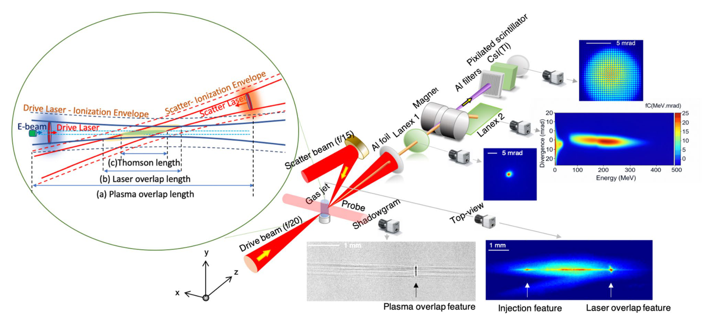
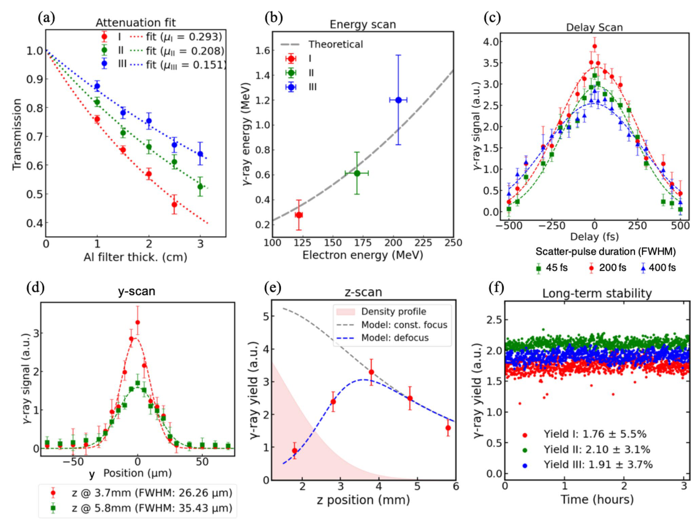
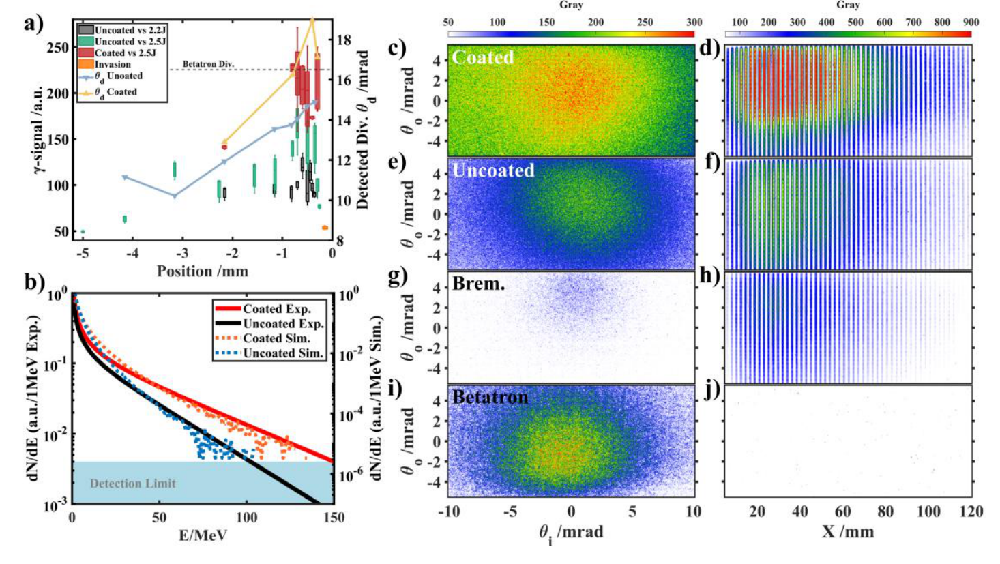
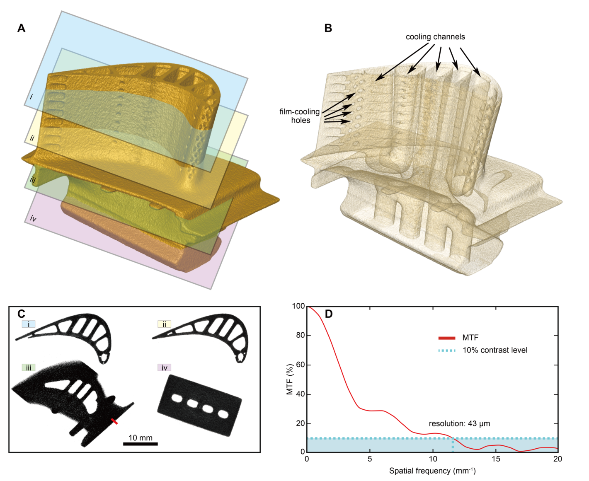
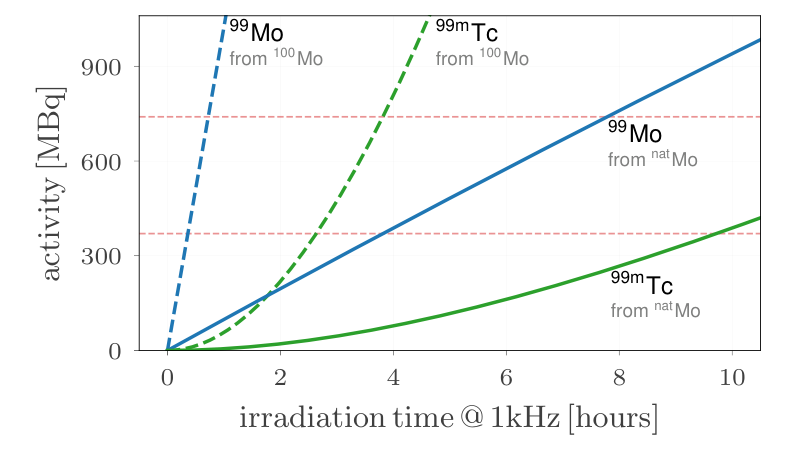
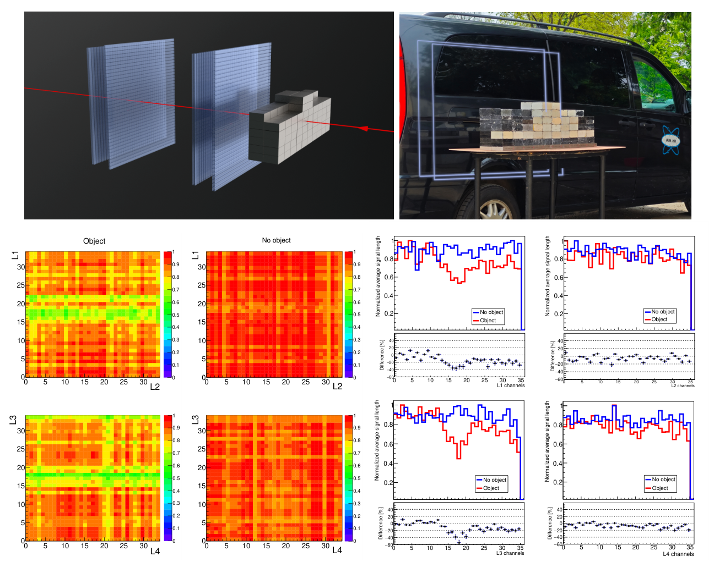

# 02 从加速束到辐射源、核反应和成像：怎样把前沿变成完整应用链

> 本章围绕“粒子源 → 转换/散射 → 输运 → 探测 → 应用目标”组织仓库论文，而非把光子数、最高能量和应用口号并排。仓库 `laser-accelerated-beam-applications` 路由有 90 条记录，也收录常规加速器核数据、聚变中子源与诊断方法；它们为激光应用提供约束，不能都称激光应用实证。重点解释 14 组工作；2026 动态截止 2026-09-30。实验、理论/PIC、粒子输运和应用设计各有独立证据边界。

## 1. 入门地图：应用端决定源端应该优化什么

激光等离子体电子常有飞秒到皮秒时间结构，离子束常有极高瞬时通量；这些优势经过转换靶、漂移、慢化器和探测器后可能被改变。要理解论文，先问要完成哪种测量：

| 应用 | 真正需要的源特性 | 下游会改变什么 | 有效评价量 |
|---|---|---|---|
| 超快衍射、相位衬度成像 | 小发射度、小源尺寸、时间同步 | 色差、空间电荷、样品散射 | 相干长度、时间分辨率、图像对比 |
| 工业厚物体 CT | 穿透谱、平均通量、连续运行 | 转换靶散射、探测器与重建 | 可检测缺陷、MTF、曝光时间 |
| 光核/同位素 | 反应阈值以上的谱权重、靶内通量 | 核截面、吸收、热负载 | 每焦耳/每秒活度、纯度与回收率 |
| 快中子与 TOF | 短源脉冲、可知谱、低背景 | 转换靶尺寸、飞行距离、散射 | 能量分辨率、每能箱可计数事件 |
| 质子照相/材料照射 | 受控能谱、相空间、可追溯剂量 | 能量选择、离子能损、几何放大 | 场反演误差、剂量及均匀性 |
| 缪子成像 | 高能前向缪子、信号/背景可区分 | 厚靶与屏蔽、几何接受度 | 透射/散射对比、粒种鉴别、通量 |
| FEL | 高峰值流强、低发射度、窄能散 | 色差、相位空间匹配 | 增益长度、饱和光子谱、稳定性 |

粒子或光子“每发总数”不是亮度。通量通常为单位时间粒子数；面通量为单位面积、单位时间；fluence 是时间积分后的单位面积总数。光源 brilliance 还除以源面积、角度平方和相对带宽。若文中使用 $0.1\%\mathrm{BW}$，不能与全谱 photons/sr 直接比较。高峰值与高平均值也不同：平均率近似 $fN_{\rm shot}$，但真实可用率还乘以占空比、合格束发比例和输运效率。

## 2. 四种电子辐射源，从原理到可测指标

### 2.1 Betatron 辐射：电子在通道里摆动

等离子体空泡中的离子背景产生聚焦力，近轴电子以 $\omega_\beta\simeq\omega_p/\sqrt{2\gamma}$ 振荡。设振幅 $r_\beta$，无量纲强度 $K_\beta=\gamma\omega_\beta r_\beta/c$。当 $K_\beta\ll1$ 时更像窄带 undulator，当 $K_\beta\gg1$ 时更像宽谱 wiggler。后者的临界频率量级是

$$
\omega_c\simeq\frac32 K_\beta\gamma^2\omega_\beta,
\qquad E_c=\hbar\omega_c.
$$

它来自相对论加速度辐射被压缩到约 $1/\gamma$ 的前向角内，观测脉冲比轨道周期短得多。增加电子能量和振幅可增硬谱，却也可能增大发射度和光子角散。双脉冲增强 betatron [R288](../appendices/reference-catalog.md#r288) 与耗尽长度之后的高通量 X 光 [R328](../appendices/reference-catalog.md#r328) 因此应同时检查电子振荡幅度、被加载电荷和辐射积分长度，不能只把光子增强归因于电子最高能量。

### 2.2 逆 Thomson/Compton：两次多普勒增益

能量为 $\gamma m_ec^2$ 的电子与光子正碰，在电子静止系中入射光子先提高约 $2\gamma$ 倍；近后向散射的光子变回实验室系又提高约 $2\gamma$ 倍，经典低强度轴上结果约 $E_\gamma=4\gamma^2\hbar\omega_0$。加入反冲、有限观测角和线偏振强场有效质量后，常用第一谐波近似是

$$
E_\gamma(\theta)\simeq
\frac{4\gamma^2\hbar\omega_0}
{1+a_0^2/2+\gamma^2\theta^2+4\gamma\hbar\omega_0/(m_ec^2)}.
$$

这不是全部非线性谐波谱。$a_0\ll1$、反冲项很小时称 inverse Thomson 更自然；强场和反冲显著时需 Compton/QED。非正碰会减少增益：相交角 $\alpha$ 的弱场前向 numerator 约为 $2\gamma^2(1-\cos\alpha)\hbar\omega_0$，其中正碰 $\alpha=\pi$。在 $0.8\,\mu\mathrm m$ 光与 200 MeV 电子的量级例中，$\gamma\approx392$，正碰得到约 0.95 MeV 光子；该教学估算未包含实际谱、碰撞角和 $a_0$。

电子能散经 $E_\gamma\propto\gamma^2$ 约放大为两倍相对光子能散，角散与非线性也会展宽。因此准单色性需要碰撞与准直设计。独立散射脉冲易调强度、脉宽和位置，但增加同步；等离子体镜让驱动光反射回电子，易于时空自同步，却引入反射率、曲率、靶预等离子体和污染。

### 2.3 制动辐射：高 Z 转换靶把电子能变成宽谱光子

电子经过核库仑场时偏转而辐射。辐射长度 $X_0$ 是高能电子因制动辐射平均能量减少到 $1/e$ 的尺度；粗略写 $dE/dx\simeq-E/X_0$，得 $E(x)\simeq E(0)e^{-x/X_0}$。该近似不含低能电离损失、能谱和二次 shower。高 Z 通常缩短 $X_0$，提高辐射转换，但厚靶同时增大散射、源尺寸、脉冲拖尾和光子吸收。

对单电子可粗略理解为 $dN_\gamma/dE_\gamma\propto1/E_\gamma$ 的宽谱，截止不超过电子可用能量；全束光子谱需对电子相空间积分。宽谱源适合厚物体与光核，但谱平均反应截面必须与实际谱卷积。转换靶的最高效率位置未必等于最大样品反应产额，因为后者还受几何接受度、吸收、反应阈值和靶厚影响。[R285](../appendices/reference-catalog.md#r285)、[R286](../appendices/reference-catalog.md#r286)

### 2.4 FEL：把自发辐射放大为相干束

电子通过周期磁场，undulator 共振波长为

$$
\lambda_r=\frac{\lambda_u}{2\gamma^2}(1+K_u^2/2),
\qquad K_u=\frac{eB_u\lambda_u}{2\pi m_ec}.
$$

相近波长的光与电子相互作用，把能量调制转成微束团，微束团再相干辐射形成正反馈。小信号增益宽度由 Pierce 参数 $\rho$ 的量级控制，常要求相对能散不显著超过 $\rho$，发射度和色差也不能破坏共振。这里给的是一维直觉，真实 FEL 需三维增益与输运模型。LWFA 的高峰值流强有利，较大能散和抖动又不利，所以必须端到端优化。[R252](../appendices/reference-catalog.md#r252)、[R264](../appendices/reference-catalog.md#r264)

## 3. 核反应的基础：为何源谱比最高能量更重要

### 3.1 截面卷积与巨偶极共振

反应截面 $\sigma(E)$ 表示每个靶核对入射粒子的有效反应面积，$1\,\mathrm b=10^{-28}\,\mathrm{m^2}$，$1\,\mathrm{mb}=10^{-31}\,\mathrm{m^2}$。薄靶近似的单发反应数为

$$
Y=N_T\int\Phi(E)\sigma(E)\,dE,
$$

这里 $N_T$ 是靶核面密度（核/cm²），$\Phi(E)dE$ 是打到靶上的粒子数谱；若用谱 fluence（粒子/cm²/MeV），则应用总靶核数而非再乘面密度。必须先对齐几何定义，避免多乘一个面积。厚靶还需沿深度积分能损、光子吸收和空间通量。

重核中典型巨偶极共振可理解为质子流体与中子流体反相振荡，光子把能量输入集体模式，随后通过蒸发中子等通道衰变。它在约十到几十 MeV 区间产生大的光核截面；不同核、不同多中子阈值和形变会改峰位与分裂。大多数电子即使很高能，若转换后谱权重没有落在合适反应区，反应数仍可能不高。这是直接以产额作为优化目标的物理理由。

谱平均截面

$$
\langle\sigma\rangle_\Phi=
\frac{\int\Phi(E)\sigma(E)dE}{\int\Phi(E)dE}
$$

依赖积分下限。用反应阈值以上的通量归一化与用全谱归一化得到不同值；比较核数据库必须统一这一约定。[R154](../appendices/reference-catalog.md#r154)

### 3.2 同位素活度不是原子数，也不是临床剂量

若生产率为 $R$ 个原子/s、衰变常数 $\lambda=\ln2/T_{1/2}$，由 $dN/dt=R-\lambda N$，初始无产物时

$$
N(t)=\frac{R}{\lambda}(1-e^{-\lambda t}),\qquad
A(t)=\lambda N(t)=R(1-e^{-\lambda t}).
$$

活度单位 Bq 是每秒衰变，不是 J/kg 的吸收剂量 Gy。停照后的活度再乘 $e^{-\lambda t_c}$，计数时需加入分支比、探测效率、计数时间和死时间。$^{99}$Mo 衰变产生 $^{99m}$Tc，需解母女核 Bateman 方程；例如初始无女核且母核一次制备后衰变，女核数为

$$
N_D(t)=b\lambda_PN_P(0)
\frac{e^{-\lambda_Pt}-e^{-\lambda_Dt}}{\lambda_D-\lambda_P}.
$$

其中 $b$ 是进入所需女核的分支比例。连续照射、反复洗脱和化学回收又要修改方程。因此模拟的单发 $^{99}$Mo 原子数，只是生产链的上游输入，不是直接交付药物或患者剂量。[R286](../appendices/reference-catalog.md#r286)、[R340](../appendices/reference-catalog.md#r340)

### 3.3 氘聚变、pitcher–catcher 与阻止本领

热 D–D 融合中 $D+D\to n+{}^3\mathrm{He}$ 给约 2.45 MeV 中子；靶若近静止且离子热速较低，谱相对窄。束靶反应的质心在移动，谱和方向可明显改变。pitcher 产生氘或质子，catcher 提供反应材料；中子也可由 breakup、光核等通道生成，不能看见中子就断言 D–D。

对厚反应靶，离子能量沿程下降，定义阻止本领 $S(E)=-dE/dx>0$。忽略散射和靶状态变化时，在反应稀少、总概率远小于 1、忽略初级粒子因反应被去除时，单个离子的反应概率近似

$$
P(E_0)\simeq\int_0^{E_0}\frac{n_T\sigma(E)}{S(E)}\,dE.
$$

这是把 $dx=-dE/S$ 代入薄层稀有反应增量的结果；厚度有限时积分下限为出射能量。若单一反应通道显著去除初级离子，先计算光学厚度 $\tau=\int n_T\sigma/S\,dE$，完整概率为 $1-e^{-\tau}$；竞争反应通道须在每个增量中加入沿程生存因子。它说明最大截面处入射未必最优，因为较高能粒子会减速穿过有利能区。温稠密靶与强束流还会使 $S(E,T_e,n_e)$ 随时间变化，不能只套冷材料 SRIM 曲线。[R173](../appendices/reference-catalog.md#r173)、[R335](../appendices/reference-catalog.md#r335)

## 4. 2026 年重点论文：十四组完整链和未闭合环节

### 4.1 辐射源开始向应用端验收

**① 稳定、可调的双激光 MeV γ 源。** [R138](../appendices/reference-catalog.md#r138) 在 BELLA 让约 122–204 MeV 的 LWFA 电子与独立散射脉冲以约 160° 相交，产生峰能 276 keV–1.2 MeV、最高约 $2\times10^7$ 光子/发。独立控制散射位置与脉宽，使交互长度与 walk-off 匹配，延长散射脉冲至约 200 fs 能增加产额。这里真正的工程问题是束团与光斑在斜交几何中迅速走离；只提高峰值强度可能压缩有效重合时间。源端 γ 测量是实验，光核或治疗性能仍需另外验收。

图 02-1｜同时控制两束激光和电子的时空重合。[R138，原图 1，PDF 第 2 页](../appendices/reference-catalog.md#r138)

主图连接驱动激光、气体喷流、约 160° 反向散射激光，以及电子和 γ 两条诊断链。左圆图把 (a) 等离子体重合长度、(b) 两激光重合长度、(c) 真正电子—散射光相遇的 Thomson 长度区分开；它是几何示意，没有数值坐标，不能把最长的重合区域直接当辐射区。磁铁把电子导向 LANEX，γ 继续穿过铝滤片到 CsI(Tl)。右上 γ 斑用 5 mrad 标尺；电子谱图横轴 MeV、纵轴发散 mrad，色标 fC/(MeV·mrad)，所以同时保留谱电荷与角分布。下方阴影图和顶视等离子体图均用 1 mm 标尺，分别帮助定位重合和电离注入；它们的亮度未共用同一绝对归一化。该图说明高 γ 产额是重合积分的结果，需要独立定位、延迟与束诊断。装置布局和代表图像属于实验依据，示意图中的光路距离、脉冲轮廓不构成尺度精确的输运或强度测量。

图 02-2｜用多种扫描把源端性能连成证据链。[R138，原图 5，PDF 第 7 页](../appendices/reference-catalog.md#r138)

图 (a) 横轴铝厚度 cm，纵轴无量纲透过率；指数拟合的 $\mu=0.293,0.208,0.151$ cm$^{-1}$ 经 NIST 衰减系数得到有效光子能量，而非直接逐光子能谱。(b) 两轴均用 MeV，把这些反演值与电子能量及 Thomson 预测比较。(c) 横轴延迟 fs、纵轴任意单位信号，45/200/400 fs 散射脉冲中 200 fs 的峰值较高，体现斜碰走离与峰强度的折中；拟合 503–656 fs 的宽度是互相关宽度。(d) 横轴横向位置 μm，26.3/35.4 μm 是重合扫描 FWHM，需假设 Gaussian 并扣除激光宽度才得电子尺寸。(e) 横轴 $z$ 位置 mm，含离焦的蓝模型更符合约 3.7 mm 最优点，粉区是密度轮廓。(f) 横轴小时，三个实验运行的信号 RMS 为 3.1–5.5%。除透过率外，信号轴均为任意单位。这组实验扫描支持可调、可稳定运转的源，并清楚保留有效能量、束尺寸与离焦机制的反演条件。

**② 涂层等离子体镜增强 ICS。** [R230](../appendices/reference-catalog.md#r230) 在代表 100 TW 实验位置，光子数由未涂层约 $1.3\times10^7$ 提到约 $7.9\times10^7$，约六倍。反演的临界能量由约 26 增到 39 MeV，截止由约 100 增到 150 MeV。PIC 与侧视发光支持预等离子体使反射临界面弯成凹面、反射光自聚焦。光子数、临界能量与激光 $a_i$ 都含探测响应/角分布反演，不能写成所有参数独立直接测量。与双激光相比，它降低同步复杂度，却把靶演化变成关键系统误差。

图 02-3｜先辨别 γ 的来源，再评价涂层增益。[R230，原图 2，PDF 第 6 页](../appendices/reference-catalog.md#r230)

图 (a) 横轴镜位置 mm，箱形图用左轴任意单位辐射信号，折线用右轴 mrad 发散；黄区是镜侵入气流，不能把这里的变化全归因反射率。虚线给无镜 betatron 的 16.8 mrad 发散。(b) 横轴光子能量 MeV，纵轴对数 $dN/dE$；实验和模拟分别用左右任意单位/MeV 标度，实线是反演实验谱，虚线是模拟，蓝区标识检测下限，不能按高度比较绝对通量。右侧 (c,d) 是 −500 μm 涂层镜，(e,f) 是同位置裸镜，(g,h) 是 −3000 μm 裸镜的制动辐射对照，(i,j) 是无镜 betatron。中列横纵角度 mrad 给 IP 斑；右列横轴 mm 给 LYSO 中沿深度的响应，色条 Gray 表示图像灰度而非 Gy 剂量。涂层条件有更强高能响应，远镜和无镜对照帮助排除背景。此图支持 ICS 增强，具体光子数及高能截止仍依赖响应、谱形和角分布重建；原图没有独立直接测量反射场的 $a_0$。

**③ 微库仑源与焦耳级硬 X。** [R285](../appendices/reference-catalog.md#r285) 将 PETAL 的宽谱高电荷电子打入金属转换板，报告硬 X 总能量约 3.3 J、高能谱分量温度 $9.3\pm1.1$ MeV；光子总能量由实测谱和模拟横向分布共同估算。电子 17 J 与光子 3.3 J 确实闭合了部分能量链，但尚未发表这一实验的光核活化/中子终点。源优势是通量，宽发散和 Maxwell 型电子谱限制准单色应用。[原始来源](https://arxiv.org/abs/2608.16459)

**④ 现场工业 CT 的连续运行证据。** [R287](../appendices/reference-catalog.md#r287) 把 40 TW 系统放入集装箱，开展七个月现场运行。72 h、0.1 Hz 电子数据给平均约 86.2 MeV、1.3% 峰能 RMS，$>70$ MeV 电荷约 164 pC、9.8% RMS；这组统计不应与另一 3.3 Hz 剂量条件混写。钨转换源的半影 FWHM 约 38 μm，多于 60,000 次曝光的涡轮叶片 CT 在 MTF 10% 处约 43 μm 分辨。小源是贡献因素，最终 CT 分辨还含重建与采样；也不能把多发 CT 称实时单发成像。

图 02-4｜源尺寸优势最终要通过 CT 的空间响应检验。[R287，原图 4，PDF 第 17 页](../appendices/reference-catalog.md#r287)

图 (A) 是叶片外轮廓三维重建，彩色平面标出 i–iv 四个截面；(B) 剖开重建体，箭头指出内冷却通道和表面膜冷却孔。二者是重建展示，没有独立定量色标，三维渲染的光照亮暗不能当材料密度。(C) 给四处横截面，10 mm 标尺让内部通道大小可估，红短线标出用于边缘分析的位置。(D) 横轴空间频率 mm$^{-1}$，纵轴调制传递函数 MTF 的百分比，低频归一化到 100%；红曲线下降到青色 10% 阈值时约 11.6 lp/mm，按 $1/(2f)$ 换算为约 43 μm 特征半周期。它是重建系统在所取边缘、所用阈值下的分辨判据，不能与源斑 38 μm FWHM 混为同一测量。该 CT 累计超过 60,000 次曝光，支持现场持续运行和工业复杂结构成像；不能据静态三维图声称单发实时 CT、任意材料相同分辨，或临床成像已经验收。

**⑤ 超低发射度电子的衍射。** [R314](../appendices/reference-catalog.md#r314) 在 2.7 MeV 得约 124 nm·rad 归一化发射度，观察硅纳米膜衍射。对应的横向相干尺度可粗略理解为 $l_c\sim\hbar/\sigma_{p_\perp}$：横向动量散越小，越能解析晶格峰。测量方法是永磁螺线管扫描，必须审计色差与模型；实验衍射并不自动给出飞秒泵浦—探测分辨率。[官方 v1/v2 记录](https://arxiv.org/abs/2602.12765) 显示初投在二月、修订在八月。

**⑥ 首个等离子体驱动 X-FEL 的用户路线。** [R364](../appendices/reference-catalog.md#r364) 围绕 EuPRAXIA@SPARC_LAB 预计的约 1 GeV witness、3.2–5.2 nm、<10 fs、100 Hz SASE 源规划 pilot experiments。作者选择单发等容加热—超快电子衍射与利用宽带谱的 ghost XAS，体现“用预计的真实初期源能力选问题”。这些是设计参数和策略，不是已经达成的光子验收；其中 PWFA 的外部束源链也不同于纯 LWFA FEL。对读者最有用的是避免默认所有 X 光用户都需要单色、最高亮度同一目标。

### 4.2 核应用：从源谱到产额与核数据

**⑦ 直接优化 $^{99}$Mo，而非只优化电子。** [R286](../appendices/reference-catalog.md#r286) 将 FBPIC 的完整相空间交给 openTOPAS，经 Ta 制动辐射转换到天然 Mo；贝叶斯目标直接取 $^{100}\mathrm{Mo}(\gamma,n){}^{99}\mathrm{Mo}$ 数。10 TW、35 fs、372 mJ 的理想驱动扫描找到 $>8$ MeV 电荷约 2.48 nC、平均 58.6 MeV、最高 249 MeV 的模拟束，每发预测 $9.42\times10^6$ 原子，超过先优化电子再事后估产额的基线一个数量级。最优约 5 μm 下坡非常苛刻；假设 1 kHz 才得到约 10 h 到 370 MBq $^{99m}$Tc 的估计，作者明确这类驱动条件当前不可直接获得。未纳入全部副反应、靶热与回收，不能称完成药物生产。[官方来源](https://arxiv.org/abs/2608.17119) 初次提交 2026-08-17，与仓库发表日期一致。

图 02-5｜从每发产额到活度，重复率是假设的一部分。[R286，原图 5，PDF 第 10 页](../appendices/reference-catalog.md#r286)

横轴是明确假设 1 kHz 时的照射时间小时，纵轴活度 MBq，即每秒 $10^6$ 次衰变；蓝线为母核 $^{99}$Mo，绿线为子核 $^{99m}$Tc。实线用天然 Mo，虚线用全富集 $^{100}$Mo，后者增加可参与 $(\gamma,n)$ 反应的靶核比例，因而达到同一活度所需时间更短。母核近似先线性积累，子核需要母核形成后再衰变供给，所以绿色曲线起初明显滞后，这正是前述耦合活化方程的物理内容。两条红水平线在图中只是 370/740 MBq 参照，不能当实测或普适医疗验收线。整图是 PIC—Monte Carlo 每发产额与衰变动力学外推，没有照射误差条，更没有化学分离与纯度实测。原文紧接着指出数百 mJ 的 kHz 驱动和 5 μm 密度下坡仍有实现难度，且优化未包含所有副反应。它帮助评价端到端优化，却不能把 10 h 外推直接写成已具备日常药物供应能力。

**⑧ 光核与 D–D 快中子俘获比较。** [R100](../appendices/reference-catalog.md#r100) 把激光源模型、Geant4 输运/屏蔽、基于核模型的俘获事件生成串联。D–D 源可提供约 2.45 MeV、$\lesssim20$ ps 的窄谱短脉冲，适合 TOF；LWFA 光核源更宽谱，源脉冲可 $\gtrsim50$ ps，但重复频率可能提高累计稀有事件。其优劣受反应核、源距、脉冲展宽、核态寿命和运行频率共同决定。论文的 start-to-end 是数值链；引用很高的峰值通量时必须注明是源区尺度，不能当样品或探测器接受通量。

**⑨ 离子束打 catcher 的真实中子源。** [R101](../appendices/reference-catalog.md#r101) 在 CoReLS 扫描 CH₂/CD₂ 超薄靶，结合滤片识别离子组分，把氘束打 Cu 转换靶，报告中子可到约 15 MeV、约 $2\times10^7\,n/J$ 量级。这个源包含 breakup 等反应，不能拿理想各向同性 2.45 MeV D–D 模板替代。离子能随电荷/质量的标度是机制判断证据之一，仍需与靶透明和电子动力学联合分析。它与上一个模拟比较形成互补：前者给设计图景，后者给真实源约束。

**⑩ 产氚测试的源保真度。** [R210](../appendices/reference-catalog.md#r210) 把 TNSA 氘分布、厚靶 D–D 模型和 Monte Carlo 包层输运相连。匹配三维例中，真实谱相对于理想源使天然锂每源中子的产氚增加约 43.5%，方向性额外修正约 1%；90% $^{6}$Li 富集时总变化约在 ±1.5%。慢化可大幅增加总产额，又削弱或反转真实源的相对增益。结论是源谱与包层组成耦合，不是“所有真实激光中子源都提高产氚”。这是数值敏感性研究，未完成实体包层实验。

**⑪ 核数据库和输运代码谁更不确定。** [R248](../appendices/reference-catalog.md#r248) 在抑制多次反应的首碰撞基准中，用相同 ENDF7u 数据时 OpenMC 开发分支与 MCNPX 积分产额差 <0.7%；换核评价数据后差可到 11.3%。FLUKA 某些积分产额接近而能谱仍不同。这说明代码一致可能只是共同用了同一数据，不能等同于实验准确。其开发分支和 broomstick 几何也不能自动担保复杂转换靶。[R154](../appendices/reference-catalog.md#r154) 的镍谱平均截面与数据库差异进一步提示，核数据误差应进入端到端产额预算。

**⑫ 用准单色 γ 测 GDR。** [R373](../appendices/reference-catalog.md#r373) 用 8–43 MeV LCS γ 与多重性分选，给 Ho/Tm 的多个中子道；旧 Ho 数据需讨论约 +0.35 MeV 移能、约 10% 归一化和 1n/2n 错分。[R389](../appendices/reference-catalog.md#r389) 在上海 LCS 源测 $^{209}$Bi 主峰约 13.5 MeV、$662.96\pm22.56$ mb。两篇都不是 LWFA 驱动实验，却为激光光核设计提供原始截面约束；由模型推出的逆 $n,\gamma$ 反应或 γ 强度函数不是同一实验直接测量。这是“背景核数据”应纳入综述的原因。

### 4.3 束流终端与新粒种

**⑬ ELIMED 的绝对剂量 commissioning。** [R284](../appendices/reference-catalog.md#r284) 输运选择后质子中心能量 $23.45\pm0.5$ MeV、FWHM 2.60 MeV，约 5.5 mm 的 50% 等剂量场，在水等效深度约 5.5–5.7 mm 有 Bragg 峰。Faraday cup、双隙电离室与 RCF 建立逐发链；上游膜改变 FC 接受度，Monte Carlo 修正后二者残差约 7%。关键贡献是剂量溯源和仪器扰动审计，不是临床深部治疗。超短束的高瞬时剂量率也不自动证明 FLASH 生物效应；后者需细胞/组织终点与剂量控制。

**⑭ 激光驱动 GeV 缪子成像。** [R380](../appendices/reference-catalog.md#r380) 让最高约 8 GeV LWFA 电子进入 40 cm Pb，厚转换与复合屏蔽筛掉大量电磁背景。20 m 与 29 m 处实验束宽 FWHM 为 4.51 m、6.35 m，GEANT4 给 4.43 m、6.27 m。成像部分在约 23 m 处用 30 发有物体/无物体测量；本次 PDF 核对的物体尺寸是 **20×25×100 cm³**，10×10×5 cm³ 是单块铅砖尺寸，不能当整件成像物体尺寸；原图 9 的照片图注也明确成像物体由此尺寸铅砖组成。旧笔记曾把单块与整体混淆。模拟给 20 m 探测器沉积能 86.91% 来自缪子；该比率不是逐事例粒种鉴别。论文支持缪子主导成像，绝对通量、逐粒子 GeV 动量和背景份额仍含模型推断。[官方原始页](https://arxiv.org/abs/2609.28788)，2026-09-23。

图 02-6｜透射阴影是探测信号图，粒种仍需背景分析。[R380，原图 9，PDF 第 9 页](../appendices/reference-catalog.md#r380)

左上示意两组正交条形探测板及红色束方向，右上照片显示铅物体与车内探测器位置；图注的 10×10×5 cm³ 是构成物体的铅砖尺寸，整体尺寸须看正文。下左两行分别是前模块 L1–L2、后模块 L3–L4，有物体/无物体图并排；轴为通道编号，每条宽 2.5 cm，颜色 0–1 是归一化的每条、每发平均信号长度，由 30 发求得，不能当绝对缪子数。下右四组曲线逐层比较红色有物体与蓝色无物体信号，下方给相对差异百分比。主要阴影沿 L1/L3 所示方向形成明显凹口，L2/L4 的变化较弱，与几何投影一致。图确实支持透射成像，却未逐事例鉴别粒种或动量；缪子主导判断还依赖测得电子谱驱动的 Geant4 背景对照。原文同时承认高光子流 SiPM 非线性、温度等效应未完整纳入 ToT 校正，这限制了从归一化阴影进一步推出绝对通量与材料厚度的精度。

缪子链的核心是电子先产生 γ，随后 $\gamma+A\to\mu^++\mu^-+A$。缪子质量约为电子的 207 倍，制动辐射更弱，可以穿过厚物体，但产生阈值、截面和屏蔽接受度都昂贵。[R237](../appendices/reference-catalog.md#r237) 的逐轨迹能量分辨测量与 [R208](../appendices/reference-catalog.md#r208) 的高能粒子照相是互补诊断入口；[R361](../appendices/reference-catalog.md#r361) 的 kJ DLA—Pb 链预测正电子/缪子数，则仍是准三维 PIC 与 GEANT4 的设计结果，不能与 R380 的实验成像合并为已实现更高产额。

## 5. 把分散论文连成设计决策

### 5.1 源的相空间在应用端必须保留

磁选器 [R310](../appendices/reference-catalog.md#r310) 把固体靶宽谱电子选择到约 0.5–5 MeV，核心电荷约 $0.73\pm0.44$ nC，并通过脉冲磁场显著压缩束斑。它证明电子筛选/准直可行，不代表入射转换靶的总能量保持；被裁掉的电子可能恰好贡献大部分原始电荷。离子实验优化 [R123](../appendices/reference-catalog.md#r123)、残余角啁啾 [R207](../appendices/reference-catalog.md#r207) 和多组分束团化 [R224](../appendices/reference-catalog.md#r224) 同样说明应用端不能只输入一条能谱而丢掉能量—角度相关性。

核端优化可结合 [R119](../appendices/reference-catalog.md#r119) 的质子谱代理与 [R151](../appendices/reference-catalog.md#r151) 的多目标靶优化，但代理必须在真正的角度、电荷与温度域内使用；超出训练域时应返回模型不确定性。AI 辅助 PHITS 工作流 [R203](../appendices/reference-catalog.md#r203) 可以降低建模操作成本，却不能替代物理表、核库和几何基准。所有自动化都需要守住单位、粒子权重和总能量账。

### 5.2 p–B 与温稠密靶提供反馈例子

[R335](../appendices/reference-catalog.md#r335) 的 pitcher–catcher 研究把强束流预热和阻止本领反馈纳入，所研究参数下最优入射中心能量从约 672 keV 截面共振附近移向约 900 keV。较高能质子先减速，再在更宽有利能区贡献反应；前沿预热还可能使尾部能损降低。它是动力学/数值模型结论，不能读成 p–B 净能量增益实验。[R150](../appendices/reference-catalog.md#r150) 的强耦合等离子体能损测量与 [R173](../appendices/reference-catalog.md#r173) 的统一阻止模型提供检验方向：靶是活跃介质，源和靶不能总是单向耦合。

### 5.3 诊断需求由最终信号决定

质子照相中，粒子横向冲量近似 $\Delta\mathbf p_\perp=q\int(\mathbf E_\perp+\mathbf v\times\mathbf B)_\perp dt$，末态偏转约 $\Delta p_\perp/p$。电场与磁场都能改图像；几何放大、源尺寸、原始能谱和 caustic 使反演不唯一。[R189](../appendices/reference-catalog.md#r189) 的线圈磁场照相将实验约 40–50 T 与模拟/反演联系，仍需审计场分离与源模型。

γ 能谱与中子谱不能只依赖“探测器总亮度”。闪烁体响应标定 [R247](../appendices/reference-catalog.md#r247)、晶体/SiPM 比较 [R163](../appendices/reference-catalog.md#r163)、单事例中子 TOF [R072](../appendices/reference-catalog.md#r072) 各提供不同响应维度；[R336](../appendices/reference-catalog.md#r336) 的中子–γ 分类器需检验在真实混合场和强瞬时流强下的域迁移。[R377](../appendices/reference-catalog.md#r377) 的新中子闪烁材料是探测器方向，不应直接升级为所有激光中子测量的性能。

### 5.4 同位素链还需要衰变和化学

[R166](../appendices/reference-catalog.md#r166) 对光子活化锡的半衰期测量，提醒衰变核数据也决定活度反演；[R340](../appendices/reference-catalog.md#r340) 讨论用中子制备长寿命 $^{228}$Th/$^{229}$Th 母体形成发生器供应链。这是聚变/核源设计与供应情景，模型的 reference dose-equivalents 不等于完成若干患者治疗。可扩展应用需要把富集材料、化学分离、子核纯度、批间一致性、靶寿命和运行经济性连起来；仅报告核反应率仍是不完整的上游指标。

## 6. 怎样设计一次可复现的端到端研究

先明确应用指标，例如某能窗样品通量、每焦耳 $^{99}$Mo、指定飞行时间能箱计数、某厚度缺陷的可检出率。建立源相空间时同时保存位置、方向、能量、时间、粒种与宏粒子权重；如果只能输入谱，明说已经丢失相关性。转换靶扫描要同时统计逃逸光子谱、能量沉积、源尺寸、脉冲时间和次级中子，不只求一个最高 photon/J。

然后拆开三个误差层。源误差包括激光与靶波动；输运误差包括核库、反应模型与多次散射；测量误差包括响应标定、接受度、饱和/死时间、展开先验。分别改变各层参数，再联合传播到最终指标。两代码的总数一致只检验部分实现；还要比较能谱、角谱和时间尾。R248 已显示总产额符合与能谱符合可以分离。

在数值验收中至少做守恒账：入射总能量 = 离开能量 + 材料沉积 + 适用的核反应能量账；粒子单位与源归一化保持明确。不得将“每个模拟 primary”直接当每发实际电子。对少量稀有反应，报告 Monte Carlo 方差、事件权重与实际事例数，避免 weighted yield 很大而有效统计极低。

实验验收则用独立监测归一化源，记录空靶/无物体/不碰撞的背景和相同条件重复。活化实验同时测参考箔；成像报告 MTF 与曝光；TOF 报源脉宽和背景窗；剂量报告绝对标定与复合修正。它们与应用口号的关系是逐层证实，最终用户性能须在最终样品/靶站测量。

## 7. 一个关于 TOF 与脉冲展宽的具体例子

中子非相对论速度 $v=\sqrt{2E/m_n}$，飞行距离 $L$ 与时间 $t=L/v$ 给 $E=m_nL^2/(2t^2)$。小误差传播为

$$
\left(\frac{\sigma_E}{E}\right)^2\simeq
4\left[\left(\frac{\sigma_L}{L}\right)^2+
\left(\frac{\sigma_t}{t}\right)^2\right]
$$

这里假设距离与时间误差独立。2.45 MeV 中子速度约 $2.17\times10^7$ m/s，1 m 飞行约 46 ns。若综合时间分辨为 1 ns，时间项单独给约 4.3% 能量分辨；若是 20 ps，则约 0.087%。但 20 ps 的源脉冲不代表系统一定达到 20 ps：转换靶产点分布、路径差、散射尾与探测器响应都要进入 $\sigma_t$。延长飞行距离提高分辨，却降低几何接受度 $\sim A/(4\pi L^2)$，因此稀有俘获与高分辨 TOF 可能选择不同源距。这是 R100 对不同中子源评价为何不能只凭一项峰值数字的直观解释。

## 8. 学习路线与今年最值得追踪的问题

先读 [第 01 章](01-laser-plasma-acceleration.md) 的电荷、发射度与能量定义，再亲算 200 MeV 电子的 ICS γ 能量和 TOF 误差；第三步用 R138/R285 比较窄谱散射源与宽谱转换源；第四步用 R286 把电子谱卷积到核截面，再解活化方程；最后用 R284/R380 判断“模型解释的终点”与“直接测量的终点”是否相同。

2026 年本库的明显走向是平均通量与连续运转变得可测、端到端目标函数进入优化、核数据误差被单独拆出、缪子等新粒种开始触及成像示范。尚未闭合的是高平均功率转换靶寿命、全链绝对标定、应用接受度内的稳定谱、低背景稀有反应统计和长期剂量控制。结构化偏振/OAM γ 源可为核光子学提供新自由度，但目前许多是理论/QED-PIC 提案；应转读 [第 03 章](03-strong-field-qed.md) 再评价实验可测性。

## 本章证据来源与覆盖

本次对 R100、R138、R285、R286、R314、R380 的本地 PDF 重跑 `pdftotext -layout`，核对源参数、应用终点、数据/模拟分界；明确纠正 R380 旧笔记的成像物体尺寸。PDF 提取中的字体警告没有阻止目标段落读取，但本次没有重做全篇渲染 QA；新增 R138、R230、R287、R286、R380 的 6 幅原图均另读图注和邻近正文，核对原始整页与最终裁图。联网核查 R286、R380、R285、R314 的官方摘要与版本/初始提交日期。核查清单见 [来源记录](../data/acceleration-source-checks.json)。

原图页码、PDF/图像 SHA-256、裁框与核查状态保存在 [逐图侧录目录](../data/figure-assets/)，取舍见 [图选说明](../data/figure-selection-acceleration.md)。原图保持坐标、图例、子图与配色。

其他重点与串联论文复用既有中文笔记；R072 等尚缺成熟笔记的记录仅用作诊断主题入口，不新增未经核对的性能。没有重跑 PIC、openTOPAS、Geant4、FLUKA、OpenMC 或核反应生成器，没有临床/剂量学实验复现，也没有全世界 2026 论文穷尽检索。基础式是带条件的教学推导，涉及监管/医疗用途的论文只作科研证据讨论。本章覆盖跨越源、核数据、材料和探测的必要背景，但不是所有应用方向的工程设计手册。

本地详细入口：[Mo-99 笔记](<../../../daily/2026-08-20/notes/Nunes et al. - 2026 - Mo-99 production laser wakefield.md>)、[缪子成像笔记](<../../../daily/2026-09-26/notes/Dobre et al. - 2026 - Laser-driven GeV muon imaging.md>)；旧笔记物体尺寸以本章 PDF 复核结果为准。
