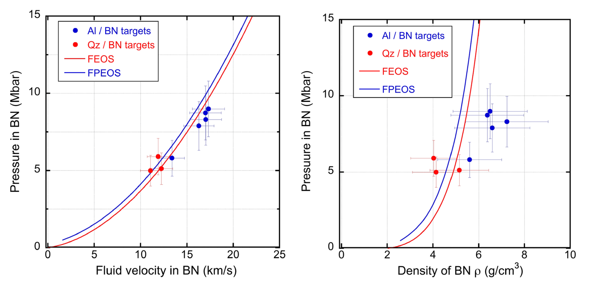
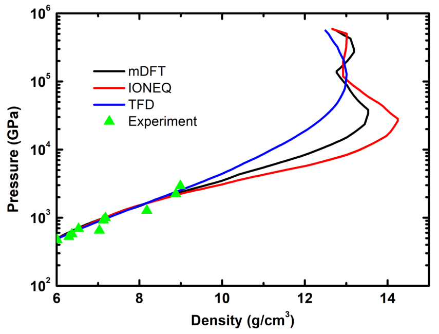
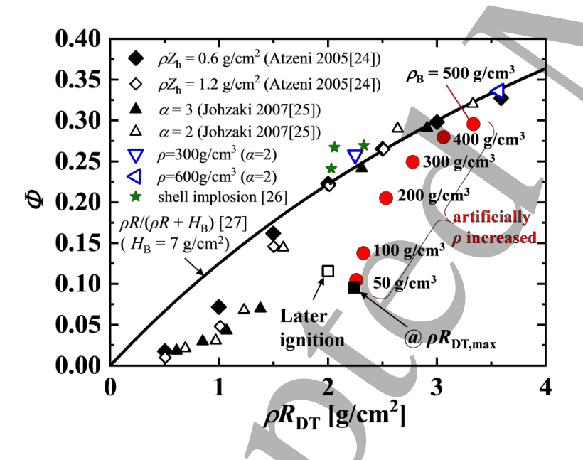
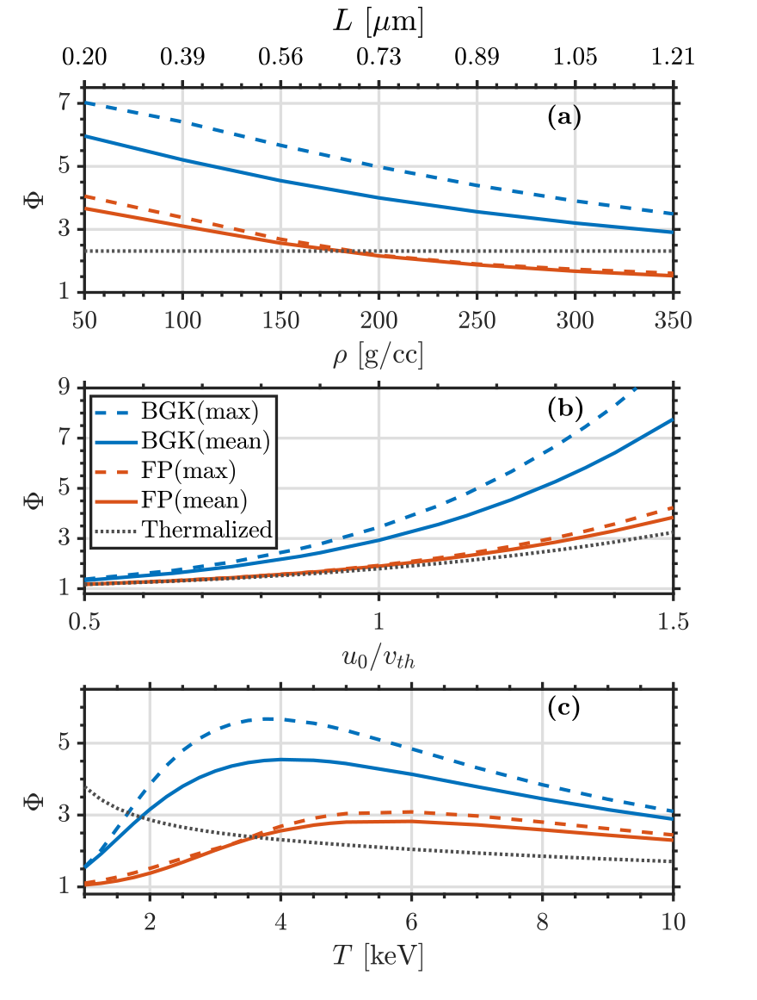
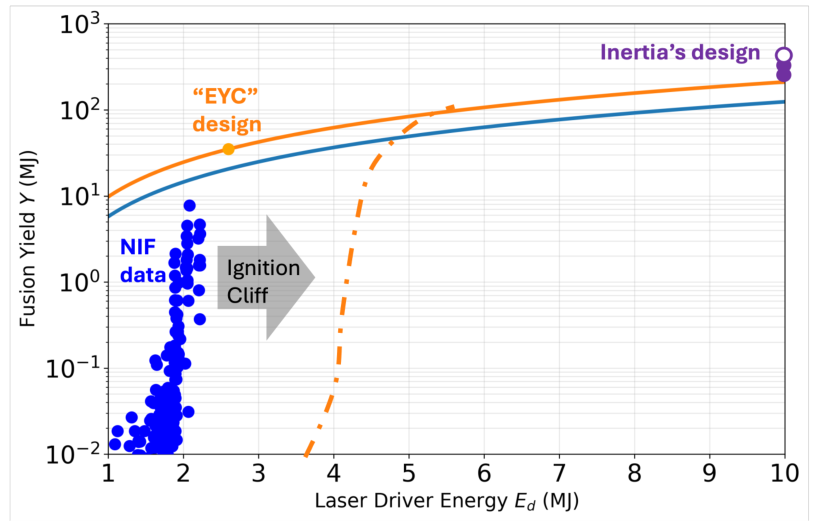
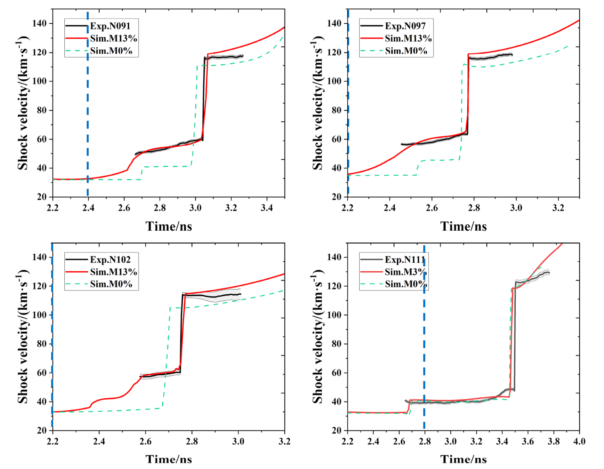

# 04 高能量密度、惯性约束聚变与实验室天体：从材料物性到燃烧闭环

> 范围与时点：以仓库截至 **2026-09-30** 的条目为语料。原分类包含 105 条，是自动路由的交叉标签，不是 105 篇纯 ICF 论文。本章重点解释物性、冲击、输运、燃烧和磁化实验室天体，束流产生技术参见第 01 章，强场与辐射反作用参见第 03 章，诊断通论参见第 08 章。论文编号链接到本综述统一参考目录。背景推导标为“教学推导”，不表示本次重跑了作者计算或独立复现实验。

## 1. 先理解这个方向要解决什么

高能量密度物理研究的是“能量挤在很小体积里以后，物质如何变化”。常用量级边界为能量密度约 $10^{11}\,\mathrm{J/m^3}$，相当于压力约 $1\,\mathrm{Mbar}=10^{11}\,\mathrm{Pa}$。这是便于划分研究区间的约定，不是所有等离子体现象都在这一点突然改变。固体被激光压缩后，密度可接近或超过普通固体，电子温度却达到 eV—keV；电子可能简并、离子可能强耦合、原子可能部分电离，所以“理想气体加完全电离”往往不够。BN 冲击测量、暖稠密铝第一性原理表和离子阻止实验，分别约束压力—密度关系、输运以及粒子沉积位置。[R039](../appendices/reference-catalog.md#r039) [R383](../appendices/reference-catalog.md#r383) [R150](../appendices/reference-catalog.md#r150)

惯性约束聚变（ICF）把小团 DT 燃料压缩、加热，让它在来得及膨胀以前释放聚变能。“惯性”指燃料自己的质量使解体需要有限时间，并非有一道静止的力把燃料永远关住。直接驱动让激光照胶囊表面；间接驱动先照黑腔壁，转成 X 射线再烧蚀胶囊。烧蚀层向外喷出的动量把剩余壳层向内推，最终在中心形成热斑。论文所讨论的冲击点火、快点火和双锥方案，是在压缩与加热的时序和几何上作不同分工，不能用一种方案的效率直接替另一种背书。[R363](../appendices/reference-catalog.md#r363) [R158](../appendices/reference-catalog.md#r158) [R274](../appendices/reference-catalog.md#r274) [R110](../appendices/reference-catalog.md#r110)

实验室天体则把“遥远、不可操控的系统”拆成可在激光平台重建的局部过程，例如磁湍流、磁重联、无碰撞冲击、磁场生成。相似的是动力学方程中的某些无量纲参数，不是实验室真的造出恒星或宇宙。磁湍流实验为间歇结构提供可控约束；题目中的宇宙学环形冲击类比需要另审相似映射，不应与真正的天体观测混为一谈。[R199](../appendices/reference-catalog.md#r199) [R186](../appendices/reference-catalog.md#r186) [R054](../appendices/reference-catalog.md#r054)

对初学者，最有效的主线是：**能量怎样进入 → 材料怎样压缩 → 热和粒子怎样输运 → 不稳定性怎样破坏对称性 → 聚变产物能否反过来维持燃烧 → 诊断是否足以区分这些机制**。今年的新文章大多在修补这条链，而不是单独追逐更高峰值温度。

## 2. 符号、单位和几个必须先检查的判据

下文 $n_e,n_i$ 是数密度，SI 单位为 $\mathrm{m^{-3}}$；文献常用 $\mathrm{cm^{-3}}$，换成 SI 要乘 $10^6$。$\rho$ 是质量密度，$1\,\mathrm{g/cm^3}=10^3\,\mathrm{kg/m^3}$。温度若写 eV，实际是 $k_BT$ 的能量，$1\,\mathrm{eV}=1.602\times10^{-19}\,\mathrm J$；公式用 $T$ 还是 $k_BT$ 必须看作者约定。面密度 $\rho R$ 的单位为质量/面积，$1\,\mathrm{g/cm^2}=10\,\mathrm{kg/m^2}$。磁场 $1\,\mathrm{MG}=100\,\mathrm T$，不要把高斯和特斯拉直接代入同一个输运公式。

**教学推导：为什么不能只问“温度多少”？** 取离子平均间距 $a=\left[3/(4\pi n_i)\right]^{1/3}$，邻近离子的库仑能与热能之比为

$$
\Gamma_i=\frac{Z^2e^2}{4\pi\epsilon_0 a k_BT_i}.
$$

分子里的两粒子相互作用能除以分母的随机热能，得到无量纲强耦合参数。$\Gamma_i\ll1$ 时独立二体碰撞较合理；接近或超过一时，关联和非线性屏蔽可能重要。电子另有简并判据 $\Theta=k_BT_e/E_F$，$E_F=\hbar^2(3\pi^2n_e)^{2/3}/2m_e$ 是非相对论自由电子费米能。$\Theta\lesssim1$ 表示量子统计不可忽略。暖稠密物质常处在两个近似同时不好用的交界区，正是第一性原理表与实验基准的价值所在。[R383](../appendices/reference-catalog.md#r383) [R150](../appendices/reference-catalog.md#r150)

输运需要再检查 $K_n=\lambda/L_T$，其中 $L_T=T/|\nabla T|$ 为温度梯度尺度。$K_n\ll1$ 才有理由用局域 Fourier 热流 $\mathbf q=-\kappa\nabla T$；高能尾的自由程更长，单一平均 $K_n$ 小也未必保证尾部局域。磁化用 $\chi=\omega_{ce}\tau_e=eB\tau_e/m_e$，不是只看绝对 $B$ 大小。热电子回旋半径、能量损失长度和靶几何三者的相对大小，决定磁场能否真正改变沉积。[R346](../appendices/reference-catalog.md#r346) [R242](../appendices/reference-catalog.md#r242) [R158](../appendices/reference-catalog.md#r158)

## 3. 冲击与状态方程：从守恒式一步步得到实验反演

**教学推导，平面稳态、忽略辐射能流的单一冲击。** 令冲击速度为 $D$，冲击前静止材料密度为 $\rho_0$，冲击后速度为 $u_p$。在冲击自身的参考系，材料流入速度 $D$，流出速度 $D-u_p$。质量守恒给

$$
\rho_0D=\rho(D-u_p),\qquad
\rho=\rho_0\frac{D}{D-u_p}.
$$

动量通量是压力加质量流携带的动量。用前式消去质量流，得到

$$
P-P_0=\rho_0 D u_p.
$$

再把单位质量的内能、压力功和动能写进能流守恒，消去 $D,u_p$，得到 Rankine–Hugoniot 能量关系

$$
e-e_0=\frac12(P+P_0)\left(\frac1{\rho_0}-\frac1\rho\right).
$$

右侧是压力乘比体积差，单位为 $\mathrm{J/kg}$，因此这里 $e$ 必须是比内能，不能误用总焦耳。Hugoniot 是同一初态经过不同强度冲击可到达的状态集合，不是完整 EOS 曲面，也不是等熵压缩轨迹。只测 $D$ 往往不足以唯一给出 $P,\rho,T$；参考材料 EOS 加界面压力/速度连续性，才构成阻抗匹配反演。[R039](../appendices/reference-catalog.md#r039) [R383](../appendices/reference-catalog.md#r383)

**重点 1：BN 到约 9 Mbar 的实验约束。** R039 用 438 nm、约 350 ps、最高约 200 J 驱动 h-BN，平顶直径约 400 μm；条纹光学高温计测 BN 与参考层的冲击自发光轨迹，再作阻抗匹配。本次布局文本复核了这些条件及“up to 9 Mbar”口径。它是新冲击数据，不是凭计算拟合出来的高压 EOS；但最终压力密度仍通过参考层模型与测速误差传播获得。读这篇时，应先区分自发光前沿、真实冲击位置和温度诊断，再看参考材料的释放线选择。对 ICF 材料，新的约束点能改变冲击时序与层间阻抗判断，却没有证明 BN 靶已实现聚变性能。[R039](../appendices/reference-catalog.md#r039)

**图 04-1｜BN冲击状态：速度空间比密度空间更容易判读。**

原 Fig. 7（PDF 第6页）左右两图共同以压力为纵轴，单位 Mbar；左横轴是 BN 的**流体粒子速度**，单位 km/s，右横轴是压缩密度，单位 g/cm³。不要把左横轴当成直接追踪到的冲击前沿速度。蓝点与红点分别使用 Al、石英参考层，蓝线 FPEOS 与红线 FEOS 是 EOS 预测。左图显示压力随粒子速度上升，约9 Mbar的点已接近两模型的可分辨区域；右图中同一批点横向误差明显更大，说明从测速推密度时反演链放大了不确定性。它的论证作用是给模型增加真实冲击约束，而非只展示一条理论 Hugoniot。重要限制在图后正文：这些点使用穿层平均冲击速度，仍受冲击非定常影响；作者随后借 MULTI 重建界面瞬时速度，得到 Fig. 9 的修正点。修正后的10–18 Mbar口径带有流体模拟辅助，不能与本图约9 Mbar的原始平均速度口径混写。两幅图因此也是学习“直接诊断—阻抗匹配—模型修正”三层证据的例子。从质量守恒 $\rho=\rho_0D/(D-u_p)$ 也能看出，当分母随误差变化时，压缩密度可比压力更敏感；因此右图的大横误差条有具体反演原因，不能凭图上离模型较远就优先否定某种EOS。 [R039](../appendices/reference-catalog.md#r039)

**重点 2：暖稠密铝为什么在高压区模型分叉。** R383 的混合确定性—随机有限温 DFT 把电子热 EOS 计算扩展到 10–1000 eV、1–18 g/cm³；输运有效域较窄，为 20–500 eV、2.7–10 g/cm³。低能强占据电子态用确定性轨道，高能弱占据部分用随机轨道，这解决高温轨道数成本，不消除泛函、赝势和有限构型误差。在 12 g/cm³、10 eV 的电子热压力比较里，TFD 高约 59%、IONEQ 低约 31%；该数字是模型对模型，不是实验误差。现有冲击数据主要位于约 9 g/cm³ 以下，恰恰尚未覆盖强分叉区，所以其高压 Hugoniot 拐点是待实验检验的预测。[R383](../appendices/reference-catalog.md#r383)

**图 04-2｜铝主Hugoniot：现有实验覆盖与高压模型分叉。**

原 Fig. 3（PDF 第6页）是单图：横轴质量密度 g/cm³，纵轴压力 GPa，采用对数刻度；所以纵轴相邻大刻度代表十倍变化，不能用线条垂直距离直接读绝对压差。黑色 mDFT、红色 IONEQ、蓝色 TFD 曲线来自改变电子 EOS 贡献后构建的完整表；绿色三角是已有实验数据。低压、约9 g/cm³以下三条曲线近似重合且受到数据约束；更高压下压缩率及拐点位置分开，说明壳层电离与电子热贡献的处理可以影响 Hugoniot。拐点并不意味着密度在实验中无原因地跳动，它是在给定初态下求解冲击能量关系得到的状态轨迹。本图的关键是**绿色点没有覆盖最大的分叉区**：低压吻合只能支持低压区，不能据此给高压预测贴上实验验证标签。前文12 g/cm³、10 eV的59%/31%差异来自另一项固定状态电子压力比较，也不能直接从这张沿 Hugoniot、温度随状态变化的图读出。它提示后续实验应主动选择模型分歧大的状态，而非继续只测大家已吻合的区域。后续若要比较曲线的可信度，还需固定初始密度、离子冷曲线与电子模型组合；从一张总EOS图直接归咎某个单独电子机制，会混淆模型装配与状态路径。 [R383](../appendices/reference-catalog.md#r383)

**重点 3：泡沫冲击中“推动层速度”不等于“冲击速度”。** R353 在 Vulcan 用长脉冲驱动 Ti 推动层进入 0.1 g/cm³ 泡沫，时间分辨 X 射线照相在 15/25/35 ns 分离推动层与前方冲击。拟合推动层轨迹得到 $18.5\pm2$ km/s，而不是把这个数直接当泡沫冲击速度。MULTI/FLASH 与主要纵向尺度相符时使用的有效激光强度是轨迹拟合参数，不能自动解释成独立测得吸收效率。Ti 层也屏蔽了直接预热，因此均匀泡沫近似的成功不能移植到激光直接进入欠临界孔隙的算例。这里特别值得学习的是“可观测位置—合成图像—多代码”的完整链条，而不是只比较一张密度彩图。[R353](../appendices/reference-catalog.md#r353)

PXRD 强度方法 R152 从另一侧补足状态判断：峰位告诉晶格间距，强度还受源谱、探测器、准直、热阻尼和未压缩参考层影响。即便近 1 TPa 条件下看见衍射峰，也不能仅凭灰度推相含量。把 R039 的测速、R353 的照相和 R152 的结构信息并读，可以理解为什么 HED 实验常要多种诊断共同约束 $P,\rho,T$ 与相态。[R152](../appendices/reference-catalog.md#r152)

## 4. 从压缩到燃烧：面密度有用，但不是充分条件

**教学推导，均匀等摩尔 DT 近似。** 若总燃料离子密度为 $n$，则 $n_D=n_T=n/2$。反应率密度为

$$
\mathcal R=n_Dn_T\langle\sigma v\rangle=\frac{n^2}{4}\langle\sigma v\rangle.
$$

$\sigma$ 单位为面积，$v$ 为相对速度，故 $\langle\sigma v\rangle$ 单位为 $\mathrm{m^3/s}$，总率为 $\mathrm{m^{-3}s^{-1}}$。对真正非 Maxwell 分布，须改为 $\int f_D(\mathbf v_D)f_T(\mathbf v_T)\sigma(v_r)v_r\,d^3v_Dd^3v_T$，不能只换一个拟合温度。DT 每次反应释放 17.6 MeV，其中约 3.5 MeV 给 alpha、14.1 MeV 给中子。中子主要逸出，alpha 若停在燃料里可形成正反馈。[R112](../appendices/reference-catalog.md#r112) [R236](../appendices/reference-catalog.md#r236)

取惯性解体时间 $\tau_h\sim R/c_s$，燃烧时间 $\tau_b\sim1/(n\langle\sigma v\rangle)$。二者之比含 $nR$，所以质量面密度 $\rho R$ 同时衡量燃烧机会与带电产物的沉积路径。这解释了经验燃耗形式 $f_b\sim \rho R/(\rho R+C)$ 的来源；常数 $C$ 有同样面密度单位，且随温度、模型和定义改变，不能把论文中的 6 或 7 当无量纲普适常数。[R274](../appendices/reference-catalog.md#r274) [R363](../appendices/reference-catalog.md#r363)

热斑的能量账本可写成

$$
\frac{dE_{hs}}{dt}=P_{\alpha,\mathrm{dep}}+P_{\mathrm{comp}}
-P_{\mathrm{rad}}-P_{\mathrm{cond}}-P_{\mathrm{exp}}.
$$

点火要求 alpha 自加热在相关时间内超过净损失，不是温度达到某个数就自动成功。对称性差会增大表面积/体积、增强热损失；高 Z 混合会增强辐射；密度空洞会使燃烧波断掉。R363 使用的热斑 $\rho R\sim0.3\,\mathrm{g/cm^2}$、4–5 keV 是其设计语境的实用阈值，不能当所有燃料和点火路径的唯一定义。[R363](../appendices/reference-catalog.md#r363)

**重点 4：非均匀燃料为何让总 $\rho R$ 失灵。** R274 把多冲击内爆的一维密度剖面映射到二维轴对称燃烧。最大面密度约 2.27 g/cm²，但超过一半面密度集中在仅含约 10% 质量的中心区；剩余大量燃料在低密外层。热点能点起来，不等于燃烧能穿过外层。晚点火扩大高密区，却使作者计算的点火能增加约 39%，饱和产额只增约 22%，燃耗约 11%。这些数字来自规定外部加热的燃烧计算，没有包含真实快电子产生/输运，因此应理解为密度剖面设计准则。它直接纠正“面密度够高就必然高增益”的直觉。[R274](../appendices/reference-catalog.md#r274)

**图 04-3｜同样总面密度，密度剖面决定能否烧穿燃料。**

原 Fig. 6（PDF 第8页）横轴为总 DT 面密度 $\rho R_{DT}$，单位 g/cm²；纵轴 $\Phi$ 是无量纲燃耗比例。黑曲线给出 $\rho R/(\rho R+H_B)$，图中 $H_B=7$ g/cm²，故分子分母量纲一致。黑色方块代表作者非均匀内爆燃料在最大面密度附近或更晚点火，约2.2 g/cm²时燃耗仅约0.1，显著低于经验线。红圆把外层密度 $\rho_B$ 人为增至50–500 g/cm³，燃耗和总面密度共同上升；它们不是只改变一个无量纲指标的实验扫描。蓝色符号及其他历史比较点对应更均匀的高密燃料，在相近面密度下更接近黑线。图的作用是揭示总积分可能被少量中心高密质量“包办”，不能保证大部分外层燃料获得足够反应与alpha加热。晚点火改善有限，也支持这一解释。所用靶剖面、外部规定加热和人工增密均为作者计算条件，尚未包括现实快电子输运或驱动器；本图不是实验燃耗图。原接受稿的灰色水印予以保留，曲线、轴和图例未重绘或改色。人工增密同时移动横轴和纵轴，因而本图更适合提出设计准则，而不是拟合一条可用于所有靶型的燃耗修正系数。 [R274](../appendices/reference-catalog.md#r274)

**重点 5：湍流反应率增强与热量增加要分开。** R112 对比 BGK、Fokker–Planck 和带核反应 PIC，说明湍流剪切既可能产生非 Maxwell 尾，也可能通过耗散优先加热离子。BGK 对尾增强较乐观，较真实碰撞算子给出更保守结果；时变加热又可使总效应超过固定温度稳态估计。这不是一条“湍流越强越好”的结论：同一湍流还可能增加混合、损失和诊断温度偏差。应把分布函数改变、温度升高和燃料逃逸分开做账，不能只用中子产额上涨推断某种尾机制。[R112](../appendices/reference-catalog.md#r112)

**图 04-4｜碰撞算子与热化基线限制非Maxwell反应率增强。**

原 Fig. 5（PDF 第7页）三图纵轴均为相对初始 Maxwell 分布的反应率增强 $\Phi$，无量纲；蓝色 BGK 与橙色 Fokker–Planck（FP）分别给出空间最大值（虚线）和平均值（实线），灰点线是将同一湍动能完全热化后的参照。**(a)**下横轴密度 g/cc，上横轴 $L$ 为等效剪切波长 μm：不是同时独立扫描密度和长度，而是利用 $kv_{th}/\nu_0$ 相同建立对应。密度升高使碰撞更强，尾增强减弱；FP在较高密度下可低于热化参照。**(b)**横轴 $u_0/v_{th}$ 是剪切速度幅度/热速度，增强随其增大，但BGK给出更强、更陡的结果。**(c)**横轴离子温度 keV，增强非单调，说明尾分布与 DT 截面对相对速度的权重共同决定结果，不能只说温度越高倍数越大。三图共同证明算子选择和基准选择会改变“湍流有益”的幅度甚至判断。FP包括速度扩散和俯仰角散射，减弱BGK保留的过强各向异性；计算仍为1D2V，并在反应率积分中假定第三速度维 Maxwell，作者明确提醒真实3V散射可能进一步降低尾优势。本图是稳态作者模拟，不是中子产额直接实验，也不含燃料混合和宏观损失账本。[R112](../appendices/reference-catalog.md#r112)

**重点 6：10 MJ 商用靶的真正进展与尚未闭合部分。** R363 以 NIF 已有实验为标定基础，提出扩大燃料量的间接驱动靶，作者 HYDRA/LASNEX 模拟预测产额 265–427 MJ、增益约 26–43，以及比 NIF 更大点火裕量。大靶让同一绝对缺陷相对更小，强 alpha 自加热也提供恢复空间，但粗糙度、低模误差和混合扫描是选定扰动下的计算，尚不是靶工厂统计良率。10 Hz 驱动、墙插效率、靶注入、腔室清空与氚循环仍是系统假设。阅读时应分别记“实验锚点”“靶级模拟”“电站情景”，不要把三者合成“已经实现商业净电”。[R363](../appendices/reference-catalog.md#r363)

**图 04-5｜从NIF实验锚点到10MJ驱动的靶级外推。**

原 Fig. 1（PDF 第2页）横轴激光驱动能量 $E_d$ 为 MJ，纵轴聚变产额 $Y$ 也是 MJ，却为对数刻度。左侧蓝点是NIF已有实验，约2 MJ附近的产额跨多个数量级，直观显示“点火悬崖”：略改驱动与靶状态，可跨过alpha自加热阈值。蓝实线以理想1D的15 MJ/2.08 MJ设计作为标尺，并非穿过每个蓝实验点的实测拟合。橙实线从2.6 MJ的EYC设计点使用Meyer–ter–Vehn尺度律外推；橙虚线示意引入靶制造、定位等非理想因素后，所需驱动能量向右移。最右紫色点是作者10 MJ靶设计的265–427 MJ计算范围，不能把蓝色实验身份继承给紫色点。图的价值在把“提高产额”与“离阈值更远、获得裕量”分开表达；曲线外推也为随后数值扰动扫描提供背景。该图没有重复率、驱动墙插效率或腔室恢复时间坐标，因此无法证明10 Hz运行，更不能单凭 $Y/E_d$ 判断净电收益。它混合历史实验、设计标尺、尺度模型和新靶模拟，四类证据需要分别读。单次靶增益还须区分 $Y/E_d$ 与墙插电能的回收比例；即便右端紫点具有高激光增益，也不替代系统各项损耗和辅助用电的守恒核算。 [R363](../appendices/reference-catalog.md#r363)

## 5. 激光等离子体不稳定性：宽带不天然等于安全

**教学推导。** 电磁泵浦 $(\omega_0,\mathbf k_0)$ 与散射波 $(\omega_s,\mathbf k_s)$ 耦合，差频差波数扰动满足 $\omega_0=\omega_s+\omega_p$、$\mathbf k_0=\mathbf k_s+\mathbf k_p$。当低频分支是电子等离子体波，称 SRS；是离子声波，称 SBS。泵浦的拍频驱动密度波，密度波又散射更多泵浦，形成反馈。TPD 则是一个泵浦衰变成两支等离子体波，$\omega_0\simeq\omega_{p1}+\omega_{p2}$，因此容易在 $\omega_{pe}\simeq\omega_0/2$，即四分之一临界密度附近出现。临界密度由 $\omega_{pe}^2=n_ee^2/(m_e\epsilon_0)=\omega_0^2$ 给出，绝不等同于四分之一靶的固体密度。[R115](../appendices/reference-catalog.md#r115) [R161](../appendices/reference-catalog.md#r161)

失谐、带宽、阻尼和有限长度都会截断反馈；但强度随机尖峰会使局部增长率很大，所以“更短相干时间”与“更高峰值统计”可能竞争。R062 的部分相干多模驱动设计、R232 的散斑统计和 R196 的结构化等离子体 Raman 放大，分别从驱动、随机场和传播环境处理这场竞争；三者面对的目标并不相同，抑制 ICF 预热和增强 Raman 放大效率也不是同一优化问题。[R062](../appendices/reference-catalog.md#r062) [R232](../appendices/reference-catalog.md#r232) [R196](../appendices/reference-catalog.md#r196)

**重点 7：适度带宽增强 TPD 的反例。** R161 的 Kunwu 实验结合 PIC 指向四分之一临界区 TPD 与热电子生成，强调随机时空强度尖峰可使带宽脉冲更易产生热尾。这个结论否定的是单参“带宽越大一定越好”，不是否定所有相干控制。正确设计变量至少包含带宽、相位相关、焦斑统计、密度坡度、泵浦强度和饱和过程。R202 为了产生热电子利用低相干驱动，ICF 为了避免预热则想压低同一输出；文献看似矛盾，往往只是目标函数相反。[R161](../appendices/reference-catalog.md#r161) [R202](../appendices/reference-catalog.md#r202)

**重点 8：光谱是热电子的代理，不是 SRS 能量计。** R360 用历史 Nova Ti K 壳层谱与新的 FAC/NLTE 双 Maxwell 模型，把小比例高能电子对电荷态和 K 壳层过程的强影响转成热尾反演。它没有新增实验 shot；固定密度与热尾温度等假设影响所求分数。谱形更符合非热模型并不能唯一确定 SRS 全角散射能量，因为尾电子还可能来自其他机制，且辐射看的是加权空间/时间积分。应与硬 X 射线、电子谱和散射光同 shot 联合约束。[R360](../appendices/reference-catalog.md#r360) [R134](../appendices/reference-catalog.md#r134)

**重点 9：早到高能 X 射线如何反转冲击标度。** R388 的 4 发 VISAR 冲击定时实验发现：主脉冲在首激波出壳前到达时，picket 功率增约 18% 反而对应首激波慢约 4 km/s。直接测量是轨迹和速度；前三炮约 13% M-band 份额、烧蚀层—液氘界面压力提高等，是一维辐射流体校准与解析估算。热沉积提前改变后续冲击所面对的压力边界，所以“更强早期驱动”不再等价于“更快首冲击”。它把激光脉冲、掺杂层、硬谱预热与冲击时序联成一个问题，但结论受当前 GDP/Si 靶结构限制。[R388](../appendices/reference-catalog.md#r388)

**图 04-6｜主脉冲提前时，硬X射线预热改变首冲击历史。**

原 Fig. 3（PDF 第5页）保留四个完整炮次面板：左上N091、右上N097、左下N102、右下N111。横轴时间 ns、纵轴冲击速度 km/s，各图时间范围不同，不能只比较同一横向位置。黑线及灰带是VISAR处理速度与不确定性，蓝竖虚线标主脉冲开始；绿虚线为M-band置零的流体模拟，红线为经校准的模拟。N091、N097、N102在主脉冲先到时，首冲击进入液氘后已持续加速，约13%M-band红线比零预热更能捕捉这一阶段；随后约110–120 km/s的跃升包含第二冲击追上首冲击。N111主脉冲延后，先出现约40 km/s平台，此面板红线标的是**3%**，不应误称四炮统一13%；作者正文解释此时主脉冲在出壳后开始，初始入燃料速度对M-band不敏感。红线后期仍会高估加速，表明模型并未在全时段完全闭合。本图支持预热时间窗的重要性；18%picket增幅对应慢4 km/s的反标度，还依赖论文对N097/N102的专门比较。直接实验是速度历史，M-band份额属于模型校准，既不是光谱仪直接测量，也不是通用最佳设置。多炮次误差带并未包含辐射谱、靶层厚度和EOS全部系统误差，所以红线接近黑线只能称特定假设下的一致，不能据此唯一反演硬谱成分。 [R388](../appendices/reference-catalog.md#r388)

## 6. 输运与磁场：峰值对了，能量沉积也可能错了

**教学推导。** 在最简单弛豫时间近似里，电子受磁场偏转与碰撞竞争，横向响应的两个分量随 $1/(1+\chi^2)$ 和 $\chi/(1+\chi^2)$ 变化。因此热流可分为沿场、跨场和侧向分量：

$$
\mathbf q=-\kappa_\parallel\mathbf b(\mathbf b\cdot\nabla T)
-\kappa_\perp[\nabla T-\mathbf b(\mathbf b\cdot\nabla T)]
-\kappa_\wedge\mathbf b\times\nabla T.
$$

侧向项是 Righi–Leduc 热流；它与温度梯度正交，仍可重排局部能量并改变扰动演化。非局域时，远处高能电子参与本地热流，不能简单只把局域 $\kappa$ 乘一个常数。电子压强电场 $\mathbf E_p=-\nabla p_e/(en_e)$ 的旋度经 Faraday 定律给出 Biermann 磁场源；当密度和温度梯度不共线，出现 $\nabla T_e\times\nabla n_e$ 的源项，符号须随所用温度与电荷约定一致。热流还可经 Nernst 效应搬运磁通，因此磁场既改变热流，又被热流改变。[R346](../appendices/reference-catalog.md#r346)

**重点 10：mSNB 改进的意义是多条链一起闭合。** R346 的本地全文是对应 arXiv 作者稿，不能称 APS 排版版。其多群扩散约化保留不同能量电子的碰撞长度和磁化差异，修改热流源项、含密度扰动的 Biermann 电场和非局域 Nernst 速度，并审计 Righi–Leduc 离散稳定性。与 VFP 对照和 FLASH 简化算例支持模型结构；这是作者数值基准，不是实验直接证实。峰值磁场接近不表示场分布相同，冷区预热尾、磁通位置和局部热流方向都应检查。[R346](../appendices/reference-catalog.md#r346)

R242 又提醒“离子轻碰电子”并不必然可忽略：特定 reduced kinetic 条件中，加入离子—电子碰撞后峰值非局域离子热流在等温时约降 16%，温度比 4 时约降 63%。百分比不是所有 ICF 的统一修正。R327 的分辨率稳健 ML 热流闭合可以加速这类描述，但首先要知道训练模型包含哪些碰撞和非局域信息。R173 的统一阻止模型、R335 的 p–B 束靶产额则把同一输运问题推进到高能离子。[R242](../appendices/reference-catalog.md#r242) [R327](../appendices/reference-catalog.md#r327) [R173](../appendices/reference-catalog.md#r173) [R335](../appendices/reference-catalog.md#r335)

**重点 11：强耦合阻止测量为什么要同步测电荷态。** R150 把约 583 keV/u、C5+ 的准单能碳离子注入 $T_e\approx17$ eV、$n_e\approx4\times10^{20}\,\mathrm{cm^{-3}}$ 的致密等离子体，同时测能损与出射电荷态。阻止力常随有效电荷强烈变化，若只看到能损低，很难区分屏蔽物理与电荷演化误判；同步诊断消掉一项重要歧义。作者发现标准线性响应/二体模型偏高，带量子修正的分子动力学更接近数据。这是具体参数区的实验基准，不是所有离子、能量和材料的阻止都应按同一比例降低。[R150](../appendices/reference-catalog.md#r150)

**重点 12：黑腔吹离泡的代码差异是有价值的负结果。** R280 用 Cu 箔吹离泡进入 He 背景的 OMEGA EP 替代平台，联合阴影、干涉和质子照相。Gorgon/HYDRA 可得到大尺度形貌，却在若干对照中显著高估膨胀，文中代表性前沿位置差可达约 26–55%。降低模拟驱动能也不能完全消掉速度偏差。这并未唯一证明某个不稳定性，而是指出磁化/非局域热输运、动理学结构和驱动标定还需联合审计。单泡不是完整黑腔，不宜直接从差异推胶囊增益修正。[R280](../appendices/reference-catalog.md#r280)

## 7. 不稳定性与实验室天体：怎样从图像走向机制

**教学推导，经典不可压缩、无黏 RT 的最小模型，忽略表面张力与磁张力。** 取密度 $\rho_h>\rho_l$ 的界面，重流体被轻流体沿不稳定方向加速。界面位移为 $\eta\propto e^{ikx+\gamma t}$，两侧势流扰动随离界面距离按 $e^{-k|z|}$ 衰减。法向速度连续给界面运动条件，压力连续加线性 Bernoulli 条件消去势幅，得到

$$
\gamma^2=Akg,\qquad A=\frac{\rho_h-\rho_l}{\rho_h+\rho_l}.
$$

$A$ 是 Atwood 数，无量纲；$k$ 是波数、$g$ 是加速度，乘积单位为 $\mathrm{s^{-2}}$。更小尺度通常长得更快，但真实烧蚀前沿有有限梯度厚度、质量流和输运，常用示意修正 $\gamma\sim\sqrt{Akg/(1+kL)}-\beta kv_a$。$L$ 是梯度厚度，$v_a$ 是烧蚀速度，$\beta$ 是依模型而定的无量纲系数。这不是所有内爆阶段的精确公式，主要说明烧蚀与梯度可以压低高波数增长。进入非线性后，气泡竞争、合并、尖峰与混合不能由线性增长率单独预测。[R191](../appendices/reference-catalog.md#r191)

**重点 13：RT 磁场自相似与精密映射的互补。** R191 用质子照相追踪细胞状磁场数量和尺度，与气泡竞争/合并模型比较；R195 更强调 OMEGA EP 约 4 kJ、2.5 ns 平面靶上的 MG 级场映射及 MHD 对照。前者约束统计演化，后者约束局部场与靶破裂的联系。质子图像是路径积分 Lorentz 偏转，若有 caustic，多解反演和源非均匀会影响重建；把一张通量图直接当二维真实磁场图是不成立的。平面靶统计规律也不能直接替球形内爆的混合量背书。[R191](../appendices/reference-catalog.md#r191) [R195](../appendices/reference-catalog.md#r195)

**重点 14：间歇磁湍流的天体关联在哪。** R199 用散斑驱动的随机扰动，在磁化实验室等离子体中形成团簇/间歇磁结构，并用统计量与空间等离子体比较。重点不应只看“像不像”，而是增量分布、不同阶结构函数、驱动与耗散尺度能否处在可比区间。实验室碰撞性、持续时间和边界与天体仍有差别；为宇宙线输运提供平台是研究价值，不等于本文已经测出某一天体宇宙线扩散系数。R020 的 Biermann 冲击前驱、R147 的磁泡膨胀、R290/R295 的可控重联和时间演化，则补齐磁场源、流、耗散的不同环节。[R199](../appendices/reference-catalog.md#r199) [R020](../appendices/reference-catalog.md#r020) [R147](../appendices/reference-catalog.md#r147) [R290](../appendices/reference-catalog.md#r290) [R295](../appendices/reference-catalog.md#r295)

## 8. 2026 年动态：本库支持怎样的趋势判断

这里的“今年动态”指 **2026 年论文所显示的研究议题**，不是对全世界产出、投入或成熟度作统计排名。2026 年 2 月的 BN 工作补物性数据，6—8 月出现尾分布、碰撞闭合、磁场映射与黑腔基准，9 月则密集出现商用靶设计、改进热输运、谱代理和高压铝表。其共同方向是让原本分开处理的材料、LPI、输运、磁场和燃烧形成可比较闭环。[R039](../appendices/reference-catalog.md#r039) [R112](../appendices/reference-catalog.md#r112) [R242](../appendices/reference-catalog.md#r242) [R280](../appendices/reference-catalog.md#r280) [R363](../appendices/reference-catalog.md#r363) [R383](../appendices/reference-catalog.md#r383)

原子物理仍是关键短板。R233 模型中屏蔽与组态相互作用可显著改变铁 L 壳不透明度；R179 用深度学习加速恒星条件下的不透明度预测。前者改变物理输入，后者主要改变计算方式；代理再快也不会自动弥补训练原子数据的偏差。R185 的 NIF 时间分辨谱仪绝对标定与 R162 的单发相关衍射成像则说明前沿同样依赖可靠仪器响应，并非只有理论模型更新。[R233](../appendices/reference-catalog.md#r233) [R179](../appendices/reference-catalog.md#r179) [R185](../appendices/reference-catalog.md#r185) [R162](../appendices/reference-catalog.md#r162)

AI 正从拟合走向反演与设计，R056 的 PDE foundation model 估参和 R122 的可微内爆设计是例子。但它们优化的是模型世界中的目标；必须在 EOS、opacity、热流、mix 和诊断响应误差下考察最优点是否稳健。R083 的辐射 SPH 和 R236 的反应 Boltzmann 是基础设施路线，不能因“预测”或“自洽”字样把作者数值结果升级成实验。[R056](../appendices/reference-catalog.md#r056) [R122](../appendices/reference-catalog.md#r122) [R083](../appendices/reference-catalog.md#r083) [R236](../appendices/reference-catalog.md#r236)

历史基础也不应被新日期遮住：R014 在 2022 年的微米尺度均匀 HED 物质研究提供制靶/体积均匀性背景；R008 在 2019 年强调近固体密度 keV 离子分布用于核反应；2025 年 R020 的冲击前驱和 R028 的多信使冲击成像则连接后续磁化与诊断研究。这些条目帮助理解本库演进，不能把它们标成 2026 新成果。[R014](../appendices/reference-catalog.md#r014) [R008](../appendices/reference-catalog.md#r008) [R028](../appendices/reference-catalog.md#r028)

## 9. 方法比较、经验总结与初学路线

| 方法 | 最直接回答 | 容易漏掉 | 读文时优先检查 |
|---|---|---|---|
| 冲击测速/阻抗匹配 | 冲击路径上的压力、密度约束 | 参考 EOS、释放线、辐射前沿 | 初态、诊断时序、误差传递 |
| 辐射流体 | 大尺度冲击、内爆、燃烧 | 非 Maxwell 尾、非局域/磁化闭合 | EOS/opacity 版本、热流、mix、网格 |
| PIC/VFP | 分布尾、波粒、碰撞与沉积 | 宏观尺度成本、缩比、噪声 | 质量比、碰撞算子、粒子数、守恒 |
| DFT/QMD | 给定温密下 EOS 与输运 | 高压实验锚点、真实历程 | 计算域、构型数、赝势、拟合外插 |
| 质子/X 射线成像 | 路径积分场与材料结构 | 唯一三维重建、绝对响应 | 谱、源尺寸、caustic、合成诊断 |
| 代理/反演 | 大扫描、条件化参数估计 | 模型偏差、不可辨识、多解 | 留出条件、后验、物理回退 |

第一条经验是**把输入不确定性和输出误差分开**。R383 拟合表对自己的 DFT 数据精确，不意味着实验精确；R353 轨迹拟合有效强度一致，也不意味着已测吸收；R388 校准 M-band 能解释轨迹，不意味着 M-band 被唯一诊断。这三类误读最容易在综述中累积成虚假的成熟度。[R383](../appendices/reference-catalog.md#r383) [R353](../appendices/reference-catalog.md#r353) [R388](../appendices/reference-catalog.md#r388)

第二条是**先量级，再拓扑，再统计**。先看单位和能量账本，再看热沉积、磁通和密度结构的位置，最后比较多个 shot、多个缺陷或多个参数的统计分布。峰值 $B$、总 $\rho R$、单发高产额各自都可能遗漏关键结构；R346、R274、R363 展示了这三种不同限制。[R346](../appendices/reference-catalog.md#r346) [R274](../appendices/reference-catalog.md#r274) [R363](../appendices/reference-catalog.md#r363)

推荐分四轮学习。第一轮先从本章守恒式自行算一个已知 $D,u_p,\rho_0$ 的冲击状态，阅读 R039 与 R353，练区分直接测量和反演。第二轮读 R383、R150、R346，把强耦合、简并、非局域和磁化四个判据做成参数表。第三轮读 R161、R388、R274、R112，画出预热—压缩—尾—燃烧的因果链，标出可能相互抵消的作用。第四轮才读 R363 与 R199，检查设计外推和实验室相似各自缺少哪一段验证。每篇至少记“问题、观测/计算量、假设、最大不确定性、下一步可以否证的测试”，比抄摘要更有长期价值。

## 10. 本章证据来源与覆盖

本轮原图补充（2026-10-01）逐一阅读6幅所选原图的图注及邻近正文，并查看原页与最终裁图；来源为 R039、R383、R274、R112、R363、R388。保留全部所选子图、坐标轴和图例；每幅均有原PDF/PNG SHA-256、页码、PDF点坐标裁框及检查侧录。此检查覆盖所选图，不表示全库逐图精读或独立复现；详见[原图选择记录](../data/figure-selection-hedp.md)与[图像来源侧录](../data/figure-assets/)。

本次清点了原分类 105 条的标题、日期、路径与交叉标签；正文人工选取其中与 HED/ICF/实验室天体最相关的条目及少量跨类基础条目。早期 R001—R019 大量同时贴 HED 标签，其中多篇实质是加速器或强场辐射，因此未将分类数等同于 ICF 证据数。正文有超过 35 篇有意义串联，14 个重点单元，未声称逐页精读全部 105 篇。

初稿阶段用本地 PDF `pdftotext -layout` 重新读取并定位关键参数的条目为 **R039、R150、R274、R280、R363、R383、R388**；该阶段属于全文文本与局部定量口径复核；本图版另对所选6幅原图完成所选原页和裁图的像素检查，仍未审阅全部论文图片、拟合原始数据或运行作者代码。其余细节主要复用仓库既有中文笔记，本次阅读了与上述重点及 R112/R152/R158/R161/R191/R195/R199/R233/R242/R290/R295/R327/R335/R346/R353/R360 相关的笔记内容；对其未新核验的数字采用限定语或不展开数字。

2026-09-30 通过 `web.open` 读取成功的原始来源包括 [R363 官方 arXiv](https://arxiv.org/abs/2609.19752) 与 [R383 官方 arXiv](https://arxiv.org/abs/2609.29435)：前者 v1 首次提交为 **09-17**，本地笔记提到的正文日期 09-18 不是首次公开日期；后者首次提交 09-24。两者分别于仓库 **09-20**、**09-26** 入库，入库日不表示发表日。网页主要用于核对标题、摘要、日期与版本属性；具体定量解释同时依赖本地全文。核查记录保存在 [来源核查表](../data/hedp-source-checks.json)。

本库是一份选择性资料库：不是完整 ICF 年度文献系统检索，也不能由条目数量推出研究经费、成功率或产业进度。未重跑 HYDRA/LASNEX、Multi1D、DFT、PIC、VFP 或辐射响应模型；教学推导只是帮助理解方程，不能作为论文独立复现证据。
