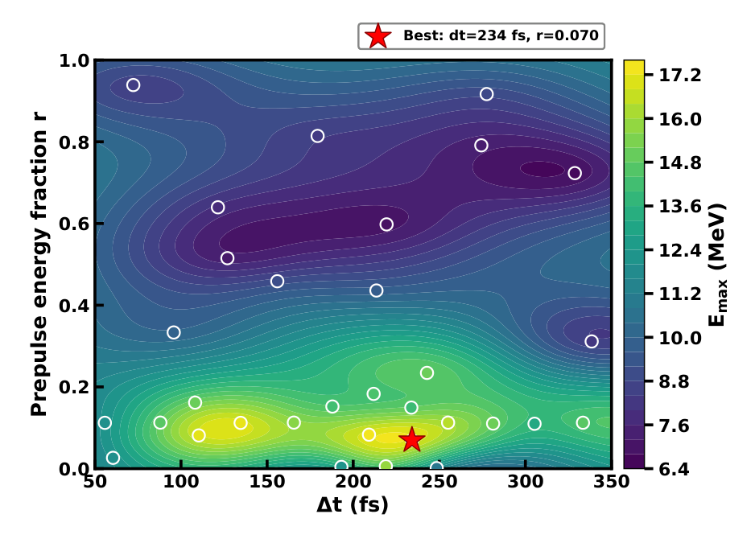
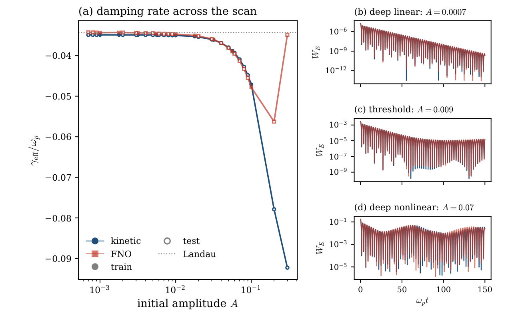
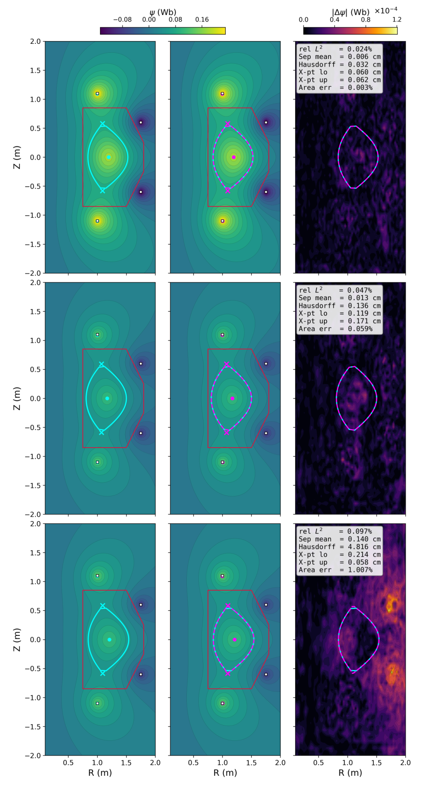
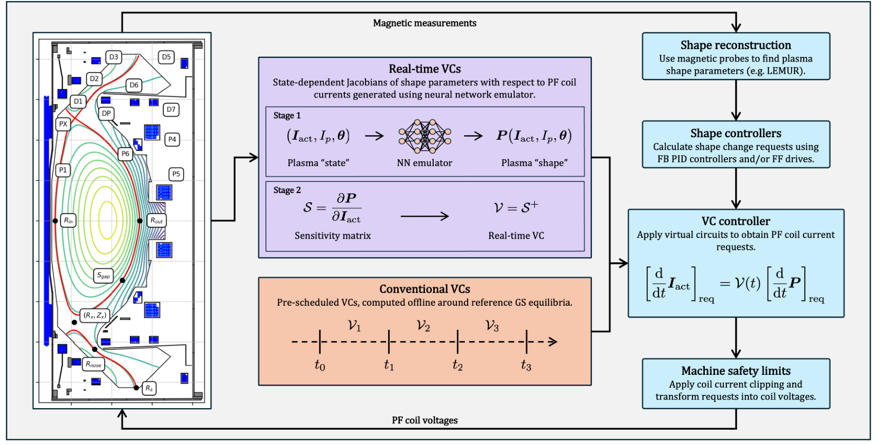
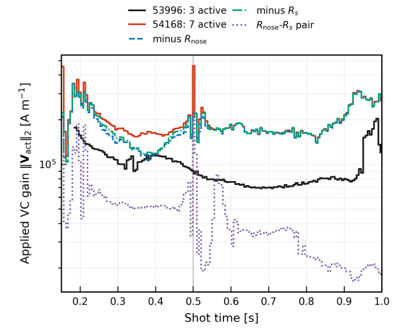
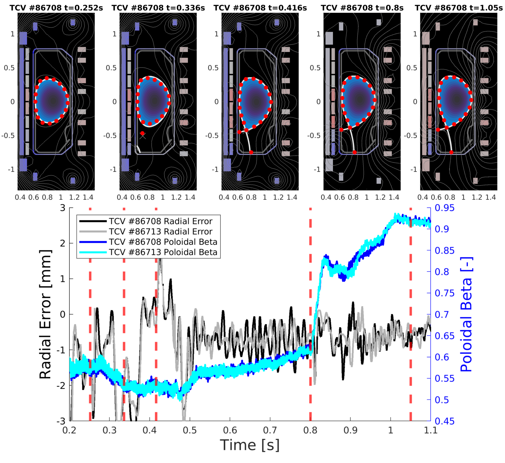

# 06｜机器学习与等离子体：预测、闭合、反演、优化和控制

> 阅读目标：能把 AI 论文放进具体物理链路，判断它究竟学了什么、训练标签是否可靠、泛化是否真正独立、部署误差如何反馈。截止 **2026-09-30**，本库 AI 分类有 64 条交叉挂载记录。章节先讲基础，再讲 2026 年代表工作；数字是作者结果或库内笔记复用，不是本次重新训练所得。

## 1. 从五种任务认识这个方向

“AI for plasma”不是一种统一算法。第一类是预测：给定激光、靶或磁构型，预测电荷、热流或谱。第二类是闭合：把低阶流体方程缺少的高阶动理学作用补上。第三类是反演：从相机、散射谱和探针数据恢复不可直接测量的状态。第四类是优化：选择下一组参数，减少昂贵模拟或实验次数。第五类是控制：根据实时状态和约束决定下一步执行器动作。这五类的验收量不同，不能用同一个回归 $R^2$ 分数概括。

例如质子谱代理 [R119](../appendices/reference-catalog.md#r119) 位于仿真之后；热流闭合 [R327](../appendices/reference-catalog.md#r327) 位于时间求解器内部；EFISH 反演 [R272](../appendices/reference-catalog.md#r272) 位于仪器之后；双脉冲贝叶斯优化 [R133](../appendices/reference-catalog.md#r133) 位于高代价 PIC 调用之外；MAST-U 实时虚拟电路 [R318](../appendices/reference-catalog.md#r318) 则进入真实线圈控制。越靠近闭环内部，一个小误差越可能改变以后输入的分布。

这个分类也解释了为什么“神经网络很快”不是完整结论。若训练数据来自一年计算，且使用模型只查十次，生成标签和训练可能得不偿失；若同一代理支撑十万次设计查询，成本就可能摊薄。若网络输出必须经过高保真求解器修正，实际收益又取决于修正迭代和回退比例。

## 2. 从普通回归到物理损失

令输入 $x$ 是控制或状态，标签 $y$ 是实验/高保真模拟输出，网络 $F_\theta$ 的参数为 $\theta$。最简单的平方损失为

$$
L_{data}=\frac1N\sum_{i=1}^N\left\|F_\theta(x_i)-y_i\right\|^2.
$$

但电场单位 V/m、密度单位 m⁻³、温度单位 K 或 eV，未经归一化直接相加没有合理意义。应先用尺度 $s_j$ 定义无量纲误差 $e_j=(\hat y_j-y_j)/s_j$；$s_j$ 可以是典型物理量、训练集变化尺度或测量标准差。按测量误差加权时，Gaussian 似然对应 $\sum e_j^2$；这时损失不只是算法技巧，还含“哪些数据更可信”的假设。

物理约束损失可写为

$$
L=L_{data}+\lambda_{PDE}\|\mathcal R[F_\theta]\|^2
+\lambda_{IC}L_{IC}+\lambda_{BC}L_{BC}+\lambda_CL_C.
$$

$\mathcal R$ 是方程残差，$IC/BC$ 表示初始/边界条件，$C$ 可表示守恒或非负性。各项也必须无量纲化。把权重调得很大，有时只会让网络牺牲数据项满足一个有偏模型；不同导数阶的残差还有不同数值噪声。PDE loss 小不能独立证明真实物理正确，因为方程本身可能是简化模型。

更强的约束可写进输出表示。二维磁场若由磁通函数构造，$B_x=-\partial_y\psi$、$B_y=\partial_x\psi$，混合偏导交换给出 $\nabla\cdot\mathbf B=0$。这比惩罚一个接近零的散度更直接。[R384](../appendices/reference-catalog.md#r384) 使用这种结构；但二阶导数 $J_z\propto\nabla^2\psi$ 仍可能放大磁通的微小误差，所以必须单独检查电流与重联率。

## 3. 闭合是什么：为什么温度方程还需要别的量

从一维无碰撞 Vlasov 方程出发，以 $1,v,m(v-u)^2/2$ 乘后对速度积分，可以得到粒子数、动量和内能方程。定义

$$
n=\int f\,dv,\quad u=\frac1n\int vf\,dv,\quad
P=m\int(v-u)^2f\,dv,
$$

$$
q=\frac m2\int(v-u)^3f\,dv.
$$

这里 $P$ 是一维压强，$q$ 是一维热流。积分时假设速度边界项消失。保留 $n,u,P$ 后，压强/能量演化仍含 $\partial_xq$；热流演化又含更高阶矩。这就是无穷矩链。截断不是把未知项设为零的无害操作，而是需要回答未保留速度结构怎样影响已保留变量。

碰撞足够强且梯度缓慢时，可近似 $q=-\kappa\partial_xT$。令平均自由程为 $\lambda_{mfp}$，温度尺度 $L_T=|T/\partial_xT|$，Knudsen 数 $K_n=\lambda_{mfp}/L_T$。$K_n\ll1$ 时局域关系较合理；快电子跨越多个温度尺度时，热流取决于邻域甚至历史。[R327](../appendices/reference-catalog.md#r327) 学非局域热流散度，[R256](../appendices/reference-catalog.md#r256) 则给闭合加入时间记忆。

Landau 阻尼尤其能说明流体闭合的难处。不同速度粒子分别产生 $e^{-ikvt}$ 相位，速度空间出现越来越细的相混合结构；电场能下降，系统却不一定发生真实碰撞耗散。只读某一时刻的少数矩，不一定知道先前已积累的高阶结构。神经闭合读取历史，是用有限记忆近似被截断自由度，而不是网络凭空发现“耗散”。

训练方式因此很关键。离线训练直接拟合 $q$ 或 $\partial_xq$，最小误差不一定导致闭环稳定；在线训练把网络放进流体求解器，让损失作用于完整轨迹，梯度穿过时间推进。它更贴近使用场景，却更费显存，并把求解器的离散方式纳入所学有效闭合。[R256](../appendices/reference-catalog.md#r256) 展示了这一区别。[R359](../appendices/reference-catalog.md#r359) 进一步讨论线性不稳定性中瞬时矩所能辨识的模式数：更多网络参数不能弥补输入信息不足。

## 4. 神经算子、普通神经网络和可微求解器

普通回归网络把有限维向量映成向量。神经算子希望学习函数到函数映射，例如整个温度场到热流散度：$\mathcal G:T(x)\mapsto\partial_xq(x)$。一个 Fourier Neural Operator 层可写为

$$
v_{\ell+1}(x)=\sigma\left[W_\ell v_\ell(x)+
\mathcal F^{-1}\{R_\ell(k)\mathcal F[v_\ell](k)\}(x)\right].
$$

$W_\ell$ 是点态混合，$R_\ell(k)$ 是有限保留波数的可学习权重，$\mathcal F$ 是 Fourier 变换。全局谱项让某一点输出感受远处输入，适合非局域作用；点态非线性又能混合模式。权重共享使不同网格上可查询同一表示，但 Nyquist 限制、保留模式、周期边界和训练形状仍约束精度。网格迁移成功不能推导出跨材料或跨装置迁移成功。

DeepONet 常用 branch 网络编码输入函数的传感器值，trunk 网络编码输出位置，再通过二者组合输出函数。它适合仪器信号到空间场的映射。[R272](../appendices/reference-catalog.md#r272) 加入 Fourier 偏置和偏振条件化，针对 EFISH 的积分核，而不是用同一模型统一解决所有电场诊断。

可微求解器则不一定包含神经网络。若状态满足 $z_{n+1}=\Phi(z_n,u_n)$，目标 $J$ 依赖终点和各步状态，链式法则可以将 $dJ/du_n$ 沿计算图反传。有限差分每改变一个参数都要多跑一次，可微/伴随方法能够同时给很多参数的梯度。其条件是离散推进和参数化足够可导；阈值、电离、激波和拓扑变化会使梯度困难。即便梯度精确，它也只是**该模型**的梯度。[R122](../appendices/reference-catalog.md#r122)、[R197](../appendices/reference-catalog.md#r197) 因此须分别验证优化效率和物理保真度。

## 5. 贝叶斯推断与高斯过程：不确定度怎样进入决策

给定参数 $\theta$、数据 $d$ 和模型 $M$，Bayes 公式为

$$
p(\theta|d,M)=\frac{p(d|\theta,M)p(\theta|M)}{p(d|M)},\quad
p(d|M)=\int p(d|\theta,M)p(\theta|M)d\theta.
$$

似然描述数据噪声，先验描述允许参数与原有知识，后验回答数据后参数有多可信。分母是模型证据：参数更多的模型虽然可以找到更小残差，但在大参数体积内都拟合得好才获得高证据。因此增加分布分量不是自动胜出。[R386](../appendices/reference-catalog.md#r386) 在合成 Thomson 谱上展示了这种 Occam 惩罚。[R204](../appendices/reference-catalog.md#r204) 则将好通道和污染通道写成混合似然，避免少量异常点支配剖面。

贝叶斯优化对昂贵函数 $y=f(x)+\epsilon$ 建立代理。高斯过程由均值 $m(x)$ 和协方差核 $k(x,x')$ 定义。对于观测矩阵 $K$、噪声方差 $\sigma_n^2$ 和新点协方差向量 $k_*$，后验预测为

$$
\mu_*=m_*+k_*^{\mathsf T}(K+\sigma_n^2I)^{-1}(y-m),
$$

$$
\sigma_*^2=k(x_*,x_*)-k_*^{\mathsf T}(K+\sigma_n^2I)^{-1}k_*.
$$

其直觉是：附近已有好数据则预测更确定，远离数据则不确定度通常增大。采集函数如 $\mu+\beta^{1/2}\sigma$ 在寻找高值与探索未知之间平衡。核长度尺度、噪声模型和参数归一化都决定代理是否合理；环境漂移使 $f$ 随时间变动时，静态高斯过程可能把漂移误当噪声或参数效果。

从 2020 年实验控制基线 [R010](../appendices/reference-catalog.md#r010) 到 2026 年双脉冲、靶层和同位素优化 [R133](../appendices/reference-catalog.md#r133)、[R151](../appendices/reference-catalog.md#r151)、[R286](../appendices/reference-catalog.md#r286)，共同思想是把昂贵扫描变成有目的补点。区别在于目标可能是截止能、窄能散、多目标 Pareto 边界或终端产额。只优化一个源端标量可能伤害应用端有效粒子数，因此目标定义比算法名称更重要。

## 6. 十六篇重点解读与 2026 年增量

### 6.1 R119：预测整个质子谱

[R119](../appendices/reference-catalog.md#r119) 把 β-VAE 学习的谱形潜变量与截止能量分支结合，目标是连续谱而非一个最大能量。它的训练标签来自一维 PIC，集成模型提供不确定性。其增量是把能谱形状与加速机制过渡一起映射；但一维标签漏掉横向膨胀和三维不稳定性。高 $R^2$ 需要注明是否在对数空间，尾部很低的粒子数也不应以平均谱形分数掩盖。库内精确评分依赖已有笔记，本章不将其当真实实验反演性能。

### 6.2 R122：高维 ICF 脉冲逆向设计

[R122](../appendices/reference-catalog.md#r122) 在可微内爆模型中优化高维驱动脉冲，减少按参数逐一差分的成本，并得到接近低熵爬升的结构。它的重要性是设计自由度可以大幅增加，未必需要先把脉冲限制为少数人为形状。但简化模型最优值可能利用遗漏的输运或不稳定性；实际路线应将梯度候选送回完整辐射流体模型，并加入激光功率、可实现波形和靶制造容差。

### 6.3 R125：从相空间演化学习碰撞项

正式期刊论文 [R125](../appendices/reference-catalog.md#r125) 用可微 Fokker–Planck 求解器反推漂移/扩散算子，标签来自均匀热等离子体的二维 PIC。比起黑箱输出下一时刻，它尝试得到能解释相空间演化的低阶物理项。要特别警惕标签中的数值碰撞：学习到的算子可能同时吸收宏粒子权重和网格效应。因此与真实库仑理论、不同数值分辨率和非平衡测试的比较，决定算子能否叫作可迁移物理模型。

### 6.4 R133：在固定激光能量下优化双脉冲

[R133](../appendices/reference-catalog.md#r133) 把前导脉冲能量分数和延迟作为两个变量，用 BO 驱动二维 PIC，在固定总能量下寻找更强 TNSA。物理解释是预脉冲改变前等离子体，使主脉冲吸收、热电子和后鞘场更有利。相比手动扫描，算法贡献是用较少点找到有效区域；物理贡献则须看同能量基线和稳健平台。最优值是否跨网格、粒子数和定时抖动保持，比单点增幅更接近实验价值。

**图 06-1：固定能量双脉冲的贝叶斯优化地图。** R133，原Fig.3，PDF第3页；作者2D PIC驱动的优化与代理插值。

**逐图解读。** 横轴为两脉冲延迟 $\Delta t$，单位fs；纵轴为前导脉冲能量分数 $r$，无量纲；主脉冲获得剩余的 $1-r$，因此每个点保持相同总驱动能量。色标是GP后验均值预测的质子截止能量 $E_{max}$，单位MeV。白圈是32次PIC调用的采样位置，红星标出 $r=0.07$、234 fs候选；连续彩色面是代理插值，不能当成每个像素都实际计算过的扫描。黄绿高值区集中在小前导份额和中等延迟，给前等离子体形成留时间，同时避免过度抽走主脉冲能量；紫色区显示“大预脉冲”并非总有利。邻近正文说明目标在主峰后统一时间窗读出，使各候选按相同口径比较。图中没有后验方差，所以色面平滑不表示统计置信度已被证明。它支持固定能量二维PIC模型中的BO选点和有效区域，不是实验优化；定时抖动、三维膨胀与分辨率改变后的稳健性仍需复核。[R133](../appendices/reference-catalog.md#r133)

### 6.5 R139：把神经场求解放进 PIC 循环

[R139](../appendices/reference-catalog.md#r139) 以源项压缩、潜残差修正和多层 FNO 重建场，分别测试直接预测与作为迭代初值的混合方案。这比只拟合一次 Poisson 解更接近真实部署，因为粒子会把场误差反馈到下一步源项。已有笔记报告的是场求解阶段收益，不能写成全程序收益。实用接入点是先做 warm start，让传统求解器恢复约束，再审计长期能量和模式演化。

### 6.6 R172：学习控制变量，减少噪声

[R172](../appendices/reference-catalog.md#r172) 学后向哈密顿流，动态更新 bulk 分布，以残差粒子降低 δf PIC 方差。它没有直接替代物理推进，而是改善采样表示。辛网络限制相空间结构，周期网络限制边界结构。这里需要同时核算网络训练成本和方差下降；对弱扰动有效的残差表示，在强偏离平衡时可能失去优势。当前静电多流测试不能直接验证强场电磁应用。

### 6.7 R197：场景优化的可微模块链

[R197](../appendices/reference-catalog.md#r197) 的 TokaGrad 将平衡、输运、加热、L–H 转变和 pedestal 连接到同一计算图，目标是执行器波形和整场景优化。它的增量是贯穿时间与模块的 Jacobian，而非单一步回归。真正的困难是模块闭合误差会沿同一梯度链传播；用简化转变模型得到光滑梯度，不代表真实转变可被同精度控制。适合先理解其计算结构，再看独立放电验证是否覆盖关键阈值。

### 6.8 R256：有记忆、在线训练的 Landau 闭合

[R256](../appendices/reference-catalog.md#r256) 在可微低阶流体求解器内训练 FNO，让损失直接作用于部署轨迹。模型读低阶矩的历史，复现从线性阻尼到非线性俘获的部分范围；训练振幅包络外明显失效。它展示“最佳有效闭合不必逐点等于真实热流”，因为闭合还补偿被截断矩的总体作用。因此学习结果依赖波数、求解器和离散方式；不能把一维单模成功当成一般湍流闭合。

**图 06-2：闭合跨越线性阻尼与非线性俘获。** R256，原Fig.5，PDF第21页；作者Vlasov与流体-FNO数值比较。

**逐图解读。** （a）横轴是初始密度扰动振幅 $A$ 的对数坐标，纵轴是归一化有效阻尼率 $\gamma_{eff}/\omega_p$；蓝线为Vlasov参考，红线为流体+FNO，灰实/空标记区分训练与测试振幅，虚线为线性Landau基线。训练范围 $10^{-3}$—$10^{-1}$ 内两线接近，向0.2、0.3外推则明显分离。（b）、（c）、（d）依次取0.0007、0.009、0.07，横轴为 $\omega_pt$，纵轴为对数归一化电场能量 $W_E$，不是焦耳：第一幅包络持续衰减；第二幅接近俘获阈值后趋平；第三幅显著振荡并保持非线性包络，FNO总体能跟随这些变化。阻尼率按原图注由初期能量峰值拟合，是本文的有效诊断口径，不宜和其他论文场振幅阻尼率未经定义直接比较。此图展示一套有记忆闭合跨训练包络的可用区与失效区；参考也是一维固定波数Vlasov计算，不能证明任意多模湍流闭合或真实实验中的一般泛化。[R256](../appendices/reference-catalog.md#r256)

### 6.9 R268：毫秒平衡代理的输入边界

[R268](../appendices/reference-catalog.md#r268) 用 FreeGS 的单装置双零位样本学习磁通，并同时检查分离面、X/O 点和方程残差。比只报磁通范数，它更接近控制需要的几何量。但指定 X 点坐标本来就是输入，网络并没有从线圈信号独立发现 X 点；固定壁面、拓扑和网格限制了泛化。毫秒推理与传统求解配置的比较，只对论文该基线成立，不能自动优于已经 warm-start 的生产求解器。

**图 06-3：磁通误差与X点几何误差。** R268，原Fig.5，PDF第8页；作者单装置固定拓扑代理测试。

**逐图解读。** 九幅图共用 $R,Z$ 米坐标；每行左、中、右依次为FreeGS参考磁通、FNO磁通和绝对误差 $|\Delta\psi|$。前两列采用同一Wb色标，误差列采用单独的 $10^{-4}$ Wb尺度，不能凭颜色相似度跨色标比较。上、中、下行分别选低误差、近中位和近p95样本，其全场相对 $L_2$ 为0.024%、0.047%、0.097%。每一行前两幅核心轮廓相近，右幅揭示误差向分离面和X点相关区域集中；青色为真实分离面，洋红为预测。上行的几何偏差较小，中行略增，下行虽仍保持小全场范数，框内Hausdorff距离已达4.816 cm。Hausdorff度量最坏局部偏差，不能和平均最近点误差混用。图中壁和线圈位置固定，X点目标本来就是输入，三行也只是500个留出样本中的代表，不是三个实机放电。它支持在所选双零位族内检查代理几何，而不证明新拓扑、另一装置或真实诊断反演同样准确。[R268](../appendices/reference-catalog.md#r268)

### 6.10 R272：带前向核和 OOD 的 EFISH 反演

[R272](../appendices/reference-catalog.md#r272) 将偏振条件、Fourier 特征和 EFISH 前向积分一起加入 DeepONet。重建场重新生成信号，能发现某些纯回归的非物理解；dropout 可标记复杂多峰场形的训练域外风险。它的实验对照是有限电极几何和可重复扫描放电，不能称为任意单发场重建。光学相位、密度和超极化率假设若不成立，信号拟合很好仍可能给错场。

### 6.11 R312/R318：从回放到真正驱动线圈

[R312](../appendices/reference-catalog.md#r312) 主要验证神经 Jacobian 与伪逆接入 MAST-U PCS 的软件、延迟和 piggyback 一致性，实际线圈仍由常规控制驱动。[R318](../appendices/reference-catalog.md#r318) 再给出主动形状控制炮次。这两个阶段必须分开。局部关系 $dP=S\,dI$、$dI=S^+dP$ 将形状请求转为线圈请求；当 $S$ 病态时，微小形状误差会放大为巨大电流。主动炮次中的保护跳闸与病态案例是部署边界，不应被平均跟踪效果掩盖。

**图 06-4：神经Jacobian接入已有控制链。** R318，原Fig.1.1，PDF第2页；论文控制架构示意。

**逐图解读。** 左侧装置示意标出 $R_{in},R_{out}$、X点和间隙等形状量，没有数值轴，颜色是磁通轮廓示意，不能读取约束性能。中间紫框先由线圈电流、等离子体电流和剖面参数预测形状，再求Jacobian $S=\partial P/\partial I_{act}$，经伪逆产生虚拟电路；橙框则是传统按放电阶段查预计算VC的替代路径。右侧磁诊断和形状重建提供当前状态，既有PID/前馈控制决定形状变化请求，VC将它变为线圈电流请求，机器保护再限制电流并转为电压，最后返回装置。图的重点是AI位于局部响应计算接口，形状估计、目标控制与执行器保护都仍有各自职责；两种VC路径也不是同时叠加的两个控制增益。它属于论文架构示意，没有跟踪误差或延迟数据；主动控制的实验证据需结合实际炮次。相比“神经网络控制聚变”这一笼统说法，这张图更准确地说明了真实闭环中被替换的环节及误差会进入何处。[R318](../appendices/reference-catalog.md#r318)

**图 06-5：实时伪逆的病态会放大线圈请求。** R318，原Fig.4.1，PDF第6页；真实放电状态与离线诊断反事实。

**逐图解读。** 横轴为放电时间s，纵轴是实际受控VC矩阵的二范数，单位A/m且采用对数刻度；它衡量单位形状变化会要求多大线圈电流，不是神经预测误差。黑线来自53996炮，红线来自54168炮所用映射，后者在大部分时段较高，约0.5 s处还有局部尖峰。蓝、绿虚线是分别删去 $R_{nose}$、$R_s$ 列后的离线重求逆，紫色点线仅取这对方向；这些反事实曲线没有用于实际控制。邻近正文指出约0.5 s两列近共线，伪逆放大形状请求，图中下降的删列曲线帮助定位退化来源。大增益会放大测量和模型误差，解释为什么网络本身准确仍可能产生不稳健执行请求。作者明确未由两炮比较建立跟踪变差的唯一因果关系，不能把尖峰直接称为诊断到的损伤。该图结合真实放电状态与离线矩阵诊断，支持对条件数和正则化的关注，不证明删除约束已经在现场解决问题。[R318](../appendices/reference-catalog.md#r318)

### 6.12 R327：网格迁移与物理分布迁移有区别

正式论文 [R327](../appendices/reference-catalog.md#r327) 学一维非局域热流散度，再嵌入隐式温度方程。当前本地全文是相应作者预印本，正式题名和日期来自 APS 元数据。热点宽度、空间降采样和训练后时间区间的测试支持有限网格/时间迁移；但热点训练不能可靠预测正弦温度组，直接展示了物理分布改变的失败。约四十倍一维闭合计时不能写成完整 ICF 加速，生成高粒子数 PIC 标签的成本也不能忽略。

### 6.13 R352：漂移归因取决于可观测性

[R352](../appendices/reference-catalog.md#r352) 用隐状态 $a_0,n_e,\mathcal C$ 和 EKF，从电荷、能量、能散推断运行漂移，再比较环境耦合模型。它提醒：多收炮数不能补足没有被激发的参数方向。若能量在零啁啾附近仅依赖 $\mathcal C^2$，一阶灵敏度为零，很难识别小啁啾漂移。全文定量结果是共享函数族的合成会话，并未用真实 LPA 数据验证；其价值是诊断设计与负结果，而非已部署维护系统。

### 6.14 R369：网络只提议时间跳跃

[R369](../appendices/reference-catalog.md#r369) 的 PhySKIP 在一维氮气漂移—扩散—Poisson/电路模型中，提议跨过 $K$ 个普通步，再执行 $M$ 个物理重锚步。PDF 定义是 $K=64/96$ 的跳跃长度、$M=16$ 的重锚步数；与旧笔记把它解释为输入窗口/周期数不同，应以原文为准。作者最高 CPU 加速 4.70 倍，但计时排除加载和诊断，测试提议均获接受。它有约束重建与回滚逻辑，尚未测 PIC、多维或高拒绝率情况。[官方摘要](https://arxiv.org/abs/2609.23358)与本次 PDF 关键段落一致。

### 6.15 R379：代理优化器也会利用代理漏洞

[R379](../appendices/reference-catalog.md#r379) 用超过二十万次非线性 GX 数据训练恒星器热流 CNN 集成，接入 DESC 和 T3D。作者给出约 45 倍墙钟与 720 倍 GPU-hour 的输运成本降低；两者相差因为硬件数量不同。更关键的是最优候选曾落到非嵌套磁面与训练域外，集成方差显著变大；非法候选还污染遗传搜索父代。本次 PDF 与[官方来源](https://arxiv.org/abs/2609.28730)核对了数据量和方法。数值温度提升没有真实恒星器测量，静电绝热电子模型也没覆盖全部输运。

### 6.16 R384：磁通误差小，电流仍可能不准

[R384](../appendices/reference-catalog.md#r384) 用磁通表示和 PINO 学二维电阻 MHD 重联，两个留出参数上的磁通误差约 1%，谱电流约 7.5%；低至中等 Lundquist 数重联率较准，高参数晚期爆发误差升至 32–42%。本次 PDF 复核支持这一范围，说明导数观测量与突发事件要单独验收。[官方摘要](https://arxiv.org/abs/2609.29514)页面当前提交日期显示 8 月 25 日，而库内记录与稿件日期为 9 月，存在元数据不一致；本章只将其称为 2026 年工作，不用它建立月份优先权。

## 7. 其余文章怎样串入完整方向

反演路线可继续读鲁棒剖面统计 [R204](../appendices/reference-catalog.md#r204)、电子滤片谱联合核修正 [R279](../appendices/reference-catalog.md#r279)、热流诊断 [R270](../appendices/reference-catalog.md#r270)、边界热导 PINN [R349](../appendices/reference-catalog.md#r349)、线标定与位置联合恢复 [R378](../appendices/reference-catalog.md#r378)、非 Maxwell CTS [R386](../appendices/reference-catalog.md#r386)。共同问题是观测不足以唯一确定参数，需要响应核、先验、独立校准和后验预测；网络并不自动创造丢失的信息。

优化路线可从恒星器 alpha 约束的降维 [R141](../appendices/reference-catalog.md#r141) 到多目标靶层 [R151](../appendices/reference-catalog.md#r151)、PIC–Monte Carlo 同位素产额 [R286](../appendices/reference-catalog.md#r286)、端到端 FEL 束线 [R252](../appendices/reference-catalog.md#r252)。目标由源端改到应用端，是本库很有意义的变化；有效能窗、接受度和终端产额常比源端最高能更有用。

场与动力学代理还包括条件 Koopman 湍流 [R218](../appendices/reference-catalog.md#r218)、边缘循环一致/不确定度 [R235](../appendices/reference-catalog.md#r235)、自回归潜扩散 MHD [R170](../appendices/reference-catalog.md#r170)、带解析方差计划的生成代理 [R323](../appendices/reference-catalog.md#r323)、粒子轨迹流模型 [R302](../appendices/reference-catalog.md#r302)。生成模型可以输出多种可能轨迹，但这不是后验自动正确；概率校准、极端事件和分布覆盖比一张逼真图更重要。

控制线包括 ITER 高能粒子输运代理 [R278](../appendices/reference-catalog.md#r278)、平衡反问题 [R308](../appendices/reference-catalog.md#r308)、湍流转变强化学习 [R317](../appendices/reference-catalog.md#r317)、无磁诊断的平衡挑战 [R324](../appendices/reference-catalog.md#r324)、观察器模型预测控制 [R390](../appendices/reference-catalog.md#r390)。仿真中的强化学习策略、历史数据回放、硬件集成、真实主动放电是连续但不同的验证层次；跨装置控制尤其不能靠随机拆分测试集宣称。

[R308](../appendices/reference-catalog.md#r308) 则由目标形状与状态估计反求线圈请求，再交给已有低层电流/位置控制。下图把它的真实TCV成形结果与全形状闭环能力分开，作为前述控制证据层次的具体例子。

**图 06-6：TCV的实机成形与已有径向反馈。** R308，原Fig.4，PDF第20页；真实TCV放电及平衡重建。

**逐图解读。** 上排是TCV #86708在0.252、0.336、0.416、0.8、1.05 s的重建平衡，背景为实验数据重建，红点表示下一目标形状；这些图没有通用温度色标，不能把核心颜色解释成温度。五幅依次显示受限形状、向下单零位过渡及后续保持；坐标刻度对应装置的 $R,Z$ 米尺度。下图横轴为秒，左轴是两炮径向位置误差mm，黑/灰曲线总体在毫米量级波动；右轴是无量纲极向beta，蓝/青曲线在中性束加热后升高，用来检查压力扰动下的成形。红虚线将轨迹时刻与上排快照联系起来。邻近正文特别说明径向位置另有反馈环路，而当时未对全部形状误差施加完整实时闭环；因此小径向误差不能全归功于神经网络。这是真实TCV成形和诊断重建证据，较纯FGE仿真前进了一步，但仍不能替代所有控制点、拓扑切换和在线适应任务的独立实机验收。[R308](../appendices/reference-catalog.md#r308)

## 8. 如何选择方法和验证泛化

|需要回答的问题|优先路线|比平均回归误差更重要的检查|
|---|---|---|
|少量昂贵试验找参数|BO/多保真优化|噪声与漂移、约束、最佳点复测|
|高维可导设计|可微模拟/伴随|模型偏差、梯度校验、可实现约束|
|宏观方程缺动理学项|在线闭合/神经算子|长时稳定、守恒、记忆和新分布|
|稀疏仪器信号恢复状态|Bayes/PINN/算子反演|可辨识性、响应核、先验敏感性|
|实时驱动执行器|代理 Jacobian/MPC/RL|全链路延迟、保护、失效与回退|

测试集切分要按真实独立单位进行。相邻时间帧、同一炮的多个像素、同一磁构型的多根磁力线，随机分入训练与测试会泄漏共享结构。至少区分：同工况插值、新参数、新初态、新几何、新装置和新物理。上述每一级都需要自己的结果；分辨率变化只覆盖其中一个轴。

不确定度也有两层。偶然噪声来自测量和随机过程，增加重复测量可部分降低；认知不确定度来自训练不足或模型缺项，需要新数据或更正确模型。深集成、dropout 和 Gaussian process 能给某种认知风险提示，但校准依赖分布；几套网络可能共同学到同一个偏差。应让高不确定度触发高保真调用，低不确定度也定期抽查。

如果目标是完整模拟加速，设原程序某阶段占比 $f$，该阶段网络加速 $s$，其他阶段不变，则总加速 $S=1/[(1-f)+f/s]$。即使场求解快 30 倍，若场只占 10%，总加速仅约 1.11 倍。还应加训练、数据、模型加载、传输、验收、回退和诊断成本。对控制，平均延迟远不够，p99 与最坏延迟、硬实时截止、状态过期和缺失输入同样重要。

## 9. 学习路线与可执行研究习惯

第一步用小数据做最简单模型：输入密度和激光参数，输出一个可解释标量，并比较线性回归、物理标度和 Gaussian process。若简单基线已经达到仪器噪声下限，更大网络未必有物理意义。每个特征写单位，每个标签写来源，记录归一化怎样计算；归一化只能用训练集统计量，避免测试信息流入模型。

第二步做一个已知前向模型的逆问题。生成带噪滤片或 Thomson 合成数据，比较不同先验能否得到同样观测却不同分布，再将后验解重新送回前向模型。通过这一步学习“拟合信号”和“唯一恢复物理量”的区别。之后加入一组独立校准数据，检查它是否打破参数退化。

第三步才把网络放进求解器或控制环。先做离线预测，再做影子运行，记录模型如果被启用会输出什么；随后在受控范围部署，有异常就回退原求解器/控制。对闭合，检查能量积分和长时模式；对优化，重算最优候选及邻域；对控制，记录保护动作和错误请求，不能只保留成功炮次。

2026 年这些文章共同提示一种值得优先追踪的前沿：AI 的价值正从“拟合一张图”走向物理方程消费、仪器响应消费和真实执行器消费。越接近实际链路，负结果、约束、失效检测和独立验证越有研究价值。这个判断是本综述的归纳，不是任一论文已经证明全部方向成熟。

一个小型验收实验可以固定训练预算，让物理标度、Gaussian process 和网络分别预测同一留出参数组，再选各自最优点及周围点用高保真模型重新计算。保存预测区间是否包含真值、最优点复算后的排名和实际总时间。这样同时回答精度、校准、决策效果与成本，避免只用回归分数决定方法优劣。若三种方法推荐相同的稳健区域，简单模型往往更方便解释；若网络只在边界给出夸张收益，应先扩大独立验证而不是直接进入实验。

## 10. 本章证据来源与覆盖

- **本次原始全文来源复核：** 本地 PDF 全文文本已提取，重点段落重新核对 [R369](../appendices/reference-catalog.md#r369)、[R379](../appendices/reference-catalog.md#r379)、[R384](../appendices/reference-catalog.md#r384)。核验范围是模型定义、关键结果、计时和失败区；未重新逐页看完全部图表。三篇官方 arXiv 页面核对了标题、摘要与日期，其中 R384 日期冲突已单独保留。
- **已有笔记复用：** 本章其他重点案例以及串联路线依赖库内中文笔记与台账。正式论文 [R327](../appendices/reference-catalog.md#r327) 的全文版本区别按现成笔记保留；本次没有重新获取 APS 排版全文。基础损失、Bayes、GP、矩链和控制推导为教学整理，已写出变量与假设。
- **未读缺口：** [R038](../appendices/reference-catalog.md#r038)、[R074](../appendices/reference-catalog.md#r074)、[R088](../appendices/reference-catalog.md#r088) 等无现成笔记项目只可作为后续入口，不能支撑本章定量结论。分类全量覆盖应结合参考目录，不能把本章重点解读称为 64 篇全部全文精读。
- **本次未做：** 没有生成训练集、训练网络、复跑 BO/GX/PASCHEN、运行真实 PCS 或重新计时；不把作者模拟、合成诊断和现场主动实验混称为实验验证。核验记录见 [methods-source-checks.json](../data/methods-source-checks.json)。

**本次原图增补的范围：** 本章新增6幅论文原图区，来自R133、R256、R268、R308、R318五篇。2026-10-01重新查看图注、邻近模型/结果和源页面，逐幅检查最终裁图；示意、作者数值验证、真实放电及离线诊断分别标注，未重新训练或进行实机控制。逐图来源、PDF页码、裁图坐标和哈希见`data/figure-assets/`的ch06侧录，选择与未用项见[原图选择方法](../data/figure-selection-methods.md)。
