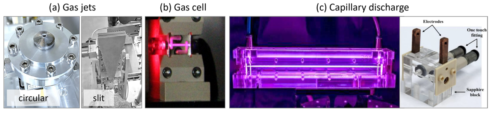
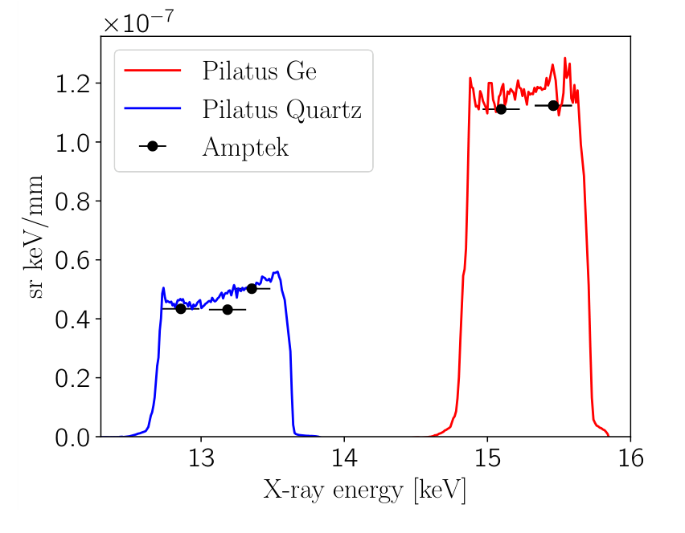
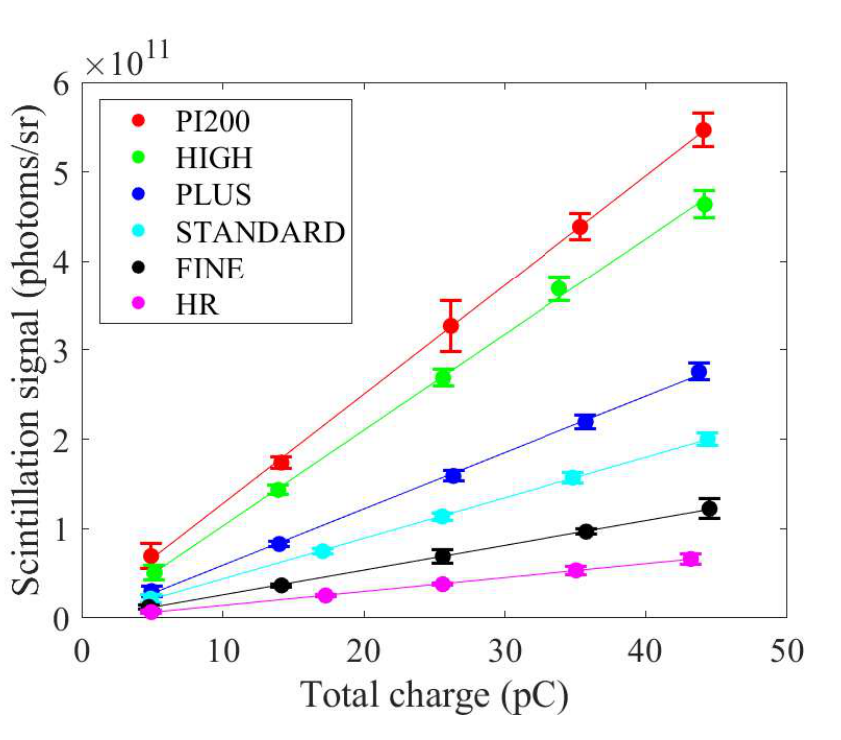
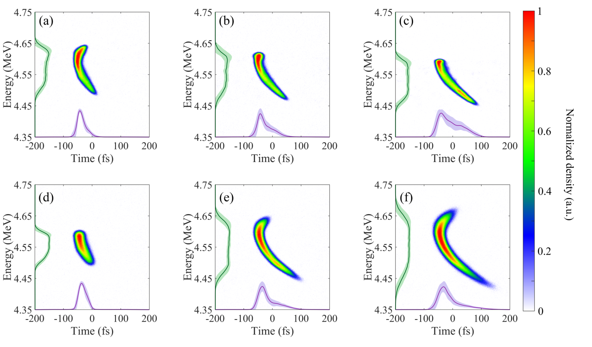
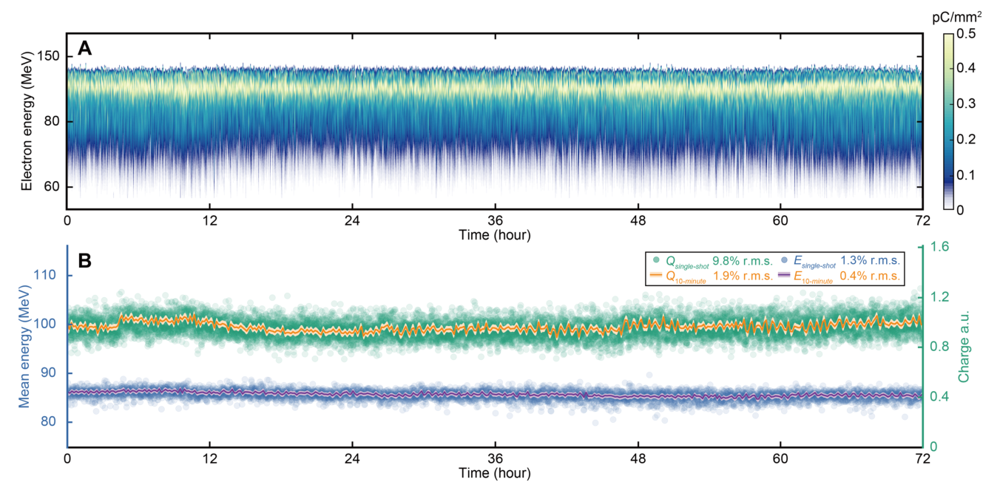
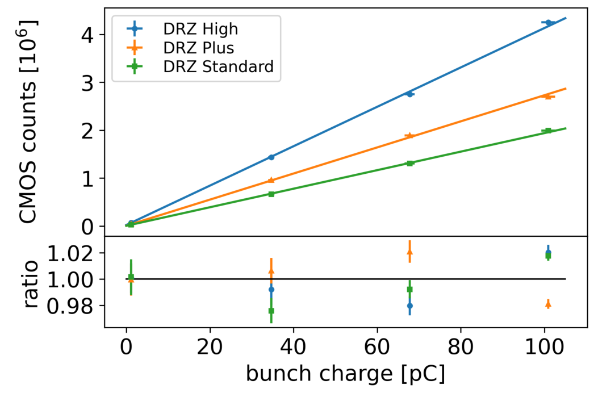

# 08｜实验平台、靶与诊断：从“有信号”到可比较的物理量

> 阅读目标：理解靶、供气、同步、探测器、标定和数据反演如何决定论文结论，学会读清重复频率、能量分辨、绝对电荷和剂量的证据。截止 **2026-09-30**，本库此分类有 112 条交叉挂载记录。它们包括真实实验、原型测试、方案、模拟和统计方法；章节始终分别说明这些层次。

## 1. 一次实验由哪些链路组成

实验不是把激光打到靶上，再读取一个数字。输入端要知道到达相互作用点的脉冲能量、时宽、波前、偏振、焦点和对比度；靶端要知道厚度、密度、电离态、预等离子体、局部几何与刷新状态；输出端要知道粒子的方向、相空间与传播损失；探测端还包含几何接受度、物质响应、光学收集、电子读出和数据处理。某一环节未知，其效应就会被误归因到物理机制。

这一点在本库越来越突出。制靶综述 [R067](../appendices/reference-catalog.md#r067) 说明靶并非被动耗材；差分抽气 [R092](../appendices/reference-catalog.md#r092) 决定高重复率能否持续；DRZ 标定 [R219](../appendices/reference-catalog.md#r219) 决定源端电荷是否可信；ELIMED 剂量 [R284](../appendices/reference-catalog.md#r284) 决定输运后的应用剂量能否追溯；现场 LWFA [R287](../appendices/reference-catalog.md#r287) 则把长时可用率直接变成平台性能。

峰值强度还需要区分定义。若能量为 $U$、时宽 $\tau$、焦斑面积 $A$，$I\sim U/(A\tau)$ 只是量级估计；Gaussian 的峰值系数取决于时宽和腰斑采用 FWHM、rms 还是 $1/e^2$。波前旁瓣、时空耦合与靶前传播也会减少有效峰值。论文中 $a_0$ 往往由强度换算，不等于逐发直接测得相互作用点场强。

## 2. 响应矩阵：探测器读数怎样变成能谱

设真实谱为 $\Phi(E)$，单位 particles/MeV，探测器通道 $i$ 的期望读数可写为

$$
\mu_i=\int R_i(E)\Phi(E)\,dE+b_i.
$$

$R_i$ 包含传输、接受度、能量沉积、光产额、收集效率和读出增益，单位随读数定义变化；$b_i$ 是本底。离散化后 $\boldsymbol\mu=A\boldsymbol\Phi+\mathbf b$。只有谱仪磁偏转位置映射还不够，必须知道探测器对每个能量的计数效率。

若多种谱给出几乎相同读数，$A$ 就病态。测量噪声经直接求逆会被放大。Tikhonov 方法最小化

$$
\|A\Phi-d\|_{\Sigma^{-1}}^2+\lambda\|L\Phi\|^2,
$$

并可加 $\Phi\ge0$。$\Sigma$ 是噪声协方差，$L$ 代表平滑等先验，$\lambda$ 控制先验强度。拟合误差小只说明能重新生成观测，不说明恢复谱唯一。机器学习与 Bayes 反演同样受该限制；[R279](../appendices/reference-catalog.md#r279)、[R386](../appendices/reference-catalog.md#r386) 是两个不同粒子/等离子体谱的例子。

响应核本身也不确定。滤片厚度、电子散射、相机量子效率和几何误差进入 $A$，应与测量噪声分开传播。如果同时自由调整谱与核，二者可能互相补偿，必须加入独立校准。物理前向一致性是必要检验，独立标定与可辨识性才决定反演结论有多强。

## 3. 闪烁屏绝对标定：为什么厂家亮度不能直接换电荷

相机总计数可示意为

$$
C-C_{dark}=N_e\,Y(E,\alpha,\rho_Q)\,
\frac{\Omega}{4\pi}\,T_{opt}\,\overline{QE}\,G.
$$

$N_e$ 为入射电子数，$Y$ 是每电子光产额，可能依赖电子能量 $E$、入射角 $\alpha$ 和电荷密度 $\rho_Q$；$\Omega$ 是收集立体角，$T_{opt}$ 为光学透过率，$QE$ 为相机量子效率，$G$ 为计数增益。若屏按 Lambert 分布出光，应使用相应角分布核，不能机械采用各向同性 $\Omega/4\pi$。实际标定应把全链路写成一个经测得的系数。

因此材料光产额、厂家相对亮度、整套相机计数/电荷系数和系统探测效率是不同对象。即便 Geant4 正确算出屏内能量沉积，还缺闪烁、光学与读出校准；把沉积乘一个经验转换常数，只得到该假设下的响应估计。它不能独立称为本机绝对标定。[R219](../appendices/reference-catalog.md#r219) 用已知束流与测得光谱闭合链路，[R393](../appendices/reference-catalog.md#r393) 再展示高通量原型中的动态范围、位置依赖和退化。

线性范围应同时检验总电荷与局部电荷密度。相同总电荷压到更小束斑，可能触发闪烁饱和、SiPM 饱和或相机满阱；单条全屏线性拟合不一定排除局部非线性。长期辐照会改变屏、光纤、传感器和电子学，在线 LED 只能检查部分光路，不能独自证明粒子响应未变。

## 4. 能谱仪的几何推导与分辨率

### 4.1 磁谱仪：位置依赖动量

带电粒子在垂直磁场中作圆弧，$p=|q|B\rho$，其中 $p$ 单位 kg·m/s，$B$ 单位 T，$\rho$ 为曲率半径。相对论电子总能量为 $E_{tot}=\sqrt{p^2c^2+m^2c^4}$，动能再减 $mc^2$。高能近似 $E_{tot}\simeq pc$。

在小偏转、均匀短磁铁近似下，角度 $\theta\simeq qB\ell/p$，屏位置 $x\simeq\theta(L+\ell/2)$。同一位置可能由低能小角、较高能不同入射角或有限源尺寸产生，因此狭缝会改善角度映射，同时减小接受度。误差近似 $\delta p/p\simeq|\delta x/x|$ 仅在这种简化几何成立；真实边缘场、磁场积分、屏倾角和相机投影需用场图追踪与已知束能校验。

实测能谱是本征谱与仪器函数卷积。若两者均为 Gaussian，$\sigma_{meas}^2=\sigma_{beam}^2+\sigma_{inst}^2$；若谱采用 Lorentzian、非对称尾或非均匀响应，则不能套这个根号公式。[R374](../appendices/reference-catalog.md#r374) 用仪器响应模型给出本征宽度上限，正说明报告“观测宽度”和“反卷积宽度”需要不同表述。

### 4.2 Thomson 抛物线：质量电荷比与能量同时编码

低速离子穿过同长电、磁区后，在两个垂直方向的偏移近似为

$$
x_B=\frac{qB\ell(L+\ell/2)}{mv},\qquad
x_E=\frac{qE_f\ell(L+\ell/2)}{mv^2}.
$$

$E_f$ 是电场，避免与粒子能量混淆。消去 $v$ 后，$x_E\propto(m/q)x_B^2$，不同 $m/q$ 沿不同抛物线。磁方向依赖 $1/v$，电方向依赖 $1/v^2$，因此高能粒子靠近零点更难分辨；加长漂移提高分离，也限制探测器可覆盖的低能端。真实 fringe field 会改变系数，[R262](../appendices/reference-catalog.md#r262) 明确把非均匀场纳入解析与装置比较。

这类谱仪通常采样很小立体角，读数不能直接代表全空间离子数。若要推总产额，需角分布或额外屏/RCF 的信息；若要做绝对谱，还需 MCP 或荧光屏的离子响应标定。分辨出物种与建立绝对电荷链是两个步骤。

## 5. 密度、时间与剂量：三种常见推导

### 5.1 干涉相位先测线积分

弱碰撞、$\omega\gg\omega_p$ 时，折射率 $n_r\simeq1-\omega_p^2/(2\omega^2)$，$\omega_p^2=n_ee^2/(m_e\epsilon_0)$。相位差是 $\Delta\phi=(2\pi/\lambda)\int(n_r-1)dl$，从而

$$
\Delta\phi\simeq-r_e\lambda\int n_e\,dl,\qquad
r_e=\frac{e^2}{4\pi\epsilon_0m_ec^2}.
$$

这里负号对应“等离子体臂减真空臂”的约定；若实验定义相反或只报相位幅值，符号相反。$n_e$ 用 m⁻³，$dl$ 用 m，乘 $r_e\lambda$ 才无量纲。单幅相位只给线积分，转局域密度需要轴对称 Abel 反演、多角断层或其他几何先验。[R159](../appendices/reference-catalog.md#r159) 用 Abel，[R344](../appendices/reference-catalog.md#r344) 用长光程并与束流频率比较。更短探针波长提高截止密度，但相移也更小，并不会自动提高所有误差项。

### 5.2 时间诊断先建立刻度

条纹、THz 偏转和 streak camera 都需要从像素到时间的标尺。横向偏转若在工作点线性化为 $x=x_0+St$，时间分辨约为 $\sigma_t=\sigma_{x,0}/|S|$，$S$ 单位 m/s。束流本身的尺寸、发散和能量相关项都进入 $\sigma_{x,0}$，不是越强偏转就没有其他限制。把能量色散放在正交方向，才可恢复二维纵向相空间，[R275](../appendices/reference-catalog.md#r275) 即沿此路线。

### 5.3 剂量不能由粒子数单独确定

吸收剂量 $D=E_{dep}/m$，单位 Gy=J/kg。给定粒子能量并不意味着全部能量沉积于受照体；谱、材料、厚度和输运决定 $E_{dep}$。平均剂量率近似 $\dot D=f_{rep}D_{shot}$，但依赖每发稳定性和束斑。相同平均值可以对应很不同的每脉冲剂量与瞬时率，对电离室复合和探测器饱和影响巨大。[R284](../appendices/reference-catalog.md#r284) 实际测量并修正逐发响应，不能用电子源能量或激光能量代替。

## 6. 十六篇重点：2026 年平台方向的实际进展

### 6.1 R067：按物理机制选择靶

制靶综述 [R067](../appendices/reference-catalog.md#r067) 将固体、气体、低温、液体和刷新方案放在统一视角。平薄靶服务鞘场、辐射压与透明度机制；近临界泡沫改变激光吸收和体加热；气体/毛细管服务电子尾场；液体、低温和 tape 服务持续刷新。读者应同时比较制备复杂度、预脉冲生存性、尺寸公差、碎屑和重复率。靶类型不能独立决定最优物理机制，激光对比度和时间尺度同样关键。

**图 08-1：气体靶的三种工程几何。** R067，原Fig.3，PDF第6页；综述中的装置照片汇编。

**逐图解读。** （a）左、右照片分别为圆口和狭缝喷嘴，开放几何便于激光与横向探针进入，也把连续供气负担交给真空系统。（b）气室把气体限制在腔体内，激光穿过入口和出口，便于形成较均匀的纵向区域，但孔口、壁侵蚀和失准必须考虑。（c）展示毛细管放电发光和电极、供气接头、蓝宝石块的结构，用预放电制备具有导引作用的等离子体通道，代价是高压与时序同步。三组都是装置照片，没有密度、温度或束能坐标；发光亮度也未做辐射标定，不能据此比较密度或导引效率。原图注注明照片来自ELI-NP及综述引用74—76，因此是2026综述汇编的已有结构，而非三项新性能实验。邻近表格对供气、诊断访问和壁损伤作比较；其典型重复率限制不是喷嘴几何的普适硬上限，高重复率论文还需单独检查气体回收、抽速和实际运行统计。这幅图给初学者一个靶的工程接口地图。[R067](../appendices/reference-catalog.md#r067)

### 6.2 R092：开放相互作用几何中的气体回收

[R092](../appendices/reference-catalog.md#r092) 将 skimmer/catcher 放到喷嘴附近，用流体设计与装置测试降低高重复率气体负载，同时保留诊断和多束访问空间。它回应连续气流与真空束线兼容问题，贡献不在新加速机制。判断方案要看捕获效率、腔压、对局部密度轮廓的扰动和机械空间；高捕获率如果改变加速区密度，可能抵消便利。库内具体效率来自原有笔记，本次未重跑流体或装置。

### 6.3 R159：UV 干涉的真实测量与几何先验

[R159](../appendices/reference-catalog.md#r159) 用 266 nm、纳秒分辨的 Mach–Zehnder 系统测超临界氦中的致密激光等离子体，分别记录两臂强度校正条纹可见度，再提相位、作 Abel 反演。它展示了一条完整处理链，但局域密度结论依赖柱对称。吸收、折射和碰撞修正是关键限制；短波探针并不意味着百分之一绝对精度。最有用的经验是把图像归一化误差与物理反演误差分别报告。

### 6.4 R185：时间分辨晶体谱仪的绝对响应

[R185](../appendices/reference-catalog.md#r185) 标定 NIF Kr 线系谱仪的晶体反射、能区、分辨率与 streak 读出链，并用时间积分通道辅助现场交叉标定。谱线展宽可约束密度，卫星线相对强度可约束温度，但先需扣除仪器线宽和响应。标定在 X 射线实验室与最终 NIF 几何之间的传递，是它的方法价值。本次提取 PDF 并核查仪器/标定段落，未复算反射率或温密反演。

**图 08-2：晶体谱仪的绝对通量换算。** R185，原Fig.11，PDF第6页；实验室X射线绝对标定。

**逐图解读。** 横轴是X射线能量keV，纵轴是晶体吞吐转换因子，单位 $\mathrm{sr\,keV/mm}$，并带 $10^{-7}$ 倍率；它来自焦面每毫米的衍射光子强度除以源的每keV、每sr光子强度，所以是带单位的几何/谱响应，不是0到1的量子效率。红、蓝曲线分别为Pilatus测得并修正效率的Ge与石英响应，黑点是另一Amptek探测器在若干位置的独立测量。石英覆盖约13 keV，Ge覆盖约15 keV；带内平台约 $5\times10^{-8}$ 和 $1.2\times10^{-7}$，边缘急降说明同样光子谱不能用全能区单常数换算。黑点与连续曲线接近，使源谱、空间色散和探测效率之间有交叉约束；局部起伏仍可含晶体表面缺陷。它是实验室晶体支路的绝对标定结果，最终NIF记录还要接上streak相机、滤片及几何传递，并非图中已直接测得热斑温密或完整单发谱的不确定度。[R185](../appendices/reference-catalog.md#r185)

### 6.5 R206：同发前后谱可以减少哪类系统误差

[R206](../appendices/reference-catalog.md#r206) 设计 90° 碰撞几何，以角—能关联区分同一发的碰撞前后电子，减少将不同发次初态差异误判为辐射损失。它属于解析与模拟驱动的测量方案，未给新辐射反作用实验。可行性仍需小发散、源尺寸、重合和足够谱分辨；同发也不自动保证参考部分代表真正受碰撞部分的初态。阅读时应问“哪些电子共享同一个未受扰参考”。

### 6.6 R219：DRZ 电荷标定应连到光谱

[R219](../appendices/reference-catalog.md#r219) 用清华射频直线加速器约 30 MeV 单能束，电荷从 2 到 100 pC，借已校准束流监测器与光学链获得 DRZ 屏响应，同时测发射谱。本次 PDF setup/result 段落与[官方原始来源](https://arxiv.org/abs/2607.17059)核验了基线。主绿光约 543 nm 的测量与滤光处理很重要，因为相机 QE 随波长变化。该结果不能无条件套给任意电子能量、屏型号、观察角与镜头；迁移到自己的能谱仪要重新折算全光学链并检查局部饱和。

**图 08-3：DRZ屏光输出斜率如何变成电荷。** R219，原Fig.4，PDF第3页；RF电子束绝对电荷标定。

**逐图解读。** 横轴是参考束流监测器给出的总电荷pC，纵轴是校正光学链后的每立体角闪烁光子数photons/sr，注意 $10^{11}$ 倍率；这里不是原始CCD灰度，也不是photons/s。不同颜色对应PI200、HIGH、PLUS、STANDARD、FINE、HR，误差棒综合束荷波动、光学效率和图像重复测量。六条拟合线在该5—50 pC扫描区间近似线性，PI200最陡，HR最缓，表明选屏会改变电荷换算因子；邻近表格将斜率换成每pC、每sr的绝对灵敏度，PI200与HR约为 $12.7\times10^9$ 和 $1.5\times10^9$。有线性关系仍需确定单位、角分布和光谱校正，不能把某条斜率直接复制到另一相机/镜头。该图属于约30 MeV射频电子束的真实标定，验证的是已用配置与束荷范围，没有验证所有能量、局部面电荷密度或饱和条件；迁移到激光宽谱电子时，应先把屏、角度、QE和完整收光链接回响应模型。[R219](../appendices/reference-catalog.md#r219)

### 6.7 R262：边缘场决定低能端偏转

[R262](../appendices/reference-catalog.md#r262) 以数值场图、非均匀场偏转公式、磁测和激光离子图验证可调漂移段 Thomson 抛物线。它说明恒场模型可能低估低能偏转，能量覆盖与物种分离要联合选择漂移长度。薄/厚箔实验给出了质子截止和多个荷态轨迹，但这些仍不是全空间绝对产额。其最易迁移经验是先验证场图再生成标定曲线，避免从一条漂亮抛物线直接反推全部离子性能。

### 6.8 R275：纵向相空间决定狭缝怎么选

[R275](../appendices/reference-catalog.md#r275) 在约 4.55 MeV、fC 级 LWFA-UED 束线上组合 THz 横向偏转与磁色散，分辨二阶纵向输运的 C 形相空间。相近能散窗移动中心位置，仍能改变束长；因此能散小并不自动束长最短。实践上要联合优化狭缝位置与开口，不能只靠一阶 $R_{56}$。所报飞秒分辨率由该束能、偏转和低电荷条件决定，对 GeV 或高电荷不具有直接适用性。

**图 08-4：能窗选择改变所测纵向相空间。** R275，原Fig.5，PDF第6页；真实LWFA束流THz诊断与响应重建。

**逐图解读。** 六幅横轴均为时间fs，纵轴为电子能量MeV；颜色是各图归一化相空间密度0—1，绿色、紫色分别为能量与时间投影，阴影表示200连续发的标准差，不能把峰色读成绝对fC。（a）、（b）、（c）保持约2.8%—2.9% FWHM能散，把窗中心从4.574移到4.554、4.532 MeV；三幅C形结构覆盖的局部斜率不同，RMS束长依次为26±3、35±5、42±5 fs。（d）、（e）、（f）保持中心约4.55 MeV，放宽能散至2.0%、3.8%、4.4%；较宽能窗纳入更多弯曲尾部，束长为27±3、40±4、44±6 fs。对应数值来自同页表格，不是按图片宽度目测。这说明狭缝位置和开口共同决定诊断到的时间投影，束长不是独立于接受度的单一源属性。图是实际THz偏转、色散及响应重建，诊断点略偏离理想全压缩点；不能外推为全部源电子都具有这些束长，也不能直接推广到GeV或高束荷条件。[R275](../appendices/reference-catalog.md#r275)

### 6.9 R284：源端质子与照射点剂量之间的链

[R284](../appendices/reference-catalog.md#r284) 在 ELIMAIA–ELIMED 将能量选择、磁输运和照射场连到 RCF、Faraday cup、双隙电离室等剂量链。照射点谱中心为约 23.45 MeV，仍有有限宽度；上游 RCF 改变下游 FC 接受度，需 Monte Carlo 修正后比较。该工作直接验证低通量 commissioning 剂量，未完成高剂量率 FLASH 或临床终点。它教会我们“参考探测器”也会被前面的测量装置扰动，布局本身要进入响应模型。

### 6.10 R287：现场长期运行给出另一种性能量

[R287](../appendices/reference-catalog.md#r287) 把 LWFA、钨转换靶和 X 射线成像放到工业现场，用多月运行、长时束谱、剂量、源尺寸和 CT 验收。相比最佳单发，平台可用日比例、连续工作时间、累计曝光数和实际缺陷分辨更接近应用需求。它提供真实现场无损检测证据，但 CT 结果来自大量多视角累计曝光，不是同分辨率单发实时成像。也不能从工业 X 射线性能自动推导光核或医学能力。

**图 08-5：72小时运行的单发与平均稳定性。** R287，原Fig.2，PDF第15页；现场LWFA长期运行测量。

**逐图解读。** （A）横轴为0—72小时，纵轴为电子能量MeV，色标是探测谱图标定的pC/mm²；长期主谱带保持在相近区域，但瞬时细条纹仍体现发间波动。图注明确数据按0.1 Hz采样以控制数据量，因此不能据此称每个激光脉冲都被完整记录。（B）左轴为平均能量MeV，右轴为相对束荷a.u.，统计只取大于70 MeV的电子；浅蓝、浅绿散点是单发，细线是10分钟、60个采样发的平均。图注给单发平均能量86.2±1.1 MeV、束荷164±16 pC，对应1.3%、9.8% RMS；平均后降为0.4%、1.9%。平均曲线更平滑说明应用积分时间能降低随机波动，却不会自动消除慢漂移或罕见失效。该图来自工业现场LWFA运行，论证长期输出可用性；它仍不是单发实时CT、全天全部脉冲稳定性或完整可用率统计。比较另一高重复率平台时，必须对齐采样、能窗和平均时间。[R287](../appendices/reference-catalog.md#r287)

### 6.11 R309：干涉仪零点与实际碰撞点不同

[R309](../appendices/reference-catalog.md#r309) 用衰减光对反向飞秒脉冲做空间与时间对准，结合波前、显微定位、粗延迟和干涉细扫。厚分束片与靶厚造成皮秒级差分延迟，必须在移到真实交互几何时补偿。观察到条纹的时间窗是该光谱/几何的自相关条件，不是普适同步精度。论文验证的是光学准备流程，未产生强场 QED 或逆 Compton 物理信号；粒子源时间抖动还需另测。

### 6.12 R344：十米源的平均密度与局部均匀性

[R344](../appendices/reference-catalog.md#r344) 展示 AWAKE 十米脉冲放电源，利用长程干涉和 SPS 质子自调制频率交叉诊断。自调制频率 $f_p\propto\sqrt n$，故 $\delta n/n\simeq2\delta f/f$；频率散布不能直接当密度散布。两种诊断采样横向尺寸不同，线平均与轴心可能不一致。其直接证据是装置、密度时序和驱动质子自调制，未报告该源中的 witness 电子加速；沿长程有等离子体也不自动证明逐段均匀。

### 6.13 R350：把启动波前变成密度载波

[R350](../appendices/reference-catalog.md#r350) 用 TREX 早期磁声前沿在 B-dot 阵列的到达时差恢复初始径向密度，低 β 近似给 $n\simeq B^2/(\mu_0m_iv^2)$。已知磁张力下，密度大则波前慢；波速就是惯性的编码。Langmuir 探针和线性 MHD 支持中心区域解释。它测的是后续 shock/reconnection 形成前的初态，不能反演任意强非线性层。阈值选取、采样、背景场和声速修正决定实际误差。

### 6.14 R374：高重复率已经要用时间序列验收

[R374](../appendices/reference-catalog.md#r374) 实测 100 Hz、连续 10,000 发的 47 MeV/15 pC LWFA，峰能 rms 波动约 1.4%、电荷约 12%。本次 PDF 关键段落和[官方摘要](https://arxiv.org/abs/2609.26390)一致。本征能散小于 10% FWHM 是响应反卷积后的 95% 上限；不是直接读屏宽度。PCA 显示慢变化占主导，机制模拟又需不同 Ar 掺比才最佳匹配。它证明该时间窗高重复率稳定束流，1 kHz 与 FLASH 仍是待实现前景。

### 6.15 R385：实施更新应怎样读

[R385](../appendices/reference-catalog.md#r385) 的 LUXE 正式论文更新电子/光子—激光碰撞模式、ELBEX 位置、探测器与安装计划。16.5 GeV 电子、40→350 TW 激光及预期产额描述计划参数与模拟，不是已取得物理数据。原型束测是实际进展，却还需完整束线背景、同步、强度和交叉标定。这类论文最重要的阅读工作是给每张图标注“布局、模拟、原型、计划或观测”，而不是把正式发表误作实验完成。

### 6.16 R393：高通量双探测器原型的正负结果

[R393](../appendices/reference-catalog.md#r393) 用闪烁屏与分段 Cherenkov 在 ARES/FACET-II 束测。屏线性偏离约小于 3%；straw 最低 $5\sigma$ 电荷约 $0.5\pm0.2$ pC，即约三百万电子，仍未满足所有低通量需求。九天运行 LED 信号下降逾半，显示传感器退化需要在线处理。本次 PDF 与[官方来源](https://arxiv.org/abs/2609.35519)核验这些数值。双读出可查系统差异，但束宽不一致和本底尚未闭合；原型可行性不能写成 LUXE 最终全谱分辨率已经达到。

**图 08-6：束测线性需要同时看拟合残差。** R393，原Fig.8，PDF第12页；ARES原型探测器真实束测。

**逐图解读。** 上图横轴为束团电荷pC，纵轴为相机ROI积分CMOS计数并带 $10^6$ 倍率；蓝、橙、绿分别为DRZ High、Plus、Standard，实线为允许非零截距的线性拟合。High最亮，但这里的斜率包含屏、收光和相机共同响应，不能直接当材料的普适光子产额。下图用相同电荷轴，纵轴为测量值除拟合值的无量纲比；围绕1的小偏离比“上图几乎直线”更直接地检验线性。邻近正文给偏离小于3%，包括横纵误差后的斜率相对不确定度约1.3%；两者分别描述线性残差和校准斜率，不能混成同一个绝对误差。拟合未强制过原点，小正截距与本底有关。它是真实ARES原型束测，已支持该光学配置的电荷换算，却不是LUXE正式非线性Compton谱；全束线本底、空间均匀性、长期退化和另一读出链仍要分别验收，也不能把局部线性推广到更高通量的所有工作条件。[R393](../appendices/reference-catalog.md#r393)

## 7. 从重点文章扩展到其余诊断路线

X 射线结构诊断包含动态压缩粉末衍射分析 [R152](../appendices/reference-catalog.md#r152)、单发强度相关成像 [R162](../appendices/reference-catalog.md#r162)、吸收 K 边约束谱模型 [R294](../appendices/reference-catalog.md#r294)、激波辐照与流体对照 [R353](../appendices/reference-catalog.md#r353)、SRS 的 K 壳谱代理 [R360](../appendices/reference-catalog.md#r360)。衍射峰移、线展宽、吸收边和辐照灰度对应不同物理量；每一种都须区分仪器响应、状态模型和空间/时间积分。

粒子与束流路线还包括 scintillator/SiPM gamma 能谱 [R163](../appendices/reference-catalog.md#r163)、非冗余孔径束尺寸 [R226](../appendices/reference-catalog.md#r226)、磁选择高电荷束 [R310](../appendices/reference-catalog.md#r310)、beam ROI 分割 [R315](../appendices/reference-catalog.md#r315)、快中子闪烁 [R377](../appendices/reference-catalog.md#r377)、多丝探测器自标定 [R378](../appendices/reference-catalog.md#r378)。图像分割可以自动选区域，但也会改变尾部接受度；新材料高光产额也不能独立给出完整中子效率和 gamma 抑制。

平台路线包括超短脉冲列 [R129](../appendices/reference-catalog.md#r129)、全反射导引 [R094](../appendices/reference-catalog.md#r094)、实验 flying-focus Thomson [R217](../appendices/reference-catalog.md#r217)、稳定双激光 gamma [R138](../appendices/reference-catalog.md#r138)、高功率 EMP 控制 [R090](../appendices/reference-catalog.md#r090)、中等重复率离子/中子源 [R101](../appendices/reference-catalog.md#r101)。这些工作改变的是驱动时空结构、运行可用性或二次源条件，不宜只以激光峰值功率排序。

面向用户设施可接着读首个 plasma X-FEL 试验路线图 [R364](../appendices/reference-catalog.md#r364)、IFMIF/EVEDA 进展 [R365](../appendices/reference-catalog.md#r365)、电子器件重离子设施概念 [R313](../appendices/reference-catalog.md#r313)。路线图和概念设计提供约束与目标，已运行设施提供实际可靠性；两者都重要，但证据强度不能按文件篇幅或期刊级别混同。

## 8. 高重复率需要新的误差与工程预算

单发 peak power 不等于平均功率：$P_{avg}=U_Lf_{rep}$。70 mJ 在 100 Hz 对应激光脉冲平均能量流约 7 W，但这一简单乘积不包含电光效率、泵浦散热和靶后辐射功率。进入 kHz 后，供气、泵速、束流 dump、碎屑和探测器积累剂量都可能成为瓶颈。[R092](../appendices/reference-catalog.md#r092)、[R374](../appendices/reference-catalog.md#r374) 给出的正是不同运行环节的限制。

统计也改变了。若逐发数据相关，平均值的不确定度不再是 $\sigma/\sqrt N$。有效独立样本数可近似为

$$
N_{eff}\simeq\frac{N}{1+2\sum_{k\ge1}\rho(k)},
$$

$\rho(k)$ 是第 $k$ 个滞后的自相关，公式在平稳、相关和可估计的条件下适用。十万发记录中若慢漂移很强，独立样本可能远少于十万。应分别报告逐发 rms、滑动平均、漂移频谱和运行可用率，说明剔除了多少发、失败如何定义；不能将多发平均稳定度标作每发稳定度。

同步和定位也不能只报最好一次。若横向误差 $\delta x$ 接近腰斑 $w_0$，强度重合随 $e^{-2\delta x^2/w_0^2}$ 下降；若延迟接近脉宽，碰撞体积下降。实际量又与粒子束尺寸和脉宽卷积。因此应测误差分布、慢漂移和高功率条件的变化。衰减光对准可建零点，高强度热漂移与等离子体折射仍需实际运行反馈。

## 9. 选择诊断的方法表与学习练习

|目标|常用路径|最容易误读的地方|最低限度的独立检查|
|---|---|---|---|
|电子能谱/电荷|磁谱仪+闪烁屏/电流计|屏宽、本征能散、接受度混同|已知束能、电荷、响应/饱和|
|离子谱/物种|Thomson 抛物线、RCF|小孔谱当全空间产额|场图、物种响应、角分布|
|局域密度|干涉+Abel/断层|线积分当局域密度|几何对称、折射、第二诊断|
|纵向相空间|偏转+能量色散|时间分辨直接外推到别的束能|偏转斜率、无偏转尺寸、仪器核|
|温密状态|X 射线线形/散射|谱拟合唯一、模型无偏|响应标定、多模型/后验预测|
|应用剂量|FC/电离室/RCF/输运|粒子数或平均率当绝对剂量|标准校准、复合、探测器扰动|

入门先练三次计算。第一，用 $p=|q|B\rho$ 算已知电子能量的半径，并解释源发散为何造成能量误差。第二，用相位关系把一条线积分密度换成弧度，显式写 m⁻³/cm⁻³ 的 $10^6$ 换算；再说明为什么未有对称性就不能除以“估计长度”得到局域峰值。第三，给定每发电荷、粒子能量和受照质量，先算全部沉积的剂量上界，再列出实际输运需要扣除什么。

随后画一条标定链：已知粒子束→材料响应→光学→相机→数值积分→物理单位。每一箭头写可测量参数、来源和不确定度。乘积模型中的独立小误差可按平方和传播；相关误差需协方差，不能重复计入或当独立消掉。如果缺一个绝对参考，就诚实报告相对量并制定校准方案。

真正参与实验时，优先记录暗场、平场、空炮、无激光/无束本底、已知参考、剂量历史和逐发同步编号。数据处理要固定 ROI、阈值、滤波、背景和反卷积规则，并保留原始图。删去坏发会改变平均产额，异常也可能正是物理机制改变的证据，应分别提供全样本与质量筛选样本结果。

2026 年本库的共同前沿是将平台验收从源端单发峰值扩到连续运行、合成诊断、绝对计量和用户端终点。真正成熟的标志是能解释每个读数的单位、误差、接受度和漂移，且别人按同一链能做比较。该判断为本综述的综合归纳；并不表示所有新平台已具备工业或医学成熟度。

### 一个从电荷到能量再到剂量的上界算例

以 [R374](../appendices/reference-catalog.md#r374) 的 15 pC、47 MeV 为教学代入，电子数约为 $N=Q/e=9.4\times10^7$。将谱暂时近似为 47 MeV 单能，束团总动能约为 $N\times47\,\mathrm{MeV}=0.705$ mJ；100 Hz 对应约 70.5 mW 的束流平均动能功率。激光平均能量流为 7 W，两者约百分之一的比例只是这个近似下的束流能量份额，不是完整激光到应用效率测量，因为接受度、低能尾和所有传播环节都没有纳入。

若再假想全部束能均匀沉积于 1 g 物体，每发剂量上界为 $0.705\,\mathrm{mJ}/10^{-3}\,\mathrm{kg}=0.705$ Gy。实际薄样品可能透过大量电子，转换靶会产生不同粒子谱，束斑和扫描又决定局部质量；因此不能把这个算术上界当作论文剂量或 FLASH 证据。真正的剂量值应由响应经校准的探测器与几何明确的输运模型得到。[R284](../appendices/reference-catalog.md#r284) 的价值恰恰在把这些步骤落到照射点，而非只给源端乘法。

## 10. 本章证据来源与覆盖

- **本次原始全文来源复核：** 从本地 PDF 提取全文文本，针对 setup、calibration、关键统计和失效段落核对 [R185](../appendices/reference-catalog.md#r185)、[R219](../appendices/reference-catalog.md#r219)、[R374](../appendices/reference-catalog.md#r374)、[R393](../appendices/reference-catalog.md#r393)。这属于关键段落再核验，未逐页重新审阅全部图表。后三篇官方 arXiv 页面核对标题与摘要。
- **已有笔记复用：** 其余十二篇重点以及宽文献链使用库内中文笔记和元数据。磁偏转、响应矩阵、干涉相位、剂量与统计关系是教学推导，已注明近似、量纲和可迁移条件。章节没有复用旧笔记的通用 QED 公式作为无关诊断机制。
- **未读缺口：** [R036](../appendices/reference-catalog.md#r036)、[R049](../appendices/reference-catalog.md#r049)、[R088](../appendices/reference-catalog.md#r088)、[R090](../appendices/reference-catalog.md#r090)、[R093](../appendices/reference-catalog.md#r093)、[R094](../appendices/reference-catalog.md#r094)、[R115](../appendices/reference-catalog.md#r115) 等快照中无现成中文笔记；其中标题层方向入口不代表本次正文核验。112 条分类记录应通过文献目录全量查阅，不能声称所有诊断论文都已全文精读。
- **本次未做：** 没有绝对标定任何实物、重做束流/PCA/剂量数据、运行 Geant4/FBPIC 或验证平台寿命；作者模拟、原型束测、真实平台运行与未来计划均按论文证据区分。来源检查见 [methods-source-checks.json](../data/methods-source-checks.json)。

**本次原图增补的范围：** 本章新增6幅论文原图区，来自R067、R185、R219、R275、R287、R393六篇。2026-10-01针对图注、邻近标定/统计段落与源页面复核，并检查最终裁图。照片汇编、实验室标定、束流诊断重建、现场运行与原型束测均保留其证据层；未进行新的独立标定或实验。逐图来源、PDF页码、裁图坐标和哈希见`data/figure-assets/`的ch08侧录，选择与未用项见[原图选择方法](../data/figure-selection-methods.md)。
