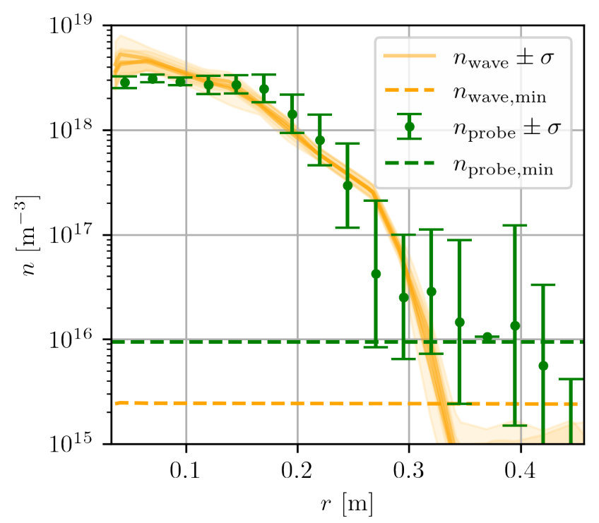
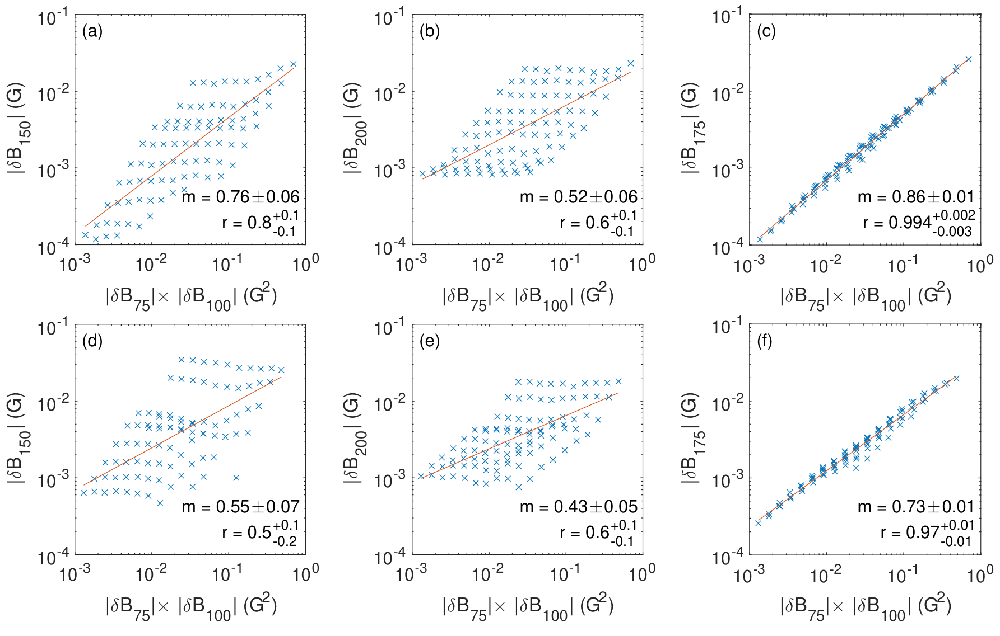
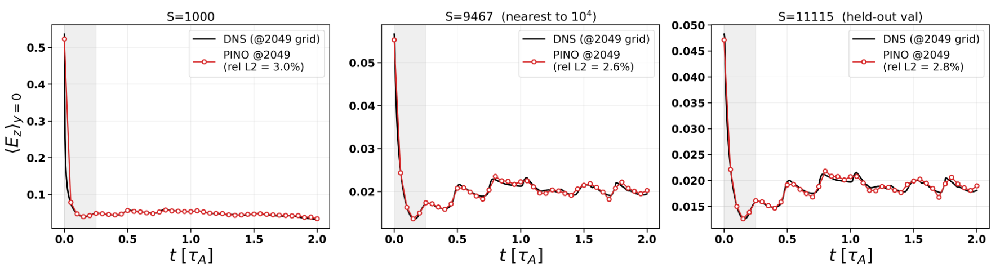
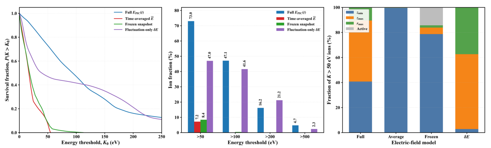
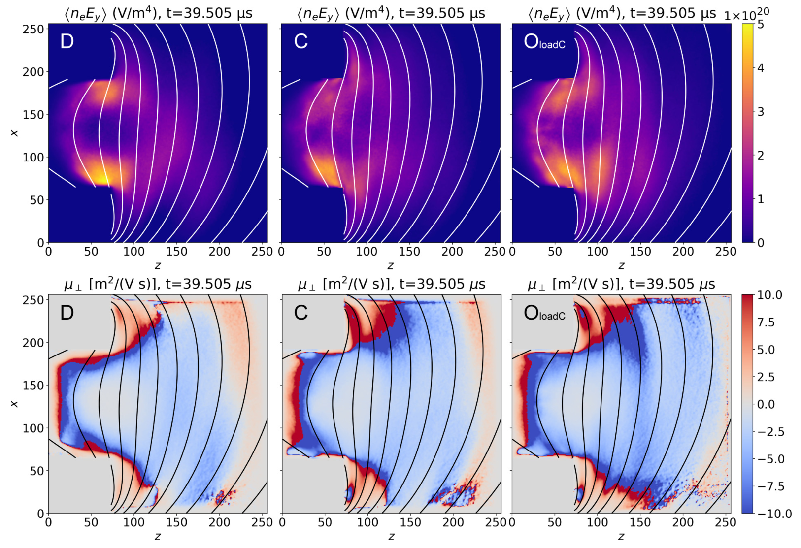
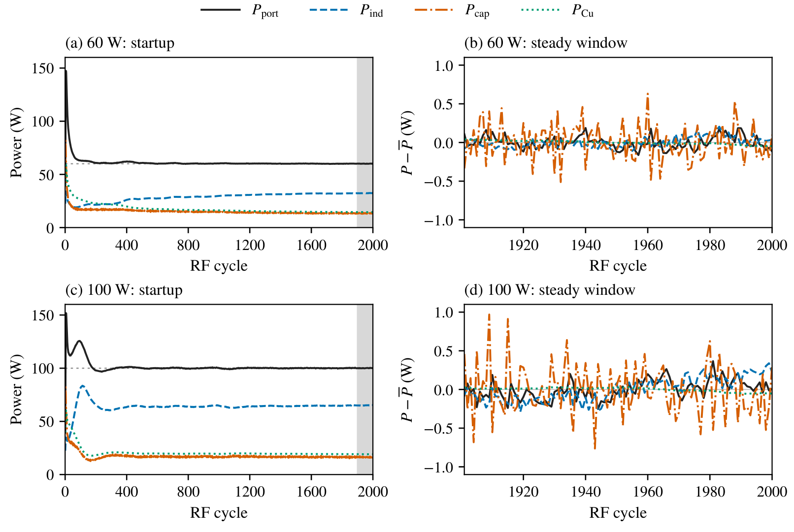

# 09 综合等离子体与交叉方法：波、开放体系、低温源和可信反演

> 截止 **2026-09-30**，仓库综合分类有 75 条，包含低温放电、空间等离子体、原子过程、辐射与核诊断等交叉文章。本章把“共同物理语言”组织成一条教学路线；ICF 冲击/燃烧详见第 04 章，磁面约束/控制详见第 07 章，PIC 算法主线详见第 05 章。这里着重这些章节以外的波、开放/弱电离体系、磁重联、相似与反演。

## 1. 综合分类并不是剩下的论文堆

等离子体是带电粒子与自洽场共同演化的物质系统。激光加速、托卡马克、推进器、微波源、超冷原子电离和尘埃晶体，温度与尺度可能差许多数量级，但都要面对屏蔽、集体波、能量输入、边界损失和模型闭合。综合章节的目的，是学会辨认这些共同方程在不同参数区里保留了什么，而不是把所有论文解释成激光束流应用。

本库标题路由存在明显噪声。例如 R354 是核磁偶极强度，R373/R389 是光中子截面，R368 是慢正电子慢化，R378 是多丝雪崩探测器校准，R351 是结构化光阴极束团动力学。它们提供核、束流或检测方法，不能因为核、plasma 或模拟关键词就视作“等离子体输运最新证明”。本章把这类条目放到交叉工具位置，主线选取确实研究波、源、输运与场动力学的工作。[R354](../appendices/reference-catalog.md#r354) [R373](../appendices/reference-catalog.md#r373) [R389](../appendices/reference-catalog.md#r389) [R368](../appendices/reference-catalog.md#r368) [R378](../appendices/reference-catalog.md#r378) [R351](../appendices/reference-catalog.md#r351)

也要避免“低温”的误会：低温放电通常是电子数 eV、气体近室温的非平衡系统；超冷等离子体由超冷原子电离产生，初态与关联完全不同；暖稠密物质却可能在高密度下数十 eV。温度名称不能代替密度、碰撞性、电离度和分布函数。[R355](../appendices/reference-catalog.md#r355) [R096](../appendices/reference-catalog.md#r096) [R033](../appendices/reference-catalog.md#r033)

## 2. 屏蔽、碰撞与分布函数：先选模型，再谈发现

**教学推导，静电、均匀等温电子与固定离子背景。** 弱电势下电子 Boltzmann 响应为 $n_e=n_0\exp(e\phi/T_e)\simeq n_0(1+e\phi/T_e)$，这里 $T_e$ 用 J。Poisson 方程给

$$
\nabla^2\phi=-\frac{e(n_i-n_e)}{\epsilon_0}
\simeq\frac{\phi}{\lambda_D^2},
\qquad
\lambda_D=\sqrt{\frac{\epsilon_0T_e}{n_0e^2}}.
$$

点电荷的远场势因而从 $1/r$ 变为 $e^{-r/\lambda_D}/r$：粒子重排让局部电荷被屏蔽。推导用了小电势、近热平衡和可用连续密度等假设；鞘层、非 Maxwell 尾、强耦合或量子简并时不能直接套。一个 Debye 球里粒子数 $N_D\sim n\lambda_D^3$ 很多、系统尺度远大于 $\lambda_D$，才通常有弱耦合集体描述的清晰尺度分离。

更一般的起点是分布函数 $f_s(\mathbf x,\mathbf v,t)$，满足

$$
\partial_t f_s+\mathbf v\cdot\nabla f_s+
\frac{q_s}{m_s}(\mathbf E+\mathbf v\times\mathbf B)\cdot\nabla_vf_s=C_s+S_s.
$$

$C_s$ 是碰撞，$S_s$ 是电离、复合、注入与损失源项。无碰撞称 Vlasov；有中性气体就要审能量相关碰撞截面和化学通道。乘 $1,m\mathbf v,mv^2/2$ 后积分，依次得到粒子、动量与能量方程。压力依赖二阶矩，能量输运依赖三阶热流，三阶又依赖四阶，因此流体模型必须在某处闭合。截断省计算，却可能漏掉非热尾与共振；保留更多矩也不自动保证闭合正确。[R359](../appendices/reference-catalog.md#r359) [R107](../appendices/reference-catalog.md#r107)

**重点 1：非线性闭合研究针对的是线性模型的精确响应。** R359 从解析矩递推构建 EKR 和缩放等变神经闭合，在 bump-on-tail 与 slab-ITG 的单模线性问题中可大幅降低增长率误差。其“非线性”指最高矩是低阶矩的非线性函数，不表示已经模拟了完整非线性湍流。单模时矩比值可恢复本征频率，多模叠加则未必；网络还缺一般因果性与稳定保证。读它最有用的是理解闭合的目标范围，并区分本征值准确、时域稳定和实验输运准确三个验收条件。[R359](../appendices/reference-catalog.md#r359)

**重点 2：Weibel 种子到 dynamo 的桥梁由闭合控制。** R107 用保留各物种压力张量的 10-moment 无碰撞流体，在离子/电子质量比 100 的非 pair 条件下追踪种子磁场到湍流放大。热流闭合改变压力各向同性化与有效磁雷诺数，系统可表现得更接近动理学或 MHD 型 dynamo。这是作者约化模型研究，不能说已用真实质量比、全动理学和天体观测确认完整路径。它告诉我们“多保留一个压力张量”并不足以解除闭合敏感性。[R107](../appendices/reference-catalog.md#r107)

## 3. 波是能量载体，也是诊断工具

**教学推导：Langmuir 波。** 对均匀静止电子小扰动，连续方程为 $\partial_t\delta n+n_0\nabla\cdot\delta\mathbf u=0$；线性动量为 $m_e\partial_t\delta\mathbf u=-e\delta\mathbf E-\nabla\delta p/n_0$。用 Poisson 消去电场，并对沿传播方向的温暖 Maxwell 电子取 $\delta p\simeq3T_e\delta n$，令扰动 $e^{i(kx-\omega t)}$，得到

$$
\omega^2\simeq\omega_{pe}^2+3k^2\frac{T_e}{m_e},
\qquad
\omega_{pe}=\sqrt{\frac{n_0e^2}{\epsilon_0m_e}}.
$$

这就是高相速度、长波 $k\lambda_D\ll1$ 条件下的 Bohm–Gross 近似；$3T_e$ 压力闭合与此条件相关，不能覆盖任意相速度。冷电子极限的振荡频率由电荷位移产生的回复力给出；温暖修正来自压力。但速度接近 $\omega/k$ 的粒子会与波持续交换能量，流体压力闭合不足以给完整 Landau 阻尼。阻尼源于速度空间相混合和共振响应，不需要显式碰撞；总粒子—场能量仍可守恒。速度分布在共振附近的斜率和因果解析延拓决定增长或阻尼。[R359](../appendices/reference-catalog.md#r359) [R386](../appendices/reference-catalog.md#r386)

**教学推导：Alfvén 波。** 对背景场 $B_0\mathbf e_z$ 的小横向扰动，线性 MHD 给

$$
\rho\partial_t\delta\mathbf u_\perp=
\frac{B_0}{\mu_0}\partial_z\delta\mathbf B_\perp,
\qquad
\partial_t\delta\mathbf B_\perp=B_0\partial_z\delta\mathbf u_\perp.
$$

对时间再求导并代入，得 $\partial_t^2\delta\mathbf u_\perp=v_A^2\partial_z^2\delta\mathbf u_\perp$，$v_A=B_0/\sqrt{\mu_0\rho}$。磁张力是弹性，质量密度是惯性。垂直传播的简单快磁声分支则有 $v_{ms}^2=v_A^2+c_s^2$；斜传播需完整角度相关色散，不能把这一式用到所有波前。离子惯性长度 $d_i=c/\omega_{pi}$ 与 $k_\perp d_i$ 判断 Hall 修正是否重要。[R350](../appendices/reference-catalog.md#r350) [R358](../appendices/reference-catalog.md#r358)

**重点 3：从快磁声速度反演密度的 TREX 实验。** R350 让 B-dot 阵列追踪重联层形成前的早期波前，在已知背景场、低 beta 条件下反演初始密度。最简式为

**图 09-1｜从磁声波速度反演密度：相符区与检测下限。**

原 Fig. 5（PDF 第5页）单图横轴柱坐标半径 $r$，单位m；纵轴数密度 m⁻³，采用对数刻度。橙线与阴影是四发放电逐炮利用波前速度反演并插值的密度及一倍标准差；绿点来自Langmuir探针，每个位置测量对应不同炮次。中心约 $10^{18}$ m⁻³范围两者相符，说明在已知背景磁场、温度和MHD近似下，磁声速度能约束密度；这里不是光学直接拍到粒子数。半径增大时密度迅速下降，两法误差增大，橙绿曲线在外侧的偏离不宜立刻解释成未知输运。绿虚线检测下限由Debye长度与探针尖间距限制，橙虚线由B-dot间距、采样频率及波传播速度限制：密度低时波速更高，相邻探针可能同一采样时刻看到波前，导数无法可靠给出速度。图的作用是界定**在哪个密度域得到交叉验证**，不是证明整个半径都测准。逐炮全剖面相对机械扫描有优势，但阈值取样、探针位置、温度估计及场标定仍进入误差；两种方法也并非完全无共同模型假设的真值比较。纵轴十倍刻度也使低密区的相对偏差显得较小，需结合检测下限读图。 [R350](../appendices/reference-catalog.md#r350)

$$
n_0\simeq\frac{B_0^2}{\mu_0m_iv_{\rm meas}^2}.
$$

这是实测到达时差加色散关系的反演，不是直接数粒子；可移动 Langmuir 探针提供交叉比较。实验 $\beta\sim0.1$、约 4 eV 的条件使有限声速修正相对小，但作者估计的温度误差约 2% 只适用于该区间。波型误认、磁场不均匀、成分未知或波前非线性都可能系统性改密度，且它测的是初始背景，不是重联层内部瞬时密度。[R350](../appendices/reference-catalog.md#r350)

**重点 4：同向 Alfvén 波也能耦合，但证据不是完整湍流谱。** R358 在 LAPD 发射 75/100 kHz 波，反向与同向相互作用均出现二次非线性模，175 kHz 和频响应与主波幅乘积相容。理想不可压 MHD 的 Elsasser 变量 $\mathbf z^\pm=\mathbf u\pm\mathbf B/\sqrt{\mu_0\rho}$ 含非线性 $\mathbf z^\mp\cdot\nabla\mathbf z^\pm$，所以最低阶需要对向波；同向耦合则与有限离子惯性尺度的二阶 Hall-MHD 项相符，并经作者 3D hybrid 模拟比较。能量向高 $k_\perp$ 移动支持级联相容性，尚不是稳态惯性区或普适谱律。该实验把空间等离子体里难分离的机制变成可控测试，外推仍需匹配无量纲区间。[R358](../appendices/reference-catalog.md#r358)

**图 09-2｜和频模依赖双波幅度：排除单天线谐波的关键比较。**

原 Fig. 2（PDF 第4页）六图均为实验幅度扫描，横轴75与100 kHz基波磁场振幅之积，单位G²；纵轴为所选模式磁场幅度，单位G，两轴均取对数。上排**(a–c)**为反向传播，下排**(d–f)**为同向传播：第一列150 kHz、第二列200 kHz、第三列175 kHz。150与200 kHz分别是单基波二次谐波，(a/b/d/e)呈菱形散布，因一台天线增强而另一台变弱也可得到同一横轴积，却不是同一谐波振幅。和频175 kHz的(c/f)则紧贴一条幂律，说明它确实依赖两波共同存在；反向/同向拟合指数约0.86/0.73，相关系数约0.994/0.97。指数接近但不等于理想二次响应对幅度积的线性指数1，作者指出效率减弱及额外耦合路径等可能性，不能把数值四舍五入为精确理论验证。各图红线为幂律拟合，图内$m$误差是拟合标准误，$r$范围为95%置信区间。该比较支持两流体尺度下同向波也有非线性耦合；它尚未单独证明充分发展的湍流、恒定惯性区通量或任意MHD尺度同向相互作用。波幅用磁场扰动的绝对值标注，实验斜率检验的是响应标度；相位、波数匹配及能量方向仍需要论文其他观测共同约束。 [R358](../appendices/reference-catalog.md#r358)

相关波研究还包括 R042 的相位控制双色 THz、R190 的红外光子减速 THz、R299 的 flying-focus 波前整形与 R048 的有质动力等离子体透镜。这些可放在“电磁波与等离子体相互整形”的地图上，但射频 MHD 波与相对论激光波不是一套可直接移植的参数；诊断和辐射应用的细节应回对应主章。[R042](../appendices/reference-catalog.md#r042) [R190](../appendices/reference-catalog.md#r190) [R299](../appendices/reference-catalog.md#r299) [R048](../appendices/reference-catalog.md#r048)

## 4. 磁重联与辐射湍流：理解尺度决定哪些机制

磁重联把磁场连接关系改变并释放磁能。理想 Ohm 定律 $\mathbf E+\mathbf u\times\mathbf B=0$ 下磁通随流冻结，必须有电阻、电子压力张量、惯性或其他非理想项让连接改变。看到两个磁泡相遇并不能独自证明重联能量分配或速率，必须定位电流层、重联电场、入流/出流以及粒子能量变化。

**教学推导：Sweet–Parker 的量级。** 对长 $L$、半厚度 $\delta$ 的不可压稳态电阻电流层，质量守恒给 $v_{in}L\sim v_{out}\delta$，磁能转动能给 $v_{out}\sim v_A$。电场匹配为 $v_{in}B\sim\eta J\sim\eta B/(\mu_0\delta)$，这里 $\eta$ 是电阻率，单位 $\Omega\,\mathrm m$，不是磁扩散率。于是

$$
\frac{\delta}{L}\sim\frac{v_{in}}{v_A}\sim S^{-1/2},
\qquad S=\frac{\mu_0Lv_A}{\eta}.
$$

长系统高 $S$ 会预测很慢重联；plasmoid、不稳电流层、Hall/电子尺度等可破坏这些假设。要讨论“快重联”，先说明相对 $v_AB$ 的归一化、系统是否稳定、时间窗与边界，而不是把所有电流片峰值比较到一条曲线。[R384](../appendices/reference-catalog.md#r384)

**重点 5：PINO 在全局磁通上准，电流上仍更难。** R384 用 34 条二维电阻/黏性可压缩 MHD 轨迹训练连续时间 FNO/PINO，预测磁通函数以保持 $\nabla\cdot\mathbf B=0$。在两个留出 $S$ 上磁通误差约 1%，谱电流约 7.5%；没有电流监督时磁通更准，二阶导数电流却可差很多。高 $S$ 晚期 plasmoid burst 不在训练窗时，重联率误差显著升高。它说明物理残差、导数和任务指标必须共同检查，不能把低场误差升级成高保真全阶段重联。本次没有运行 DNS 或网络。[R384](../appendices/reference-catalog.md#r384)

**图 09-3｜重联代理的物理指标：留出参数与时间窗都要交代。**

原 Fig. 8（PDF 第11页）三图从左到右为 $S=1000$、训练值9467、留出值约 $1.1\times10^4$（图内具体标11115）。横轴 $t/\tau_A$ 是Alfvén时间归一化，纵轴电流层平均 $E_z$ 为作者无量纲重联率，不是SI电压。黑线为2049²网格DNS内部记录，红圆为仅在513²网格训练的PINO直接查询2049²网格所得；因此“同网格对照”不意味着曾用该高网格训练。左图初态松弛后进入较平稳低值，中右图显示振荡趋稳；三图不同纵轴范围，不能凭高度比较绝对重联速度。灰区 $t\le0.25$ 被排除在图例相对 $L_2$ 误差外，报告3.0%、2.6%、2.8%仅适用于后续窗口。它同时说明参数插值与分辨率转移的可行性，但最高$S$晚期plasmoid burst没有画在这里，正文另报相关误差升至32–42%。导数诊断还须与求解器内部记录比：粗网格有限差分即使用于DNS本身也会带来误差，不能全部归咎网络。此图属于二维电阻MHD数值基准，不是无碰撞重联实验或本次独立复现。留出数值仍处于训练参数区间内部，因此这属于插值检验；“没有用于训练”与“超出所有训练条件”的物理外推应严格区分。 [R384](../appendices/reference-catalog.md#r384)

R300 的 electron-only 重联出流下混合漂移不稳定性和 R325 的 MRX 电流层半碰撞动理学，研究的是电阻 MHD 不包含的尺度。第 04 章的 R290/R295 是 HED 可控平台；本章只建立共同框架，不重复其装置细节。不同条目都含 reconnection，却可能分别在模型、实验与诊断反演层上。[R300](../appendices/reference-catalog.md#r300) [R325](../appendices/reference-catalog.md#r325) [R290](../appendices/reference-catalog.md#r290) [R295](../appendices/reference-catalog.md#r295)

**重点 6：辐射湍流的能量与角分布要一起读。** R372 用二维电子—正电子 EPOCH 衰减湍流追踪粒子与同步辐射，发现冷却不只改能谱，还选择性耗散垂直动量、改变俯仰角随能量的标度。弱/强冷却的低能分支不同，高能曲率漂移又可让俯仰角上升。这里的 pair、二维、弱激发和经典辐射阻尼是边界，不能直接当任意天体源辐射模板。R339 的冷却不稳定两相结构与 R382 的 QED 事件采样补充另一种辐射反馈/计算层次，辐射应用详见第 02 章、强场机制详见第 03 章。[R372](../appendices/reference-catalog.md#r372) [R339](../appendices/reference-catalog.md#r339) [R382](../appendices/reference-catalog.md#r382)

## 5. 开放等离子体：喷管、阴极与 Hall 推进器

开放系统既有粒子流入流出，也有壁面、电极和中性气体持续交换能量。关闭边界或只用周期盒常有助于研究局部模，但不能直接预测放电电流、羽流和寿命。尤其“异常输运”只是指超过所选经典模型，并不是神秘新力；缺失的涨落、边界、二次发射或碰撞都可能参与。

**教学推导，磁化等温电子与冷离子的简单磁喷管。** 磁通管截面积 $A\propto1/B$，稳态连续性 $nuA=\mathrm{const}$，所以 $nu/B=\mathrm{const}$。电子压强沿场产生双极电场，简化离子动量为 $m_iudu=-T_e d\ln n$。用连续式消去密度，得到

$$
\left(u-\frac{c_s^2}{u}\right)\frac{du}{ds}
=-c_s^2\frac{d\ln B}{ds},\qquad c_s^2=\frac{T_e}{m_i}.
$$

当 $u=c_s$，平滑跨声速要求右侧也为零，解释喉部/磁场极值条件。离子加速能来自电子压强经电场转移，磁场自身不做功。这个示范忽略电子动力学、温度变化、旋转和场自洽重塑，不能直接代替真实喷管解。[R149](../appendices/reference-catalog.md#r149)

**重点 7：喷管平衡不能只给一条外磁场。** R149 将跨声速流与带惯性力的广义 GS 结合；在轴对称、无电流/无方位旋转特殊情形，磁面上的流速受局部磁场强度控制，磁面又被流惯性重塑。它提醒“给定场上追粒子”与“流和场自洽”是不同模型。开放镜、推进与先进排热几何可借这一思想，真实脱离、湍流和壁面仍需另审。[R149](../appendices/reference-catalog.md#r149)

**重点 8：多镜端塞依赖速度选择，不等于已装成反应堆。** R167 的 travelling rotating magnetic field 利用多普勒移频的回旋共振与相空间混合抑制开放端损失，单粒子轨道给半动理学率方程系数。与强加热方案相比，某些模型限制下可主要重排相空间、降低能耗。但实际感生电场、天线、等离子体屏蔽和响应还需实验；理论端塞约束增强不能直接当 Lawson 达标或净聚变电站。[R167](../appendices/reference-catalog.md#r167)

**重点 9：空心阴极的粒子履历把“哪里加速”问清楚。** R347 的 0.8–3.5 A Xe 羽流实验测高能离子与宽带涨落，再用二维轴对称静电 WarpX 的代表算例追离子出生、轨迹与积分功。完整时变场更易把指定出生队列送入高能区，许多高能流出离子来自羽流内电离。它没有把每个实验工况逐点重建；双探针相位图还受混叠影响，不能唯一认定能量来自某种离子声模。做法最值得借鉴的是对同一出生队列比较时变、平均和冻结场，并用 $\Delta K=q\int\mathbf v\cdot\mathbf E\,dt$ 作能量来源审计。[R347](../appendices/reference-catalog.md#r347)

**图 09-4｜同一出生队列：时变场如何改变高能尾与逃逸。**

原 Fig. 11（PDF 第13页）图注按(a–c)指从左到右三面板，图中本身未另印字母。作者令同一百万个KDE出生粒子在完整PIC时变场、时间平均场、冻结场及仅涨落场中传播。左图横轴末态能量阈值 eV，纵轴存活函数 $P(K_f>K_0)$：完整时变场保留宽尾，平均/冻结场在约50–100 eV迅速衰减。中图横轴四能量阈值，纵轴比例%；大于50 eV分别73.0%、7.2%、8.4%、47.0%，展示平均场无法重现同一队列的高能轨道。右图只在 $K_f>50$ eV条件下，纵轴逃逸族比例%，蓝/橙/绿为上游$z_{min}$、下游$z_{max}$、径向$r_{max}$，灰为结束时仍活跃。平均场几乎全部高能离子回上游，而完整时变场分布于多条路径。它是受控敏感性试验，改变场也会改变轨迹，所以四组结果不能相加解释成能量贡献分解；仅涨落场也不是独立自洽等离子体解。73%尤其不是实验羽流高能离子占比，和瞬时自洽PIC的11.87%属于不同统计群体。真正机制还需轨迹积分功与空间出生数据支持，不能由这张图唯一归因某种离子声波。右图灰色仍活跃群体并未自动失去高能，只是尚未到达吸收边界，有限传播终止时间会影响各逃逸族份额。 [R347](../appendices/reference-catalog.md#r347)

**重点 10：Hall 推进器的净输运出现在近壁路径。** R370 的作者 3D PIC 包括电离、中性演化、介质充电、二次发射与开放羽流。时间/方位平均的密度—电场相关揭示出口附近持续近壁通道，而非均匀铺满截面的迁移率。拓扑跨几个边界处理保持，但绝对迁移率、高波数谱和晚期收敛仍有限制。真实推进器的整环曲率也被局部扇区近似简化。它是作者模拟发现，不是本次或论文已经直接在整机测到两条电流通道。[R370](../appendices/reference-catalog.md#r370)

**图 09-5｜瞬态波动平均后留下近壁净输运足迹。**

原 Fig. 8（PDF 第13页）六面板的列依次为D固定电位壁、C陶瓷介质壁、$O_{loadC}$介质壁与开放羽流组合；上排是时间与方位平均的 $\langle n_eE_y\rangle$，色标乘 $10^{20}$ V/m⁴，下排有效垂直迁移率 $\mu_\perp$，单位m²/(V·s)。所有横轴$z$、纵轴$x$都是**网格索引**，不能当毫米；白/黑曲线是磁力线结构。上排三种边界均在出口附近的内外壁邻近形成两条较亮带，核心较弱，说明净相关并不均匀遍布横截面；下排相应负迁移率结构更明显。负号遵从作者定义，表示电子跨场向阳极输运，不是负耗散定律或器件功率增益。时标39.505 μs对应代表性晚期窗口，200个样本平均滤掉快速EDI振荡，留下非零输运；瞬时单幅波纹无法代替此平均。图支持多个边界处理下**拓扑相似**，不证明绝对迁移率已网格/时长完全收敛。分母含局部场和密度，弱场区的比值解释尤需谨慎；局部方位扇区、固定背景磁场及开边界也限制整环推广。六图均为作者3D PIC诊断，尚不是整机电子通道的直接观测。同样的两带位置可以与不同绝对强度并存，故边界鲁棒性需同时报告拓扑与幅度。 [R370](../appendices/reference-catalog.md#r370)

R348 的 Vlasov plasma-wall 代码适合研究低噪声相空间和壁过程，但给出框架不等于所有 sheath/化学已验证。R350 的波速密度法、R347 的轨迹功、R370 的涨落相关提供三种“从观测或场履历辨认输运”的视角，不能被一个有效扩散系数完全替代。[R348](../appendices/reference-catalog.md#r348)

## 6. 低温源、鞘层与复杂等离子体：能量进去了多少，去哪了

**教学推导：最简 Bohm 入鞘条件。** 取冷单电离离子、Maxwell 电子，鞘边电子密度 $n_e\simeq n_0(1+e\phi/T_e)$，负壁势下离子加速且通量守恒。能量式 $m_iu^2/2=m_iu_0^2/2-e\phi$ 给 $n_i\simeq n_0[1+e\phi/(m_iu_0^2)]$。要让负电势区电子减少得足够快、形成正空间电荷，需 $m_iu_0^2\gtrsim T_e$，即 $u_0\gtrsim\sqrt{T_e/m_i}$。它是最简鞘判据，温离子、多组分、二次发射、磁斜入和非 Maxwell 电子会改变条件。

弱电离放电中，电子加热—碰撞电离—带电密度—负载阻抗会反馈到电源；只规定一个固定电场常漏这条链。离子在壁上复合、二次电子离开壁、中性粒子回流，均可改收支。因此功率应分别记端口输入、导体损耗、电子加热、离子/壁能流和辐射，而不是只给峰值电子温度。[R355](../appendices/reference-catalog.md#r355) [R176](../appendices/reference-catalog.md#r176)

**重点 11：phasor–PIC 把电感与电容反馈同时接回电路。** R355 联立二维轴对称 implicit PIC/MCC、每匝线圈电流/电位和射频网络：感应电流回馈反电动势，Poisson 同一离散 Gauss 通量给表面电荷，再取基频位移电流。这样可以审查真空互感或窗口电容是否双计数。无粒子制造解约二阶收敛、作者 GEC 算例功率平衡残差约 0.4–0.5%，说明装配与收支有可信基准；基频相量、每 RF 周期更新、轴对称与局部集肤近似仍限制快瞬态和三维。历史密度比较不是已与硬件电源双向实时闭环。[R355](../appendices/reference-catalog.md#r355)

**图 09-6｜端口功率不全是电子加热：双向场电路的能量账。**

原 Fig. 14（PDF 第30页）保留(a–d)：上排目标端口60 W，下排100 W。左列**(a/c)**横轴RF周期数，纵轴完成周期的功率 W；黑线总端口功率，蓝虚线感应耦合、橙点划线电容耦合、绿点线铜损。启动时各项迅速改变，随后总端口落到灰水平目标，感应项缓慢增长、铜损和电容项调整，说明不能把发生器端口输入直接全赋给等离子体。右列**(b/d)**只看周期1901–2000，纵轴各项相对其自身窗口平均的偏差 W；四曲线不是共同减去总功率均值。电容通道波动较大而铜损较稳，60/100 W的统计幅度也不同；所有曲线未平滑，保留PIC统计与负载反馈。左灰竖带与右图对应同一稳态统计窗，便于把启动瞬态和周期平均分开。论文特别提醒启动期电容曲线是周期封闭的端口功，稳态加热解释需结合其能量定义，不能把每个瞬态值都读成即时电子耗散。图论证双向场—电路耦合的分项收支与稳定工作点，仍是轴对称、基频相量的作者模拟，没有展示硬件网络实时闭环或高次谐波全部能量。[R355](../appendices/reference-catalog.md#r355)

**重点 12：虚拟临界耦合靠波形而非固定匹配。** R176 用指数增长微波驱动，在过耦合谐振器中使入射与返回场瞬态相消，改善反射与点火储能。论文实验展示动态匹配的可行性，既有笔记报告特定配置的最高储能约常规临界耦合四倍；本章不把这个值推广到任意源。等离子体点火后负载改变、窗口与导体损耗仍须跟踪。与 R355 对照，一篇主动设计驱动时间波形，一篇求解双向负载，都是电磁源工程里“只看稳态阻抗不够”的例子。[R176](../appendices/reference-catalog.md#r176)

**重点 13：尘埃二聚体增加了取向自由度。** R221 的分子动力学研究带电二聚体在径向约束与周期体相中的排列，粒子数增长可形成不同环状和取向结构，位置关联与取向关联耦合。若把二聚体都当点粒子，会丢掉旋转、各向异性相互作用与缺陷结构。它是理想化模型基线；真实尘埃的充电涨落、中性阻尼、wake 和电极鞘层需另加，不能仅由模拟有序图就声称实验已能精确组装。[R221](../appendices/reference-catalog.md#r221)

**重点 14：超冷 Rydberg—等离子体转换并非低温放电。** R096 在 $^{87}$Rb Bose–Einstein 凝聚体用单个飞秒脉冲，跨两光子电离阈值调节初态自由/激发电子，直接测释放电子动能并与粒子级 MD 比较。宽带激发可跨过窄带 Rydberg blockade 的密度限制；作者把电荷不平衡识别为稠密 Rydberg 气向超冷等离子体衰变的重要驱动。这是实验结合模型的多体研究，不是把中性气体电离截面换到 ICP 就可复用的机制。低温、强关联和超快初态制备分别控制不同尺度。[R096](../appendices/reference-catalog.md#r096)

## 7. 相似律、代理与反演：今年跨方向方法最值得学的部分

**重点 15：广义相似从方程出发，而不是只缩图。** R343 以 Boltzmann–Maxwell 的尺度对称性统合多个受控系统。无碰撞例子中，令缩小系统尺寸为原系统的 $1/k$，则时间同样缩小，速度不变，电磁场放大 $k$，带电密度放大 $k^2$。这样 $\omega_{pe}$ 增为 $k$ 倍、$\lambda_D$ 缩为 $1/k$，维持时间/长度相对尺度；代回 Vlasov 与 Maxwell，各项有一致缩放。加入碰撞后中性密度、截面、组分和电离度要另外匹配，固定壁材、原子能级或辐射可破坏相似。作者 PIC/fluid 给四类数值例子，不是“任何实验缩小都会相同”的定理。[R343](../appendices/reference-catalog.md#r343)

**重点 16：PhySKIP 用约束重建与回退限定时间跳跃。** R369 的小 CNN 只预测物理短步之后的状态修正，Poisson/外电路重建场，周期重锚、非负性/收支检查与回滚限制漂移。作者在固定一维氮气漂移—扩散模型上报告约数倍 CPU 加速；不包含模型加载与诊断成本，且展示候选全被接受，所以回退机制本身还没有被压力测试充分检验。它并不是一般 PIC 时间步稳定限制已被取消。其可借鉴原则是让学习只负责未受约束部分，把必须满足的方程重新求解。[R369](../appendices/reference-catalog.md#r369)

**重点 17：CTS 贝叶斯反演的“最可信”只在候选集合内。** R386 用群体退火同时估计非 Maxwell 分布参数与模型证据，在合成三 Maxwell 和 super-Gaussian 光谱中比较单到四分量。更多分量可稍微降低残差，但证据惩罚不必要自由度，偏向能解释数据的较简单模型。峰不是分布函数的直接照片：介电响应、色散与 Landau 阻尼也生成/移动峰。作者使用准稳态前向模型与稳定性约束，真实仪器函数、杂散光、空间积分和动态不稳可能改变结果。因此“找到正确分布”应限定为给定模型集与合成数据的恢复，而非直接观测真实尾。[R386](../appendices/reference-catalog.md#r386)

可把贝叶斯逻辑写成教学式 $p(\theta|D,M)\propto p(D|\theta,M)p(\theta|M)$，模型证据 $p(D|M)=\int p(D|\theta,M)p(\theta|M)d\theta$。最小残差只看一个最优点，证据比较整个先验体积里有多少参数能合理解释数据；所以结果也会随先验范围变。拟合不确定性与模型缺项必须分开，精确后验不能证明候选族已包含所有真实机制。[R386](../appendices/reference-catalog.md#r386)

原子过程 R174 的碰撞电离/shake-off、R065 的原子细结构强化学习、R179 的不透明度代理、R366 的铁离子谱诊断，是“原子数据—布居—辐射—探测响应”的交叉链。R029 的超快气体击穿摄影、R073/R075 的 XFEL 加热/电离探测、R098 的多脉冲 X 射线成像则增加时序信息。新仪器能提供约束，但不能凭时空分辨高就自动解决多参数退化。[R174](../appendices/reference-catalog.md#r174) [R065](../appendices/reference-catalog.md#r065) [R179](../appendices/reference-catalog.md#r179) [R366](../appendices/reference-catalog.md#r366) [R029](../appendices/reference-catalog.md#r029) [R073](../appendices/reference-catalog.md#r073) [R075](../appendices/reference-catalog.md#r075) [R098](../appendices/reference-catalog.md#r098)

R050 还给一个有用的守恒提醒：题目说零入射角动量激光产生等离子体旋转，作者理论与多维 PIC 中电子获得角动量由离子与组合电磁场补偿，不是角动量无中生有。本次读本地摘要复核这一限定。阅读任何“无输入也产生某输出”的标题，都应先找完整系统的守恒收支。[R050](../appendices/reference-catalog.md#r050)

## 8. 2026 年动态与方法比较

本库今年的共同动态不是一种新等离子体，而是三类研究工作并进。**可控机制测试**以 R358 同/反向波、R350 波速密度和 R096 多体电离为代表。**边界与履历**以 R347/R370/R355 为代表，让出生、输运、壁/电路反馈进入模型。**约束下的机器学习**以 R384/R369/R386 为代表，从只报场误差转向导数、方程约束、回退或模型选择。它们发表/公开于不同月份，与 9 月入库批次密集不能混成“所有机制都在 9 月新发现”。[R358](../appendices/reference-catalog.md#r358) [R350](../appendices/reference-catalog.md#r350) [R096](../appendices/reference-catalog.md#r096) [R347](../appendices/reference-catalog.md#r347) [R370](../appendices/reference-catalog.md#r370) [R355](../appendices/reference-catalog.md#r355) [R384](../appendices/reference-catalog.md#r384) [R369](../appendices/reference-catalog.md#r369) [R386](../appendices/reference-catalog.md#r386)

历史基础应按物理近似理解：Debye 屏蔽建立集体尺度，Langmuir/Alfvén 波建立两种回复力，Landau 相混合揭示流体遗漏，MHD 冻结与重联建立场拓扑变化，放电相似与 sheath 建立边界语言。今年的文章是在相应基础上增加可辨识条件、电子/离子尺度、真实边界和计算接口，而不是每篇都推翻前面所有理论。

| 问题 | 可用近似 | 哪个判据会提示失效 | 本库示例 |
|---|---|---|---|
| 弱电势屏蔽 | Boltzmann/Poisson | 强场、非 Maxwell、简并/强耦合 | R386、R096 |
| 大尺度磁波 | MHD | $k_\perp d_i$ 或动理学共振不可忽略 | R350、R358 |
| 稳态电阻重联 | Sweet–Parker | plasmoid、Hall、电子压强/惯性 | R384、R300、R325 |
| 开放沿场流 | 双极流体/喷管 | 尾分布、旋转、边界与脱离 | R149、R167 |
| 弱电离电磁源 | PIC/MCC + 外电路 | 谐波、快瞬态、非轴对称 | R355、R176 |
| 低维代理/反演 | 训练物理与前向响应 | 分布外、候选缺项、动态性 | R369、R386 |

这些都是选择模型的起点，不是自动归类器。一个实验可以同时跨几个失效判据，例如阴极有非 Maxwell 电子、中性碰撞和开放边界；不能只因为温度低就认为“便宜流体模型一定足够”。

## 9. 经验总结与入门练习

首先 **不要把相关性当机制**。R347 的宽带涨落和高能离子、R358 的非线性模与级联，分别需要轨迹功或幅度/尺度关系才能增加机制证据；峰值一起出现只是第一层。其次 **必须在观测空间比较**：电子分布要变成 CTS 谱，密度要变成波前时差，壁热流要变成温升，场要通过真实探针响应；只比理想变量容易漏仪器误差。再次 **有效系数是模型产物**，异常迁移率、热扩散、阻尼都可能吸收遗漏边界与几何，移植前先审假设。[R347](../appendices/reference-catalog.md#r347) [R358](../appendices/reference-catalog.md#r358) [R386](../appendices/reference-catalog.md#r386) [R350](../appendices/reference-catalog.md#r350) [R370](../appendices/reference-catalog.md#r370)

第一阶段可做三个纸笔练习：给 $n,T,B,L$ 算 $\lambda_D,\omega_{pe},v_A,\rho_i$ 并检查单位；从已知磁声速度反解密度，传播一次速度误差；用 Sweet–Parker 看系统尺度增大是否真的维持相似。这样会迅速建立“有多少尺度”的直觉。

第二阶段按 R350 → R358 → R149 → R355 阅读，分别理解波诊断、非线性波、开放流与电源反馈。第三阶段读 R347/R370，在轨迹/场历史里检查粒子做功与平均涨落通量，不急着给每个结构贴模名。最后读 R343/R369/R386/R384，练习为缩比、代理和反演写一份假设清单：输入来自哪里、可观测量是什么、未包含机制是什么、出现什么现象必须停止外推。

若关心科研经验，最有价值的成果往往是发现一个闭环仍不够：低磁通误差不保电流层、完整时变场增能不唯一指模、最小谱残差不选正确复杂度、数倍加速不代表回退已验证。这些边界使后续实验/数值问题具体化，也比无条件的“突破性”判断更适合规划工作。

## 10. 本章证据来源与覆盖

本轮原图补充（2026-10-01）逐一阅读6幅所选原图的图注及邻近正文，并查看原页与最终裁图；来源为 R350、R358、R384、R347、R370、R355。保留全部所选子图、坐标轴和图例；每幅均有原PDF/PNG SHA-256、页码、PDF点坐标裁框及检查侧录。此检查覆盖所选图，不表示全库逐图精读或独立复现；详见[原图选择记录](../data/figure-selection-hedp.md)与[图像来源侧录](../data/figure-assets/)。

本次清点 75 个路由条目的标题、日期、路径和交叉分类，正文有超过 35 篇串联，17 个重点单元。核与束流诊断条目只按工具联系放置，未升级为等离子体机制证明。对 HED/磁聚变与强场辐射条目以跨章导航处理，保持本章低温/开放体系和共同波理论的主线。

初稿阶段重新用本地 `pdftotext -layout` 读取并定位 **R350、R358、R384、R386、R343** 的关键模型/数字；另外读取 **R096、R050** 的本地全文开头与摘要，核对实验/模拟属性。初稿其余重点主要复用并阅读了现有笔记 R107/R149/R167/R174/R176/R221/R347/R355/R359/R369/R370/R372，未声称本次逐页精读所有 75 篇。R032 没有本轮可用全文/笔记内容支撑，本章只把其标题所示丝化成像作为目录关联，未推断实验细节。

2026-09-30 原始来源成功核查包括 [R350 官方 arXiv](https://arxiv.org/abs/2609.11743)、[R343 官方 arXiv](https://arxiv.org/abs/2609.08413) 与 [R358 官方 arXiv](https://arxiv.org/abs/2609.17162)。首次提交分别为 **09-10、09-08、09-15**，仓库入库分别为 **09-12、09-11、09-17**；R350 页面另注明 09-08 投期刊，这不是 arXiv 公开日。网页核查确认摘要与版本，详细数字以本地全文与既有笔记为基础。记录见 [来源核查表](../data/hedp-source-checks.json)。

本章没有新跑 PIC、MHD、MD、PINO、Bayesian 反演或低温化学网络，也没有读取原始探针/电子谱数据。教学推导是受明确假设限制的示范；把相关原理讲清楚，不等于本次已经独立验证论文模型或完成束流应用实验。
