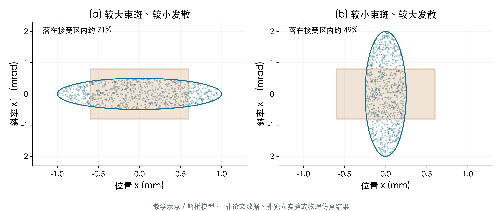
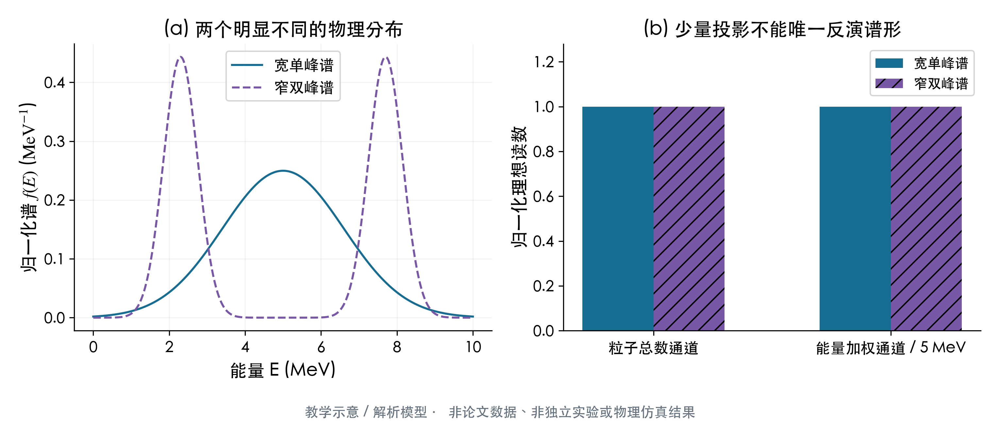
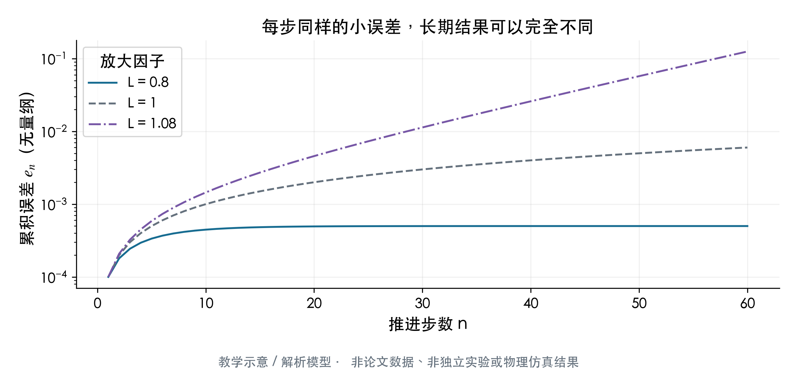

# 10 · 跨方向趋势、研究经验与学习路线

本章把九个方向放回同一张问题地图。以下“趋势”是基于本库和前九章的综述判断，不是对全球全部2026论文的统计结论。重要实验、作者模拟和条件化理论仍保留各自边界；具体参数、假设和来源版本见对应主题章。

## 1. 从峰值纪录走向有效输出

高能量、高电荷、高强度当然重要，但它们只是某一环节的指标。能量增益与亮度同时提高，需要控制注入、束流加载和横向动力学；把束流送进光源或成像系统，还要求发散、能散、时序、重复率与接受度同时合适。2025年的PWFA能量与亮度工作是背景，2026的高重复率LWFA、电子衍射和FEL端到端优化则显示了几种不同的需求牵引。[R025](../appendices/reference-catalog.md#r025)、[R314](../appendices/reference-catalog.md#r314)、[R374](../appendices/reference-catalog.md#r374)、[R252](../appendices/reference-catalog.md#r252)。

这一转变应该怎样理解？设某应用接受的粒子能区为 $\mathcal E$，空间与角度接受度为 $\mathcal A$，则有用电荷是相空间分布在接受区的积分：

$$
Q_{\mathrm{acc}}=e\int_{\mathcal E,\mathcal A}f(\mathbf x,\mathbf p)\,d^3x\,d^3p.
$$

对电子这里取电荷绝对值；$f$的归一化为实际粒子数。总电荷增加而发散变大时，$Q_{\mathrm{acc}}$未必增加。研究下一步应从“我产生了多少”追问“用户在定义好的接受区拿到了多少”。01和02章提供具体机制与案例，08章说明怎样测清这些量。

**图像与公式怎样对应。** 两图横轴为位置$x$、单位mm，纵轴为近轴斜率$x'$、单位mrad，坐标范围相同。蓝色椭圆分别代表半轴为(1 mm, 0.5 mrad)和(0.25 mm, 2 mrad)的均匀填充相空间；二者面积相同，RMS几何发射度均为半轴乘积的四分之一，即0.125 mm·mrad。橙色矩形是同一应用接受区。缩小束斑同时增大发散，未必提高矩形内的粒子比例：本图固定种子的4000个教学采样点约为71%与49%。这些比例仅解释几何重叠，不是任何论文束线的测量；实际束还有非均匀分布、能散、色差与空间电荷。

在时间维度上，平均输出不是峰值通量乘一个随意选取的脉宽。简化成每发产额 $Y$、发频 $f_{\mathrm{rep}}$、有效发比例 $p_{\mathrm{good}}$、在线占空比 $d$，则

$$
\overline{Y}=Y f_{\mathrm{rep}}p_{\mathrm{good}}d.
$$

还要分别统计发间波动、漂移和失效模式。R374的连续shots统计具有直接运行层面的价值，但仍不能代表所有下游应用都已达到长期稳定要求。[R374](../appendices/reference-catalog.md#r374)，[官方来源](https://arxiv.org/abs/2609.26390)。

## 2. 从源设计走向端到端证据链

DLA泡沫电子—高Z转换靶—光子/活化/中子实验是本库重要的应用连接点；而同位素优化、pair/muon设计或中子俘获方案中仍有大量计算性预测。它们可共同讨论，但不能使用同一种“已经实现”的语言。[R053](../appendices/reference-catalog.md#r053)、[R286](../appendices/reference-catalog.md#r286)、[R361](../appendices/reference-catalog.md#r361)、[R100](../appendices/reference-catalog.md#r100)。

工程链越长，误差就越容易放大。例如输出 $Y$ 依赖源能谱参数、靶密度、核截面、输运和探测效率，用参数向量 $\boldsymbol\theta$ 表示。在小误差、可微条件下，

$$
\mathrm{Var}(Y)\simeq\nabla_{\theta}Y^{\mathsf T}
\,\mathbf C_{\theta}\,\nabla_{\theta}Y,
$$

其中 $\mathbf C_\theta$ 包含协方差。忽略相关性可能低估也可能高估不确定度；非线性强或尾部主导时应做采样传播，而非只用线性公式。对活化、剂量或成像应用尤其应检查：哪一段不确定度支配最终结论？更精细的PIC网格如果不能改善源谱的实验约束，可能不是最优投入。

**最值得追踪的新增证据**是同一平台或同一shots集合中同时约束一次束流、转换靶、光子谱、核反应和探测器响应，并公开阈值、接受度和误差传播。单独一个更大的预测产额不够闭合整条链。

**读图时区分物理分布和读数。** (a)横轴是能量MeV，纵轴为归一化能谱，单位 $\mathrm{MeV^{-1}}$；蓝线是宽单峰、紫虚线是两个窄峰，均积分为1并具有5 MeV平均能量。(b)自拟的两个理想响应分别测粒子总数和除以5 MeV的能量一阶矩，因而两种谱的两个柱子都等于1。图没有噪声，仍然出现非唯一性；这不是某个真实探测器的响应，也不是论文反演结果。其论证作用是说明：仅凭总信号或平均能量，很难唯一恢复谱形。增加有不同能量权重的独立通道可以补充信息；单纯换更复杂的拟合网络，不能自动补出原始测量未包含的信息。

## 3. 从发现量子效应走向区分量子模型

在强场QED里，看到电子损失能量或出现高能光子，并不自动唯一识别量子模型。需要控制初始束流、焦点场、时空重叠和诊断响应，并找出不同理论在可观测量上的分离。量子RR实验与LUXE的设计/原型探测工作代表不同阶段：前者有具体实验对照，后者的重要内容包括装置和测量能力建设。[R035](../appendices/reference-catalog.md#r035)、[R385](../appendices/reference-catalog.md#r385)、[R393](../appendices/reference-catalog.md#r393)。

一个有用的统计思路是比较假设 $H_1,H_2$ 给出的信号概率分布，而非只比较平均曲线：

$$
\log\Lambda=\log p(\mathbf y\mid H_1)-\log p(\mathbf y\mid H_2).
$$

焦点位置、束流能散和标定常数等是 nuisance parameters，需要边缘化或做受控扫描；若这些参数变化也能产生相似信号，理论差异就未必可识别。偏振、自旋、角度与关联测量可能增加识别信息，但会带来更复杂的诊断和较少的有效事件。03章讨论的结构化γ、真空非线性及高阶理论，应该在产额、背景和可观测性预算里一起评价。

## 4. 从“守恒代码”走向可信计算

守恒、低色散、GPU性能和可扩展实现处理的是不同问题。守恒格式仍可能存在不合适的分辨率、错误的物理模块、边界污染或低粒子数噪声。混合PIC、δf、连续Vlasov和全PIC也没有一个普遍最优解，应从研究尺度和分布函数偏离程度选择模型。05章对守恒、谱求解、GPU、混合模型及学习型加速做了比较。[R131](../appendices/reference-catalog.md#r131)、[R139](../appendices/reference-catalog.md#r139)、[R369](../appendices/reference-catalog.md#r369)。

数值可信度可以按依赖顺序建立：先验证离散部件符合方程，再对可解析或标准问题验证整体行为，再做分辨率/粒子数/盒子尺寸检查，再对实验可观测量做响应后的比较。不能跳过前三步，直接用一张外观相似的实验图当作验证。

比较方法时还要分清“快”的来源。算法减少物理维度、改变容许误差、缩短演化时长或学习近似都可能提高速度，但不都属于同精度计算成本的降低。可信的速度比较应记录参考物理模型、误差目标、硬件、数据成本、全部执行时间和失效工况。

## 5. 从离线AI误差走向在线闭环

在这份文献库中，AI至少有五种角色：昂贵模型的代理、方程闭合、实验参数优化、诊断反演和实际控制。它们的失败标准并不相同。诊断反演需要校准和可识别性；闭合需要稳定与正确的长期输运；控制需要延迟、执行器约束和失效保护。06和07章把这些角色放在具体系统中讨论。[R256](../appendices/reference-catalog.md#r256)、[R308](../appendices/reference-catalog.md#r308)、[R318](../appendices/reference-catalog.md#r318)、[R390](../appendices/reference-catalog.md#r390)。

以演化代理为例，真实系统 $x_{n+1}=F(x_n)$，模型为 $\widehat F$。若误差 $e_n=\widehat x_n-x_n$，线性化得到

$$
e_{n+1}\simeq DF(x_n)e_n+\delta F(x_n).
$$

即使每步局部误差 $\delta F$ 很小，系统的放大因子也可能让误差累积。训练集随机拆分的低均方误差，不能代替长时间滚动推进，更不能代替跨装置验证。若训练样本来自相同shot、相邻时刻或同一次数值扫描，随机拆分还可能造成信息泄漏，应按实验批次、参数区域或装置分组留出。

**坐标与适用边界。** 横轴是推进步数，纵轴为无量纲误差、对数刻度；三条线使用完全相同的局部误差 $\delta=10^{-4}$ 和初始误差0，只改变常数放大因子L。蓝线L=0.8趋近有限误差，灰虚线L=1线性累积，紫点划线L=1.08不断放大。曲线是标量递推 $e_{n+1}=Le_n+\delta$ 的教学计算，局部误差被设成同号；真实系统的Jacobian有多个方向且随时间变化，不能据此预报任一论文的误差曲线。它说明为什么05/06章的长期推进、守恒、重新锚定和留出工况图比一张低MSE散点图更有判断力。

**今年文章应该按部署阶段阅读：** 单模型拟合 → 留出工况 → 在线求解器耦合 → 数字或物理闭环 → 实际装置运行。不同论文停在不同阶段；综述不能把它们压成一个笼统的“AI已经解决等离子体控制”。

## 6. 聚变与HED问题的共同难点：闭合、诊断与多尺度

ICF关注压缩、预热、混合和燃烧；磁约束关注平衡、输运、快粒子和边界控制。共同难点是关键物理跨越多个尺度，而诊断往往只看到投影。ICF的高能X预热、金污染、热流闭合与磁约束的非Maxwell分布、快粒子输运、平衡重建，都体现了“模型怎样把不可直接观测的量连接到信号”的问题。[R388](../appendices/reference-catalog.md#r388)、[R229](../appendices/reference-catalog.md#r229)、[R327](../appendices/reference-catalog.md#r327)、[R386](../appendices/reference-catalog.md#r386)、[R278](../appendices/reference-catalog.md#r278)。

尤其要区分物理过程真实变化与诊断模型改变。例如用不同不透明度、非LTE模型或空间积分处理得到不同温度，可能首先反映模型依赖，而不是实验装置突然达到更高性能。跨代码、跨诊断和跨实验平台验证比单一最优拟合更能减少这种歧义。04、07、08章各自展开这些问题。

## 7. 如何选择一个值得做的研究问题

下面是基于本库的研究建议，属于综述判断而非已开展的项目。

| 问题 | 已有基础 | 最有价值的下一类证据 | 最容易误判之处 |
| --- | --- | --- | --- |
| 高重复率LWFA能否稳定服务用户 | 束流与连续shot统计 | 实际接受度、长运行、样品端有效输出 | 把峰值能量当作平均可用性能 |
| 泡沫DLA与转换靶怎样联合优化 | 实验与PIC/MC连接 | 同shots源谱、靶响应、活化与剂量协方差 | 忽略宽谱尾部与角度耦合 |
| 强场QED怎样区分理论模型 | RR观测与装置设计 | 受控时空重叠、多观测量联合拟合 | 将不确定的场强变化当作量子效应 |
| 学习型闭合怎样长期稳定 | 解析/数值训练与短期基准 | 长时间留出工况、守恒与极限恢复 | 用单步MSE代表物理稳定性 |
| 代理控制怎样跨装置使用 | GS代理与实机控制个案 | 跨装置冻结模型、时延与失效测试 | 将单装置数据覆盖当作普适性 |
| HED物性与预热怎样减少模型依赖 | 光谱、冲击与流体模型 | 多诊断、空间/时间响应、跨代码UQ | 把反演最佳值当作唯一物理真值 |

选题时，先把目标写成可反驳的句子，例如“在固定接受区和误差预算内，预脉冲参数改变使某一能区的平均活化产额提高”。然后找最强的替代解释，并设计能区分它的对照。这样比“提高性能、加入AI、研究新靶”更容易形成可评价的结果。

## 8. 阅读与计算中的可操作经验

**先手算再读细节。** 给定密度算 $\lambda_p$，给定激光算 $a_0$，给定束荷和能量算束流能量。若论文的效率差几个数量级，先检查能区、角域、有效面积和归一化，不急着判断作者错误。

**把模型假设写成表。** 维度、几何、离子运动、电离、碰撞、辐射、核数据、边界和时长至少各占一项。两个模型若这些条件不同，结果差异不能全部归因于新算法。

**先比较响应后的可观测量。** 数值粒子能谱和仪器屏信号之间有磁输运、滤片、空间积分和响应。让模拟经过相同仪器模型再比较，通常比直接对比内部物理量更有意义。

**保存“测量—反演—机制”三层笔记。** 哪些仪器记录发生了什么？反演用了哪些参数？机制解释排除了哪些替代方案？这能避免几年后只有一句“发现某效应”而找不到证据。

**公开失败比只保存最佳点更重要。** 运行漂移、代理失稳、目标制造误差和异常shots影响实际部署；它们也常揭示模型缺少哪一项物理。

## 9. 一个适合基础较少读者的八周顺序

时间只是建议，可以按兴趣拉长。每周目标是能解释一个机制并完成一个量级题，不要求读完该周所有文献。

| 周 | 阅读 | 动手任务 | 读懂的判据 |
| --- | --- | --- | --- |
| 1 | 00共同基础、术语表 | 算三种密度下的$\lambda_p$、$n_c$与$a_0$ | 能辨欠密/近临界，解释相对论与量子参数区别 |
| 2 | 01加速 | 画LWFA/PWFA/DLA的能量与相位关系 | 能解释注入、去相位、加载和束流品质 |
| 3 | 02应用、08诊断前半 | 写薄靶产额积分与探测计数修正 | 能追踪源→靶→核反应→读数的每一段 |
| 4 | 03强场QED | 比较迎头/同向碰撞的有效场与χ | 能分开RR、Compton、BW及真空效应 |
| 5 | 05数值 | 手写一个简单电荷守恒/误差预算 | 能指出网格、粒子数和边界各可能造成什么误差 |
| 6 | 04HEDP/ICF | 推导简化冲击跃迁并列其假设 | 能分开EOS、预热、混合与燃烧问题 |
| 7 | 07磁约束、09交叉 | 画磁面、粒子漂移与波粒共振 | 能解释平衡、输运、快粒子与重联不是同一问题 |
| 8 | 06AI、10本章 | 设计按shot/装置留出的验证方案 | 能判断代理、反演、闭合与实机控制的证据阶段 |

如果偏向PIC/HPC，第5周可提前；如果偏向辐射诊断，优先做第3周并补08全文；若偏向聚变，先选择ICF或磁约束其中一条，之后再理解共同方法。

## 10. 读完综述之后怎样继续

先从自己关心的分类挑一篇“机制最清楚”的文章、一篇“实验最完整”的文章和一篇“最新但证据仍有限”的文章，分别做推导、诊断链和假设审计。不要立刻把最复杂或最高能量论文当作入门文献。后续更新应优先引入能改变上述判断的新证据，而不只是继续增加条目数量。

本章引用与前九章共享R编号。数值例题与误差/滚动推导是本文教学整理；跨方向趋势来自前九章的局部原文复核与既有笔记综合。没有新增物理运行或独立实验验证。
